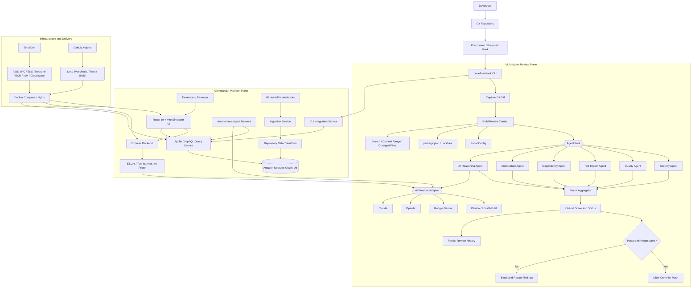
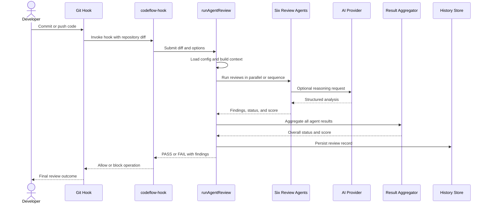

# Codeflow Commander Architecture Diagram

This document maps the implemented architecture of Codeflow Commander and the `codeflow-hook` multi-agent review workflow.

## System Architecture

## Review Execution Sequence

## Architectural Boundaries

| Boundary | Responsibility |
|---|---|
| Git integration | Captures repository changes and enforces the quality gate |
| Review orchestrator | Builds shared context and coordinates enabled agents |
| Specialist agents | Evaluate security, quality, tests, dependencies, architecture, and AI-assisted reasoning |
| Aggregation layer | Produces the final score, status, and blocking decision |
| Provider layer | Keeps model selection configurable and prevents hard coupling to one vendor |
| Platform services | Provide simulation, API analysis, ingestion, and graph querying |
| Infrastructure | Packages, deploys, observes, and validates the system |

## Source Mapping

- `packages/cli-tool/lib/agents/orchestrator.cjs`: review context, agent pool, parallel execution, aggregation, gate, and history persistence
- `packages/simulator-ui`: React and Vite CI/CD simulator
- `server`: Express analysis backend and AI proxy
- `packages/services/query-service`: Apollo GraphQL access layer
- `packages/services/ingestion-service`: GitHub-to-Neptune ingestion
- `packages/services/autonomous-agent-network`: autonomous coordination layer
- `IaC/terraform`: AWS infrastructure definitions
