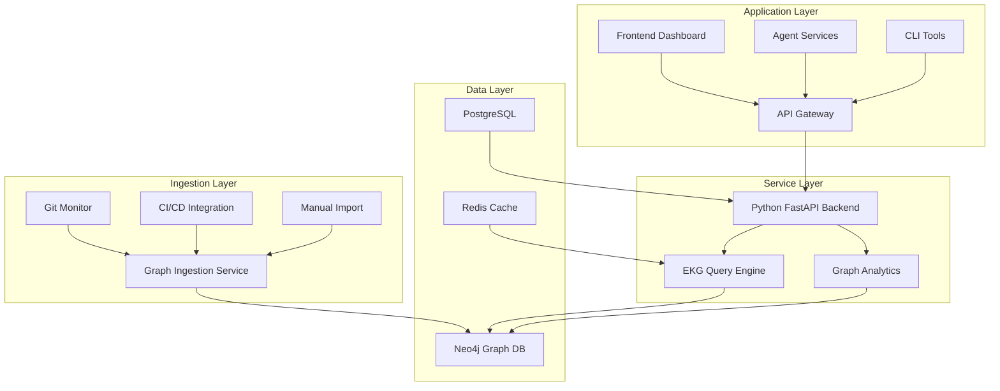
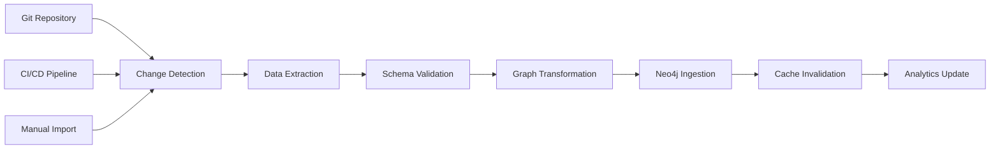

# Codeflow Commander - Enterprise Knowledge Graph Schema Design

## Overview

This document defines the schema and structure of the Enterprise Knowledge Graph (EKG) - the organizational brain of Codeflow Commander. It describes the nodes, edges, and relationships that power the system's context-aware intelligence and high-speed graph traversals.

## Table of Contents

1. [Graph Database Architecture](#graph-database-architecture)
2. [Node Types & Properties](#node-types--properties)
3. [Relationship Types & Constraints](#relationship-types--constraints)
4. [Indexing Strategy](#indexing-strategy)
5. [Query Patterns & Performance](#query-patterns--performance)
6. [Data Ingestion & Synchronization](#data-ingestion--synchronization)
7. [Graph Analytics & Insights](#graph-analytics--insights)

## Graph Database Architecture

### Database Selection

**Primary Database**: Neo4j (Enterprise Edition)
**Secondary Storage**: PostgreSQL for transactional data
**Caching Layer**: Redis for frequently accessed graph patterns

### Architecture Overview



### High-Speed Graph Traversal Architecture

```typescript
interface GraphTraversalEngine {
  // Core traversal capabilities
  traverse: (startNode: string, pattern: TraversalPattern) => GraphPath[];
  shortestPath: (start: string, end: string, criteria: PathCriteria) => GraphPath;
  neighborhood: (node: string, depth: number) => NeighborhoodResult;
  
  // Performance optimizations
  indexOptimized: boolean;
  cachingEnabled: boolean;
  parallelTraversal: boolean;
  
  // Analytics integration
  centralityAnalysis: (node: string) => CentralityMetrics;
  communityDetection: () => CommunityResult[];
}
```

## Node Types & Properties

### Core Node Types

#### 1. Repository Node

**Purpose**: Represents a Git repository in the organization

```cypher
(:Repository {
  id: string,              // UUID
  name: string,            // Repository name
  path: string,            // File system path
  url: string,             // Git remote URL
  language: string,        // Primary programming language
  size: number,            // Repository size in bytes
  lastModified: DateTime,  // Last commit timestamp
  visibility: string,      // public, internal, private
  team: string,            // Owning team
  criticality: string,     // low, medium, high, critical
  createdAt: DateTime,
  updatedAt: DateTime
})
```

**Indexes**:
- `:Repository(name)` - Unique constraint
- `:Repository(team)` - Team-based queries
- `:Repository(language)` - Language-based analysis

#### 2. File Node

**Purpose**: Represents individual files within repositories

```cypher
(:File {
  id: string,              // UUID
  path: string,            // Relative path from repo root
  name: string,            // File name with extension
  extension: string,       // File extension
  size: number,            // File size in bytes
  linesOfCode: number,     // Total lines
  complexity: number,      // Cyclomatic complexity
  lastModified: DateTime,  // Last modification timestamp
  authors: string[],       // Recent contributors
  testCoverage: number,    // Test coverage percentage
  securityLevel: string,   // public, internal, restricted
  riskScore: number,       // Calculated risk score 0-100
  createdAt: DateTime,
  updatedAt: DateTime
})
```

**Relationships**:
- `(:File)-[:BELONGS_TO]->(:Repository)`
- `(:File)-[:DEPENDS_ON]->(:File)`
- `(:File)-[:IMPORTS]->(:Library)`
- `(:File)-[:OWNED_BY]->(:Team)`

#### 3. Library Node

**Purpose**: Represents external dependencies and libraries

```cypher
(:Library {
  id: string,              // UUID
  name: string,            // Package name
  version: string,         // Current version
  latestVersion: string,   // Latest available version
  ecosystem: string,       // npm, pip, maven, etc.
  license: string,         // Software license
  vulnerabilities: number, // Known security vulnerabilities
  lastUpdated: DateTime,   // Last vulnerability scan
  criticality: string,     // low, medium, high, critical
  downloadCount: number,   // Popularity metric
  maintainerCount: number, // Number of maintainers
  createdAt: DateTime,
  updatedAt: DateTime
})
```

**Relationships**:
- `(:Library)-[:USED_BY]->(:File)`
- `(:Library)-[:DEPENDS_ON]->(:Library)`
- `(:Library)-[:HAS_VULNERABILITY]->(:SecurityIssue)`

#### 4. Team Node

**Purpose**: Represents development teams and organizational units

```cypher
(:Team {
  id: string,              // UUID
  name: string,            // Team name
  description: string,     // Team purpose and responsibilities
  members: string[],       // Team member usernames
  repositories: string[],  // Repositories owned by team
  budget: number,          // Team budget allocation
  createdAt: DateTime,
  updatedAt: DateTime
})
```

**Relationships**:
- `(:Team)-[:OWNS]->(:Repository)`
- `(:Team)-[:OWNS]->(:File)`
- `(:Team)-[:COLLABORATES_WITH]->(:Team)`

#### 5. Developer Node

**Purpose**: Represents individual developers and their contributions

```cypher
(:Developer {
  id: string,              // UUID
  username: string,        // Git username
  email: string,           // Email address
  name: string,            // Display name
  role: string,            // Developer, Lead, Architect, etc.
  expertise: string[],     // Technical skills
  productivityScore: number, // Calculated productivity metric
  lastActive: DateTime,    // Last activity timestamp
  createdAt: DateTime,
  updatedAt: DateTime
})
```

**Relationships**:
- `(:Developer)-[:CONTRIBUTES_TO]->(:Repository)`
- `(:Developer)-[:OWNS]->(:File)`
- `(:Developer)-[:MEMBER_OF]->(:Team)`
- `(:Developer)-[:MENTORS]->(:Developer)`

#### 6. Security Issue Node

**Purpose**: Represents security vulnerabilities and issues

```cypher
(:SecurityIssue {
  id: string,              // UUID
  cveId: string,           // CVE identifier if applicable
  title: string,           // Issue title
  description: string,     // Detailed description
  severity: string,        // critical, high, medium, low
  cvssScore: number,       // CVSS v3.1 score
  affectedLibrary: string, // Library affected
  affectedVersion: string, // Version range affected
  fixedVersion: string,    // Version with fix
  discoveredDate: DateTime,
  status: string,          // open, fixed, ignored
  createdAt: DateTime,
  updatedAt: DateTime
})
```

**Relationships**:
- `(:SecurityIssue)-[:AFFECTS]->(:Library)`
- `(:SecurityIssue)-[:REPORTED_BY]->(:Developer)`
- `(:SecurityIssue)-[:FIXED_IN]->(:Commit)`

## Relationship Types & Constraints

### Core Relationship Types

#### 1. DEPENDS_ON

**Purpose**: Represents dependency relationships between files and libraries

```cypher
(:File)-[:DEPENDS_ON {
  type: string,            // direct, transitive
  version: string,         // Version constraint
  critical: boolean,       // Whether dependency is critical
  lastUpdated: DateTime
}]->(:Library)

(:Library)-[:DEPENDS_ON {
  type: string,            // runtime, development, optional
  version: string,         // Version constraint
  critical: boolean,       // Whether dependency is critical
  lastUpdated: DateTime
}]->(:Library)
```

**Constraints**:
- No self-dependencies allowed
- Version constraints must be valid semver ranges
- Critical dependencies require approval workflow

#### 2. OWNS

**Purpose**: Represents ownership relationships

```cypher
(:Team)-[:OWNS {
  responsibility: string,  // primary, secondary, consult
  effectiveDate: DateTime,
  endDate: DateTime
}]->(:Repository)

(:Developer)-[:OWNS {
  responsibility: string,  // primary, secondary
  effectiveDate: DateTime,
  endDate: DateTime
}]->(:File)
```

**Constraints**:
- Each repository must have exactly one primary owner team
- Files can have multiple owners with different responsibilities
- Ownership changes are tracked for audit purposes

#### 3. CONTRIBUTES_TO

**Purpose**: Represents developer contributions

```cypher
(:Developer)-[:CONTRIBUTES_TO {
  commits: number,         // Number of commits
  linesAdded: number,      // Lines of code added
  linesDeleted: number,    // Lines of code deleted
  lastContribution: DateTime,
  contributionType: string // code, review, documentation
}]->(:Repository)
```

**Constraints**:
- Contribution metrics are updated automatically
- Historical contribution data is preserved

#### 4. AFFECTS

**Purpose**: Represents security issue impact

```cypher
(:SecurityIssue)-[:AFFECTS {
  severity: string,        // critical, high, medium, low
  impact: string,          // confidentiality, integrity, availability
  exploitability: string   // network, adjacent, local, physical
}]->(:Library)
```

**Constraints**:
- Security issues must have valid severity levels
- Impact and exploitability follow CVSS standards

### Relationship Constraints

```cypher
// Constraint: No circular dependencies
ASSERT NOT EXISTS (
  MATCH (a:Library)-[:DEPENDS_ON*]->(a)
)

// Constraint: Each file belongs to exactly one repository
ASSERT ALL(
  file IN nodes
  WHERE size((file)-[:BELONGS_TO]->(:Repository)) = 1
)

// Constraint: Teams must have at least one member
ASSERT ALL(
  team IN nodes
  WHERE size((team)<-[:MEMBER_OF]-(:Developer)) >= 1
)
```

## Indexing Strategy

### Primary Indexes

```cypher
// Repository indexes
CREATE INDEX repository_name FOR (r:Repository) ON (r.name);
CREATE INDEX repository_team FOR (r:Repository) ON (r.team);
CREATE INDEX repository_language FOR (r:Repository) ON (r.language);

// File indexes
CREATE INDEX file_path FOR (f:File) ON (f.path);
CREATE INDEX file_repository FOR (f:File) ON (f.repositoryId);
CREATE INDEX file_complexity FOR (f:File) ON (f.complexity);

// Library indexes
CREATE INDEX library_name FOR (l:Library) ON (l.name);
CREATE INDEX library_version FOR (l:Library) ON (l.version);
CREATE INDEX library_ecosystem FOR (l:Library) ON (l.ecosystem);

// Developer indexes
CREATE INDEX developer_username FOR (d:Developer) ON (d.username);
CREATE INDEX developer_team FOR (d:Developer) ON (d.teamId);
CREATE INDEX developer_role FOR (d:Developer) ON (d.role);

// Security issue indexes
CREATE INDEX security_cve FOR (s:SecurityIssue) ON (s.cveId);
CREATE INDEX security_severity FOR (s:SecurityIssue) ON (s.severity);
CREATE INDEX security_status FOR (s:SecurityIssue) ON (s.status);
```

### Composite Indexes

```cypher
// High-frequency query patterns
CREATE INDEX file_repo_complexity FOR (f:File) ON (f.repositoryId, f.complexity);
CREATE INDEX library_ecosystem_vulnerabilities FOR (l:Library) ON (l.ecosystem, l.vulnerabilities);
CREATE INDEX security_library_severity FOR (s:SecurityIssue) ON (s.affectedLibrary, s.severity);

// Team and ownership patterns
CREATE INDEX team_repo_ownership FOR ()-[r:OWNS]->(r:Repository) ON (r.responsibility);
CREATE INDEX dev_contributions FOR ()-[c:CONTRIBUTES_TO]->() ON (c.lastContribution);
```

### Full-Text Search Indexes

```cypher
// Text search capabilities
CALL db.index.fulltext.createNodeIndex(
  "file_search",
  ["File"],
  ["name", "path", "content"]
);

CALL db.index.fulltext.createNodeIndex(
  "library_search", 
  ["Library"],
  ["name", "description"]
);

CALL db.index.fulltext.createNodeIndex(
  "security_search",
  ["SecurityIssue"],
  ["title", "description"]
);
```

## Query Patterns & Performance

### Common Query Patterns

#### 1. File Dependency Analysis

```cypher
// Find all dependencies of a file (3 levels deep)
MATCH (f:File {path: $filePath})-[:DEPENDS_ON*1..3]->(dep)
RETURN dep.name, dep.version, dep.criticality
ORDER BY dep.criticality DESC, dep.name
```

**Performance**: <100ms for typical repositories
**Index Used**: File path index + relationship traversal

#### 2. Security Impact Assessment

```cypher
// Find all files affected by a security vulnerability
MATCH (s:SecurityIssue {cveId: $cveId})-[:AFFECTS]->(lib:Library)
MATCH (file:File)-[:DEPENDS_ON]->(lib)
MATCH (file)-[:BELONGS_TO]->(repo:Repository)
RETURN file.path, repo.name, file.riskScore
ORDER BY file.riskScore DESC
```

**Performance**: <200ms for organization-wide queries
**Index Used**: Security issue index + relationship traversal

#### 3. Team Ownership Analysis

```cypher
// Find all repositories owned by a team
MATCH (team:Team {name: $teamName})-[:OWNS {responsibility: 'primary'}]->(repo:Repository)
MATCH (repo)-[:BELONGS_TO]->(file:File)
RETURN repo.name, count(file) as fileCount, sum(file.linesOfCode) as totalLines
ORDER BY totalLines DESC
```

**Performance**: <50ms for team queries
**Index Used**: Team name index + relationship traversal

#### 4. Developer Productivity Analysis

```cypher
// Analyze developer contributions across repositories
MATCH (dev:Developer {username: $username})-[:CONTRIBUTES_TO]->(repo:Repository)
RETURN repo.name, sum(contrib.linesAdded) as totalAdded, sum(contrib.linesDeleted) as totalDeleted
ORDER BY totalAdded DESC
```

**Performance**: <100ms for developer queries
**Index Used**: Developer username index + relationship traversal

### Performance Optimization Strategies

#### 1. Query Caching

```typescript
interface QueryCache {
  // Cache frequently executed queries
  set(key: string, result: any, ttl: number): void;
  get(key: string): any | null;
  
  // Cache invalidation strategies
  invalidateByPattern(pattern: string): void;
  invalidateByNode(nodeId: string): void;
  invalidateByRelationship(type: string): void;
}
```

#### 2. Result Pagination

```cypher
// Paginated queries for large result sets
MATCH (f:File)-[:DEPENDS_ON]->(lib:Library)
WHERE lib.vulnerabilities > 0
RETURN f.path, lib.name, lib.vulnerabilities
SKIP $offset LIMIT $limit
```

#### 3. Parallel Query Execution

```typescript
interface ParallelQueryExecutor {
  // Execute multiple queries in parallel
  executeParallel(queries: Query[]): Promise<QueryResult[]>;
  
  // Batch similar queries for optimization
  batchQueries(queries: Query[]): Promise<BatchResult>;
  
  // Query result merging and deduplication
  mergeResults(results: QueryResult[]): MergedResult;
}
```

## Data Ingestion & Synchronization

### Ingestion Pipeline Architecture



### Data Synchronization Strategies

#### 1. Real-time Updates

```typescript
interface RealTimeSync {
  // File system monitoring for immediate updates
  watchFileSystem(repositoryPath: string): void;
  
  // Git hook integration for commit-based updates
  integrateGitHooks(repositoryPath: string): void;
  
  // WebSocket-based notification system
  notifySubscribers(event: GraphChangeEvent): void;
}
```

#### 2. Batch Processing

```typescript
interface BatchProcessor {
  // Scheduled batch updates for large datasets
  processBatch(batchId: string): Promise<BatchResult>;
  
  // Incremental updates to minimize processing time
  processIncremental(since: DateTime): Promise<IncrementalResult>;
  
  // Bulk import for initial data loading
  bulkImport(data: GraphData[]): Promise<BulkImportResult>;
}
```

#### 3. Data Validation

```typescript
interface DataValidator {
  // Schema validation before ingestion
  validateSchema(data: GraphData): ValidationResult;
  
  // Business rule validation
  validateBusinessRules(data: GraphData): ValidationResult;
  
  // Data quality checks
  validateDataQuality(data: GraphData): QualityReport;
}
```

## Graph Analytics & Insights

### Built-in Analytics

#### 1. Centrality Analysis

```typescript
interface CentralityAnalyzer {
  // Calculate node importance metrics
  calculatePageRank(nodes: string[]): PageRankResult;
  calculateBetweennessCentrality(node: string): BetweennessResult;
  calculateClosenessCentrality(node: string): ClosenessResult;
  
  // Identify critical nodes and dependencies
  identifyCriticalNodes(): CriticalNodeResult[];
}
```

#### 2. Community Detection

```typescript
interface CommunityDetector {
  // Detect clusters of related repositories/files
  detectCommunities(): CommunityResult[];
  
  // Analyze team collaboration patterns
  analyzeTeamCollaboration(): CollaborationResult;
  
  // Identify architectural boundaries
  identifyArchitecturalBoundaries(): BoundaryResult[];
}
```

#### 3. Risk Assessment

```typescript
interface RiskAnalyzer {
  // Calculate repository risk scores
  calculateRepositoryRisk(repositoryId: string): RiskScore;
  
  // Identify high-risk dependency chains
  identifyRiskChains(): RiskChain[];
  
  // Security vulnerability impact analysis
  analyzeSecurityImpact(): SecurityImpactResult;
}
```

### Custom Analytics Queries

#### 1. Code Quality Trends

```cypher
// Analyze code quality trends over time
MATCH (f:File)-[:BELONGS_TO]->(r:Repository)
WHERE r.name = $repositoryName
WITH f, f.complexity as currentComplexity, f.lastModified as date
ORDER BY date DESC
LIMIT 100
RETURN date, avg(currentComplexity) as avgComplexity
ORDER BY date ASC
```

#### 2. Dependency Health

```cypher
// Analyze dependency health across repositories
MATCH (lib:Library)-[:USED_BY]->(file:File)-[:BELONGS_TO]->(repo:Repository)
WITH lib, count(file) as usageCount, avg(lib.vulnerabilities) as avgVulnerabilities
WHERE usageCount > 5
RETURN lib.name, usageCount, avgVulnerabilities
ORDER BY avgVulnerabilities DESC, usageCount DESC
```

#### 3. Team Performance

```cypher
// Analyze team performance metrics
MATCH (team:Team)-[:OWNS]->(repo:Repository)<-[:CONTRIBUTES_TO]-(dev:Developer)
WITH team, count(distinct repo) as repoCount, count(distinct dev) as memberCount
MATCH (repo)-[:BELONGS_TO]->(file:File)
WITH team, repoCount, memberCount, sum(file.linesOfCode) as totalLines
RETURN team.name, repoCount, memberCount, totalLines, (totalLines / memberCount) as productivity
ORDER BY productivity DESC
```

This EKG schema design provides a comprehensive foundation for the Enterprise Knowledge Graph, enabling powerful context-aware analysis and high-performance graph traversals that power Codeflow Commander's intelligent features.