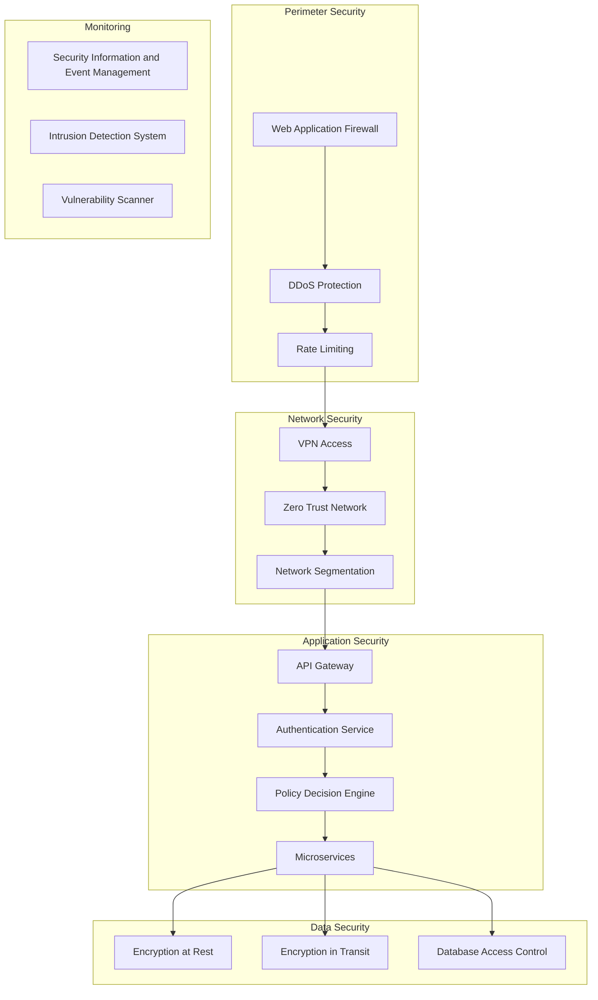
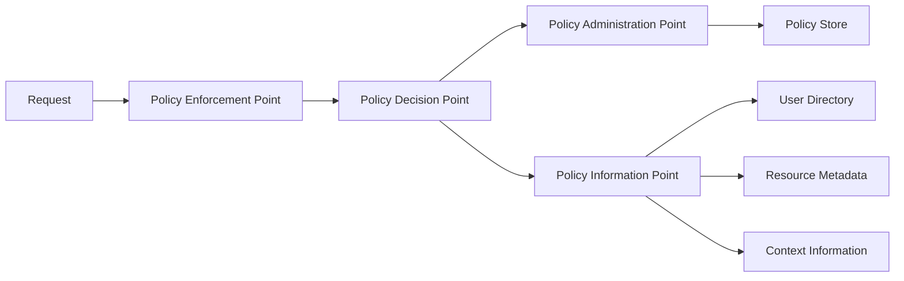

# Codeflow Commander - Enterprise Identity & Access Management Policy

## Overview

This document defines the comprehensive security framework, identity management, and access control policies for Codeflow Commander. It establishes the Policy Decision Engine (PDE) architecture and defines how user roles map to system permissions in an enterprise environment.

## Table of Contents

1. [Security Architecture Overview](#security-architecture-overview)
2. [Identity Management Framework](#identity-management-framework)
3. [Policy Decision Engine (PDE)](#policy-decision-engine-pde)
4. [Role-Based Access Control (RBAC)](#role-based-access-control-rbac)
5. [Permission Matrix & Authorization](#permission-matrix--authorization)
6. [Authentication & Session Management](#authentication--session-management)
7. [Audit & Compliance](#audit--compliance)
8. [Security Monitoring & Incident Response](#security-monitoring--incident-response)

## Security Architecture Overview

### Defense-in-Depth Strategy



### Security Zones

#### 1. Public Zone (DMZ)
- **Purpose**: External API endpoints and public documentation
- **Access**: Anonymous read access only
- **Security Level**: Medium
- **Components**: API Gateway, Public Documentation

#### 2. Internal Zone
- **Purpose**: Internal application services and authenticated users
- **Access**: Authenticated users with appropriate permissions
- **Security Level**: High
- **Components**: Application Services, Internal APIs

#### 3. Restricted Zone
- **Purpose**: Sensitive data and administrative functions
- **Access**: Privileged users with multi-factor authentication
- **Security Level**: Critical
- **Components**: Database, Configuration Management, Audit Logs

#### 4. Isolated Zone
- **Purpose**: Agent execution and code analysis
- **Access**: Service accounts with minimal privileges
- **Security Level**: High
- **Components**: Agent Runtime, Code Analysis Engine

## Identity Management Framework

### Identity Providers Integration

```typescript
interface IdentityProvider {
  // Authentication methods
  authenticate(credentials: Credentials): Promise<AuthenticationResult>;
  refreshToken(refreshToken: string): Promise<TokenResult>;
  revokeToken(token: string): Promise<void>;
  
  // User management
  getUserInfo(userId: string): Promise<UserInfo>;
  searchUsers(query: string): Promise<UserInfo[]>;
  
  // Group/Role management
  getUserGroups(userId: string): Promise<string[]>;
  isUserInGroup(userId: string, group: string): Promise<boolean>;
}

// Supported Identity Providers
interface SupportedProviders {
  azure_ad: AzureADProvider;
  okta: OktaProvider;
  auth0: Auth0Provider;
  saml: SAMLProvider;
  ldap: LDAPProvider;
}
```

### User Identity Schema

```typescript
interface UserIdentity {
  // Core identity information
  id: string;                    // UUID
  username: string;              // Unique username
  email: string;                 // Primary email
  displayName: string;           // Display name
  
  // Enterprise attributes
  employeeId: string;            // Corporate employee ID
  department: string;           // Organizational department
  managerId: string;            // Manager's user ID
  costCenter: string;           // Cost center code
  location: string;             // Physical location
  
  // Security attributes
  roles: UserRole[];            // User roles
  groups: string[];             // Security groups
  permissions: Permission[];    // Direct permissions
  mfaEnabled: boolean;          // Multi-factor auth status
  lastPasswordChange: Date;     // Password change timestamp
  accountStatus: AccountStatus; // active, disabled, locked
  
  // Audit information
  createdAt: Date;
  lastLogin: Date;
  lastModified: Date;
}

enum AccountStatus {
  ACTIVE = 'active',
  DISABLED = 'disabled',
  LOCKED = 'locked',
  PENDING_APPROVAL = 'pending_approval'
}
```

### Group Management

```typescript
interface SecurityGroup {
  id: string;                    // Group UUID
  name: string;                  // Group name
  description: string;           // Group purpose
  type: GroupType;              // security, distribution, application
  members: string[];            // User IDs
  nestedGroups: string[];       // Nested group IDs
  permissions: Permission[];    // Group permissions
  owner: string;                // Group owner
  createdAt: Date;
  lastModified: Date;
}

enum GroupType {
  SECURITY = 'security',
  DISTRIBUTION = 'distribution',
  APPLICATION = 'application'
}
```

## Policy Decision Engine (PDE)

### Architecture Overview

The Policy Decision Engine is the central authority for all access control decisions in Codeflow Commander.



### Policy Decision Point (PDP)

```typescript
interface PolicyDecisionPoint {
  // Core decision making
  evaluate(request: AccessRequest): Promise<AuthorizationDecision>;
  evaluateBatch(requests: AccessRequest[]): Promise<AuthorizationDecision[]>;
  
  // Policy management
  loadPolicies(): Promise<void>;
  reloadPolicies(): Promise<void>;
  validatePolicy(policy: Policy): Promise<ValidationResult>;
  
  // Policy evaluation context
  getContext(request: AccessRequest): Promise<EvaluationContext>;
  enrichContext(context: EvaluationContext): Promise<EvaluationContext>;
}

interface AccessRequest {
  subject: Subject;              // Who is making the request
  action: Action;               // What action is being requested
  resource: Resource;           // What resource is being accessed
  environment: Environment;     // Context of the request
}

interface AuthorizationDecision {
  decision: Decision;           // Allow, Deny, NotApplicable, Indeterminate
  obligations: Obligation[];    // Required actions
  advice: Advice[];             // Recommended actions
  policyId: string;             // Policy that made the decision
  evaluationTime: Date;         // When decision was made
}

enum Decision {
  PERMIT = 'Permit',
  DENY = 'Deny',
  NOT_APPLICABLE = 'NotApplicable',
  INDETERMINATE = 'Indeterminate'
}
```

### Policy Language (XACML-inspired)

```typescript
interface Policy {
  id: string;
  description: string;
  target: Target;
  rules: Rule[];
  combiningAlgorithm: CombiningAlgorithm;
  obligations: Obligation[];
  advice: Advice[];
}

interface Rule {
  id: string;
  effect: Effect;               // Permit or Deny
  condition: Condition;
  description: string;
}

interface Condition {
  attribute: string;            // Subject, Resource, Action, or Environment
  operator: Operator;           // Equal, GreaterThan, LessThan, etc.
  value: any;                   // Value to compare against
}

enum Effect {
  PERMIT = 'Permit',
  DENY = 'Deny'
}

enum CombiningAlgorithm {
  DENY_OVERRIDES = 'DenyOverrides',
  PERMIT_OVERRIDES = 'PermitOverrides',
  FIRST_APPLICABLE = 'FirstApplicable',
  ONLY_ONE_APPLICABLE = 'OnlyOneApplicable'
}
```

### Example Policies

#### 1. Critical File Access Policy

```typescript
const criticalFileAccessPolicy: Policy = {
  id: "policy-critical-file-access",
  description: "Restrict access to critical security files",
  target: {
    resource: {
      type: "File",
      attributes: {
        securityLevel: "critical"
      }
    }
  },
  rules: [
    {
      id: "rule-critical-file-access",
      effect: Effect.DENY,
      condition: {
        attribute: "subject.role",
        operator: "NOT_IN",
        value: ["security_admin", "architect"]
      },
      description: "Only security admins and architects can access critical files"
    }
  ],
  combiningAlgorithm: CombiningAlgorithm.DENY_OVERRIDES,
  obligations: [
    {
      id: "obligation-audit-log",
      description: "Log all critical file access attempts",
      action: "log_access_attempt"
    }
  ]
};
```

#### 2. Agent Execution Policy

```typescript
const agentExecutionPolicy: Policy = {
  id: "policy-agent-execution",
  description: "Control agent execution permissions",
  target: {
    action: {
      type: "Execute",
      attributes: {
        resourceType: "Agent"
      }
    }
  },
  rules: [
    {
      id: "rule-agent-execution",
      effect: Effect.PERMIT,
      condition: {
        attribute: "subject.permissions",
        operator: "CONTAINS",
        value: "agent:execute"
      },
      description: "Allow users with agent execution permission"
    },
    {
      id: "rule-agent-execution-time",
      effect: Effect.DENY,
      condition: {
        attribute: "environment.time",
        operator: "NOT_BETWEEN",
        value: ["06:00", "22:00"]
      },
      description: "Restrict agent execution to business hours"
    }
  ],
  combiningAlgorithm: CombiningAlgorithm.DENY_OVERRIDES
};
```

## Role-Based Access Control (RBAC)

### Role Hierarchy

```typescript
interface UserRole {
  id: string;
  name: string;
  description: string;
  permissions: Permission[];
  parentRoles: string[];        // Inherited permissions
  childRoles: string[];         // Roles that inherit from this role
  constraints: RoleConstraint[]; // Additional constraints
}

// Enterprise Role Hierarchy
const enterpriseRoles: UserRole[] = [
  {
    id: "role-developer",
    name: "Developer",
    description: "Standard developer with code access",
    permissions: [
      "repository:read",
      "repository:write",
      "file:read",
      "file:write",
      "agent:suggestions:read"
    ],
    parentRoles: [],
    childRoles: ["role-senior-developer", "role-team-lead"],
    constraints: [
      {
        type: "time_restriction",
        value: { start: "09:00", end: "17:00" }
      }
    ]
  },
  {
    id: "role-senior-developer",
    name: "Senior Developer",
    description: "Senior developer with additional privileges",
    permissions: [
      "repository:read",
      "repository:write", 
      "repository:merge",
      "file:read",
      "file:write",
      "agent:suggestions:read",
      "agent:suggestions:accept"
    ],
    parentRoles: ["role-developer"],
    childRoles: ["role-team-lead"],
    constraints: []
  },
  {
    id: "role-team-lead",
    name: "Team Lead",
    description: "Team lead with team management capabilities",
    permissions: [
      "repository:read",
      "repository:write",
      "repository:merge",
      "repository:admin",
      "file:read",
      "file:write",
      "agent:suggestions:read",
      "agent:suggestions:accept",
      "agent:suggestions:reject",
      "team:manage"
    ],
    parentRoles: ["role-senior-developer"],
    childRoles: ["role-architect", "role-security-admin"],
    constraints: []
  },
  {
    id: "role-architect",
    name: "Solution Architect",
    description: "Architecture decisions and system design",
    permissions: [
      "repository:read",
      "repository:write",
      "repository:merge",
      "repository:admin",
      "file:read",
      "file:write",
      "agent:suggestions:read",
      "agent:suggestions:accept",
      "agent:suggestions:reject",
      "agent:architecture:execute",
      "architecture:design",
      "architecture:approve"
    ],
    parentRoles: ["role-team-lead"],
    childRoles: ["role-security-admin"],
    constraints: []
  },
  {
    id: "role-security-admin",
    name: "Security Administrator",
    description: "Security policies and critical file management",
    permissions: [
      "repository:read",
      "repository:write",
      "repository:merge",
      "repository:admin",
      "file:read",
      "file:write",
      "agent:suggestions:read",
      "agent:suggestions:accept",
      "agent:suggestions:reject",
      "agent:security:execute",
      "security:policy:manage",
      "security:critical-files:access",
      "audit:logs:read"
    ],
    parentRoles: ["role-team-lead", "role-architect"],
    childRoles: [],
    constraints: [
      {
        type: "mfa_required",
        value: true
      }
    ]
  }
];
```

### Custom Role Creation

```typescript
interface RoleConstraint {
  type: ConstraintType;
  value: any;
  description: string;
}

enum ConstraintType {
  TIME_RESTRICTION = "time_restriction",
  MFA_REQUIRED = "mfa_required",
  IP_WHITELIST = "ip_whitelist",
  GEOGRAPHIC_RESTRICTION = "geographic_restriction",
  MAX_SESSION_DURATION = "max_session_duration"
}

interface CustomRole {
  name: string;
  description: string;
  baseRole: string;             // Inherits from base role
  additionalPermissions: Permission[];
  constraints: RoleConstraint[];
  approvalRequired: boolean;    // Requires admin approval
  approvalWorkflow: string;     // Approval process ID
}
```

## Permission Matrix & Authorization

### Permission Categories

```typescript
interface Permission {
  id: string;
  name: string;
  description: string;
  category: PermissionCategory;
  resourceType: ResourceType;
  action: ActionType;
  riskLevel: RiskLevel;
}

enum PermissionCategory {
  REPOSITORY = "repository",
  FILE = "file",
  AGENT = "agent",
  TEAM = "team",
  SECURITY = "security",
  ADMIN = "admin",
  AUDIT = "audit"
}

enum ResourceType {
  REPOSITORY = "repository",
  FILE = "file",
  AGENT = "agent",
  TEAM = "team",
  USER = "user",
  POLICY = "policy"
}

enum ActionType {
  READ = "read",
  WRITE = "write",
  EXECUTE = "execute",
  DELETE = "delete",
  ADMIN = "admin",
  MERGE = "merge"
}

enum RiskLevel {
  LOW = "low",
  MEDIUM = "medium",
  HIGH = "high",
  CRITICAL = "critical"
}
```

### Permission Matrix

| Role | Repository Read | Repository Write | File Read | File Write | Agent Suggestions | Agent Execute | Security Admin |
|------|----------------|------------------|-----------|------------|-------------------|---------------|----------------|
| Developer | ✅ | ✅ | ✅ | ✅ | ✅ | ❌ | ❌ |
| Senior Developer | ✅ | ✅ | ✅ | ✅ | ✅ | ❌ | ❌ |
| Team Lead | ✅ | ✅ | ✅ | ✅ | ✅ | ❌ | ❌ |
| Architect | ✅ | ✅ | ✅ | ✅ | ✅ | ✅ (Architecture) | ❌ |
| Security Admin | ✅ | ✅ | ✅ | ✅ | ✅ | ✅ (Security) | ✅ |

### Dynamic Permission Evaluation

```typescript
interface PermissionEvaluator {
  // Evaluate permissions in context
  evaluatePermission(
    user: UserIdentity,
    permission: Permission,
    resource: Resource,
    context: EvaluationContext
  ): Promise<PermissionResult>;
  
  // Check if user has permission
  hasPermission(
    userId: string,
    permissionId: string,
    resourceId?: string
  ): Promise<boolean>;
  
  // Get user's effective permissions
  getEffectivePermissions(userId: string): Promise<Permission[]>;
  
  // Audit permission decisions
  auditPermissionDecision(decision: PermissionResult): Promise<void>;
}

interface PermissionResult {
  granted: boolean;
  reason: string;
  constraints: PermissionConstraint[];
  auditTrail: AuditEvent[];
}
```

## Authentication & Session Management

### Multi-Factor Authentication (MFA)

```typescript
interface MFAProvider {
  // MFA methods
  generateTOTP(userId: string): Promise<string>;
  verifyTOTP(userId: string, token: string): Promise<boolean>;
  sendPushNotification(userId: string, challenge: string): Promise<boolean>;
  verifyPushNotification(userId: string, response: string): Promise<boolean>;
  
  // Recovery methods
  generateRecoveryCodes(userId: string): Promise<string[]>;
  verifyRecoveryCode(userId: string, code: string): Promise<boolean>;
}

// MFA Requirements by Risk Level
const mfaRequirements: Record<RiskLevel, MFARequirement> = {
  [RiskLevel.LOW]: { enabled: false },
  [RiskLevel.MEDIUM]: { enabled: true, methods: ["totp"] },
  [RiskLevel.HIGH]: { enabled: true, methods: ["totp", "push"] },
  [RiskLevel.CRITICAL]: { enabled: true, methods: ["totp", "push", "biometric"] }
};
```

### Session Management

```typescript
interface SessionManager {
  // Session creation and validation
  createSession(user: UserIdentity, factors: AuthenticationFactor[]): Promise<Session>;
  validateSession(sessionId: string): Promise<SessionValidationResult>;
  refreshSession(sessionId: string): Promise<Session>;
  terminateSession(sessionId: string): Promise<void>;
  
  // Session security
  validateSessionSecurity(session: Session): Promise<SecurityValidationResult>;
  detectSessionAnomalies(session: Session): Promise<AnomalyDetectionResult>;
  
  // Session lifecycle
  cleanupExpiredSessions(): Promise<void>;
  getActiveSessions(userId: string): Promise<Session[]>;
}

interface Session {
  id: string;
  userId: string;
  factors: AuthenticationFactor[];
  permissions: Permission[];
  createdAt: Date;
  lastActivity: Date;
  expiresAt: Date;
  ipAddress: string;
  userAgent: string;
  location: GeoLocation;
}

interface AuthenticationFactor {
  type: FactorType;
  verifiedAt: Date;
  method: string;
}

enum FactorType {
  PASSWORD = "password",
  TOTP = "totp",
  PUSH = "push",
  BIOMETRIC = "biometric",
  HARDWARE_TOKEN = "hardware_token"
}
```

### Single Sign-On (SSO) Integration

```typescript
interface SSOProvider {
  // SAML/OIDC integration
  initiateSSO(request: SSORedirectRequest): Promise<SSORedirectResponse>;
  handleCallback(callback: SSOCallback): Promise<AuthenticationResult>;
  validateAssertion(assertion: string): Promise<SAMLAssertion>;
  
  // Token management
  exchangeToken(tokenRequest: TokenExchangeRequest): Promise<TokenExchangeResult>;
  refreshTokens(refreshRequest: TokenRefreshRequest): Promise<TokenRefreshResult>;
}
```

## Audit & Compliance

### Audit Logging Framework

```typescript
interface AuditLogger {
  // Core audit events
  logAuthenticationEvent(event: AuthenticationEvent): Promise<void>;
  logAuthorizationEvent(event: AuthorizationEvent): Promise<void>;
  logResourceAccess(event: ResourceAccessEvent): Promise<void>;
  logPolicyDecision(event: PolicyDecisionEvent): Promise<void>;
  
  // Administrative events
  logUserManagement(event: UserManagementEvent): Promise<void>;
  logPolicyManagement(event: PolicyManagementEvent): Promise<void>;
  logSystemEvent(event: SystemEvent): Promise<void>;
  
  // Audit trail queries
  queryAuditTrail(query: AuditQuery): Promise<AuditResult[]>;
  generateAuditReport(reportType: AuditReportType): Promise<AuditReport>;
}

// Audit Event Types
interface AuthenticationEvent {
  eventType: "authentication";
  userId: string;
  timestamp: Date;
  ipAddress: string;
  userAgent: string;
  factors: AuthenticationFactor[];
  result: "success" | "failure";
  failureReason?: string;
}

interface AuthorizationEvent {
  eventType: "authorization";
  userId: string;
  permission: Permission;
  resource: Resource;
  timestamp: Date;
  decision: Decision;
  policyId: string;
  context: EvaluationContext;
}

interface ResourceAccessEvent {
  eventType: "resource_access";
  userId: string;
  resourceId: string;
  action: ActionType;
  timestamp: Date;
  result: "success" | "failure";
  dataAccessed?: string[];
}
```

### Compliance Framework

```typescript
interface ComplianceFramework {
  // Regulatory compliance
  checkGDPRCompliance(): Promise<GDPRComplianceReport>;
  checkSOXCompliance(): Promise<SOXComplianceReport>;
  checkHIPAACompliance(): Promise<HIPAAComplianceReport>;
  
  // Internal compliance
  checkAccessReviews(): Promise<AccessReviewReport>;
  checkSegregationOfDuties(): Promise<SegregationOfDutiesReport>;
  checkLeastPrivilege(): Promise<LeastPrivilegeReport>;
  
  // Compliance monitoring
  monitorComplianceViolations(): Promise<ComplianceViolation[]>;
  generateComplianceDashboard(): Promise<ComplianceDashboard>;
}

interface ComplianceReport {
  framework: string;
  timestamp: Date;
  status: ComplianceStatus;
  violations: ComplianceViolation[];
  recommendations: ComplianceRecommendation[];
  nextReviewDate: Date;
}

enum ComplianceStatus {
  COMPLIANT = "compliant",
  NON_COMPLIANT = "non_compliant",
  PARTIALLY_COMPLIANT = "partially_compliant",
  NOT_ASSESSED = "not_assessed"
}
```

## Security Monitoring & Incident Response

### Security Information and Event Management (SIEM)

```typescript
interface SIEMIntegration {
  // Event collection
  collectSecurityEvents(): Promise<SecurityEvent[]>;
  normalizeEvents(events: SecurityEvent[]): Promise<NormalizedEvent[]>;
  correlateEvents(events: NormalizedEvent[]): Promise<SecurityIncident[]>;
  
  // Threat detection
  detectAnomalies(events: SecurityEvent[]): Promise<AnomalyDetectionResult>;
  identifyThreats(events: SecurityEvent[]): Promise<ThreatIntelligenceResult>;
  
  // Alerting and response
  generateSecurityAlerts(incidents: SecurityIncident[]): Promise<SecurityAlert[]>;
  triggerIncidentResponse(incident: SecurityIncident): Promise<IncidentResponseResult>;
}

interface SecurityEvent {
  id: string;
  timestamp: Date;
  source: string;
  eventType: SecurityEventType;
  severity: SecuritySeverity;
  description: string;
  details: any;
  ipAddress?: string;
  userId?: string;
}

enum SecurityEventType {
  AUTHENTICATION_FAILURE = "authentication_failure",
  UNAUTHORIZED_ACCESS = "unauthorized_access",
  PRIVILEGE_ESCALATION = "privilege_escalation",
  DATA_EXFILTRATION = "data_exfiltration",
  MALICIOUS_FILE = "malicious_file",
  SUSPICIOUS_ACTIVITY = "suspicious_activity"
}

enum SecuritySeverity {
  LOW = "low",
  MEDIUM = "medium",
  HIGH = "high",
  CRITICAL = "critical"
}
```

### Incident Response Framework

```typescript
interface IncidentResponse {
  // Incident detection and classification
  classifyIncident(event: SecurityEvent): Promise<IncidentClassification>;
  createIncident(incident: SecurityIncident): Promise<IncidentResponsePlan>;
  
  // Response execution
  executeResponsePlan(plan: IncidentResponsePlan): Promise<ResponseExecutionResult>;
  coordinateResponse(incident: SecurityIncident): Promise<ResponseCoordinationResult>;
  
  // Post-incident activities
  conductPostMortem(incident: SecurityIncident): Promise<PostMortemResult>;
  updateSecurityControls(incident: SecurityIncident): Promise<SecurityControlUpdateResult>;
}

interface IncidentResponsePlan {
  incidentId: string;
  classification: IncidentClassification;
  severity: SecuritySeverity;
  affectedSystems: string[];
  responseTeam: string[];
  containmentSteps: ResponseStep[];
  eradicationSteps: ResponseStep[];
  recoverySteps: ResponseStep[];
  communicationPlan: CommunicationPlan;
  estimatedResolutionTime: Date;
}

interface ResponseStep {
  id: string;
  description: string;
  priority: number;
  assignedTo: string;
  status: ResponseStepStatus;
  startTime?: Date;
  endTime?: Date;
  dependencies: string[];
}

enum ResponseStepStatus {
  PENDING = "pending",
  IN_PROGRESS = "in_progress",
  COMPLETED = "completed",
  FAILED = "failed"
}
```

### Security Metrics & KPIs

```typescript
interface SecurityMetrics {
  // Authentication metrics
  getAuthenticationSuccessRate(timeframe: Timeframe): Promise<number>;
  getMFAAdoptionRate(): Promise<number>;
  getAverageAuthenticationTime(): Promise<number>;
  
  // Authorization metrics
  getAuthorizationDecisionLatency(): Promise<number>;
  getPolicyEvaluationPerformance(): Promise<PolicyEvaluationMetrics>;
  getPermissionUsageAnalytics(): Promise<PermissionUsageAnalytics>;
  
  // Security incident metrics
  getMeanTimeToDetection(): Promise<number>;
  getMeanTimeToResponse(): Promise<number>;
  getIncidentResolutionRate(timeframe: Timeframe): Promise<number>;
  
  // Compliance metrics
  getComplianceScore(): Promise<number>;
  getPolicyViolationRate(): Promise<number>;
  getAuditCoverage(): Promise<number>;
}

interface SecurityDashboard {
  authenticationMetrics: AuthenticationMetrics;
  authorizationMetrics: AuthorizationMetrics;
  incidentMetrics: IncidentMetrics;
  complianceMetrics: ComplianceMetrics;
  securityPosture: SecurityPosture;
  recommendations: SecurityRecommendation[];
  lastUpdated: Date;
}
```

This comprehensive IAM policy framework establishes a robust security foundation for Codeflow Commander, ensuring enterprise-grade identity management, access control, and compliance monitoring while maintaining system performance and user experience.