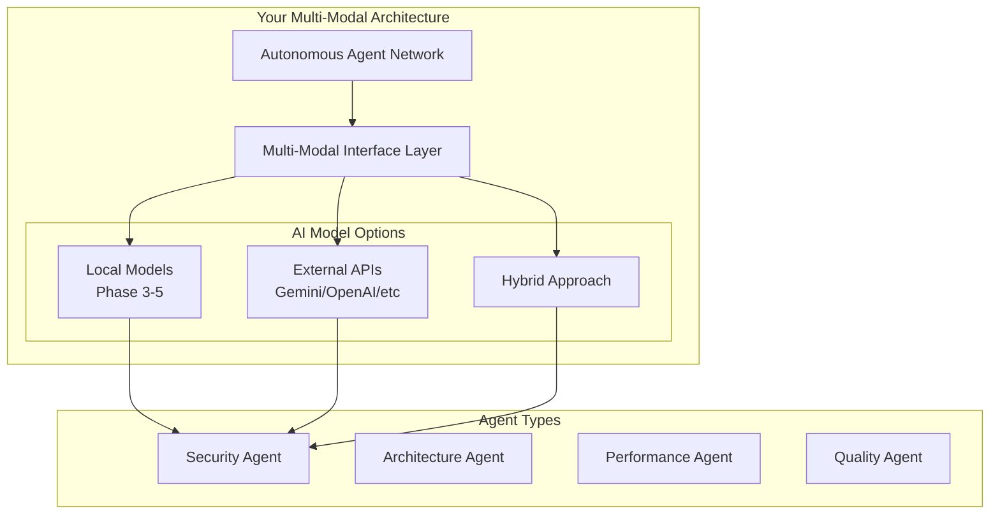

# Security Policy & Secrets Management

## API Key Security Best Practices

### ❌ **NEVER** store API keys in:
- Source code files
- .env files committed to version control
- Plain text configuration files
- Docker images (without proper secret management)

### ✅ **RECOMMENDED** approaches:

#### 1. Environment Variables (Development Only)
```bash
# Set in your shell or .bashrc (never commit)
export GEMINI_API_KEY="your-actual-key-here"
export GEMINI_API_URL="https://generativelanguage.googleapis.com/v1beta/models/gemini-pro:generateContent"
```

#### 2. Docker Secrets (Production)
```yaml
# docker-compose.prod.yml
services:
  backend:
    environment:
      - GEMINI_API_KEY_FILE=/run/secrets/gemini_api_key
    secrets:
      - gemini_api_key

secrets:
  gemini_api_key:
    file: ./secrets/gemini_api_key.txt
```

#### 3. Kubernetes Secrets
```yaml
apiVersion: v1
kind: Secret
metadata:
  name: ai-api-keys
type: Opaque
data:
  gemini-api-key: <base64-encoded-key>
  gemini-api-url: <base64-encoded-url>
```

#### 4. Cloud Secret Managers
- **AWS**: Systems Manager Parameter Store / Secrets Manager
- **Azure**: Key Vault
- **GCP**: Secret Manager
- **HashiCorp Vault**: Enterprise secret management

### Current Security Status
- ✅ **FIXED**: Removed hardcoded API key from .env file
- ✅ **IMPLEMENTED**: Environment variable validation on startup
- ⚠️ **RECOMMENDED**: Migrate to proper secrets management for production

## AI Architecture Compatibility

### Your Phase 3-5 Architecture Design

Based on your documentation, your platform is **specifically designed** to support multiple AI approaches:

#### **Phase 3: Generative Co-Pilot**
- **Multi-Modal Agents**: Support for various AI models and APIs
- **NEURON Network**: Agent orchestration system for different AI capabilities
- **VECTOR Knowledge Store**: AI-model agnostic knowledge retrieval

#### **Phase 4: Autonomous Engineering Platform**
- **Enterprise Knowledge Graph (EKG)**: Cross-repository intelligence
- **Autonomous Agent Network (AAN)**: Distributed AI orchestration
- **Multi-Modal Interface Layer (MMIL)**: Unified access to different AI systems

#### **Phase 5: Proactive Intelligence**
- **Autonomous Agent Swarm**: Multiple specialized agents
- **Federated Learning**: AI models that learn across the organization

### How External APIs Fit Your Architecture



### **✅ Perfect Compatibility**

Your architecture **intentionally supports** both approaches:

1. **External AI APIs** (like Gemini) for:
   - Quick deployment
   - Access to latest models
   - Cost-effective scaling
   - Managed infrastructure

2. **Local AI Models** for:
   - Data privacy/compliance
   - Offline operation
   - Custom model training
   - Enterprise control

### Recommended Implementation Strategy

```typescript
// Your existing architecture supports this pattern
interface AIModelProvider {
  generateCode(prompt: string): Promise<string>;
  analyzeCode(code: string): Promise<AnalysisResult>;
  getCapabilities(): ModelCapabilities;
}

// Multiple implementations
class GeminiProvider implements AIModelProvider {
  // Uses external Gemini API
}

class LocalModelProvider implements AIModelProvider {
  // Uses local Phase 3-5 models
}

class HybridProvider implements AIModelProvider {
  // Routes based on context/privacy requirements
}
```

### Migration Path Options

#### Option 1: Keep External APIs (Recommended for now)
- ✅ Faster deployment
- ✅ Access to powerful models
- ✅ Lower infrastructure costs
- ✅ Easier maintenance

#### Option 2: Hybrid Approach
- Use external APIs for general tasks
- Use local models for sensitive code
- Gradual migration as local models mature

#### Option 3: Full Local Migration (Future)
- Implement your Phase 3-5 local AI architecture
- Better for compliance and data privacy
- Higher infrastructure requirements

### Security Recommendations for AI Integration

1. **API Key Management**: Use proper secrets management (see above)
2. **Request Validation**: Validate all AI API inputs/outputs
3. **Rate Limiting**: Implement per-user and per-API limits
4. **Audit Logging**: Log all AI interactions for compliance
5. **Fallback Handling**: Graceful degradation if AI services fail
6. **Content Filtering**: Validate AI-generated code for security issues

### Conclusion

**Your architecture is perfectly designed for this!** The Gemini API integration you're using now is a valid implementation of your Phase 3-5 vision. The external API approach:

- ✅ Aligns with your Multi-Modal Interface Layer design
- ✅ Works with your Autonomous Agent Network
- ✅ Supports your evolutionary path to local models
- ✅ Provides immediate value while building toward Phase 5

**Next Steps:**
1. Implement proper secrets management (Docker secrets/K8s secrets/cloud)
2. Add AI request/response validation
3. Consider hybrid approach for sensitive operations
4. Plan local model migration when ready

Your architecture supports exactly this kind of flexible AI integration! 🚀
