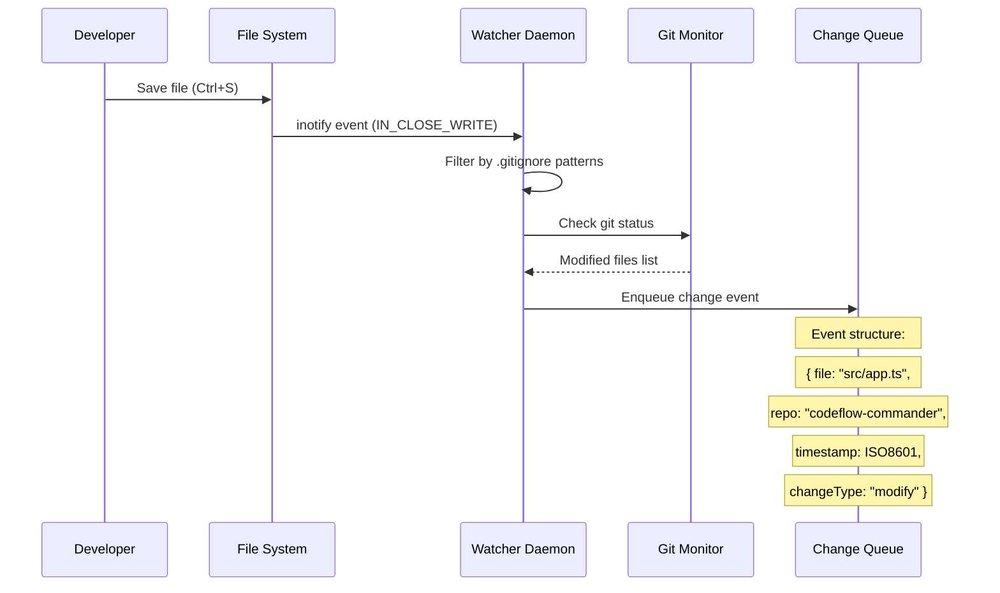
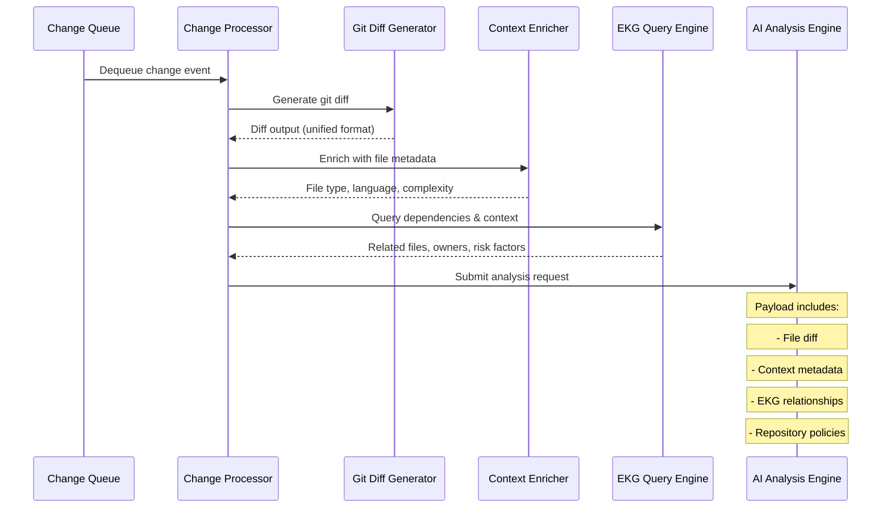
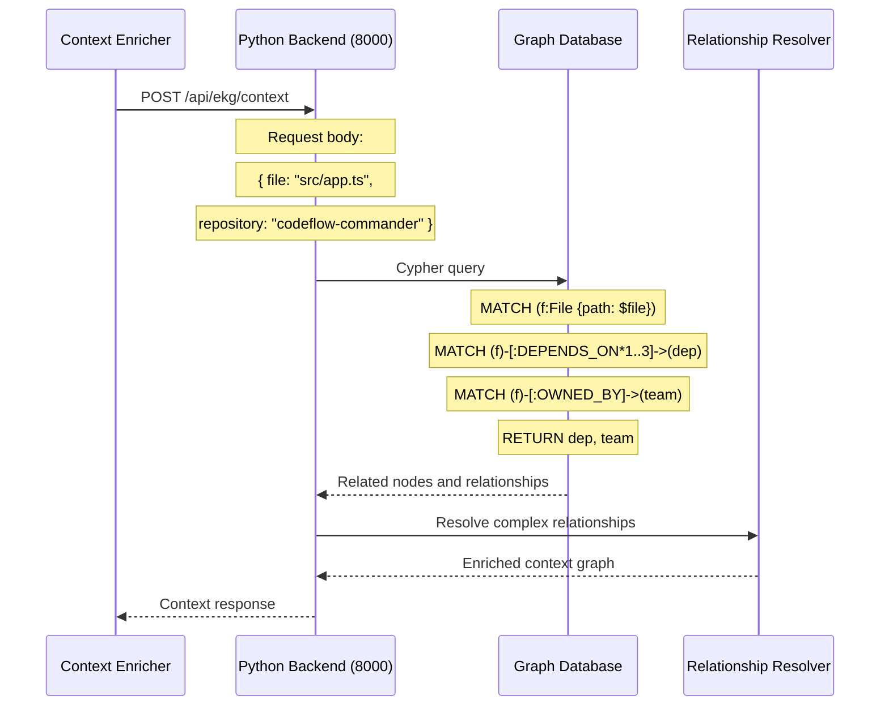
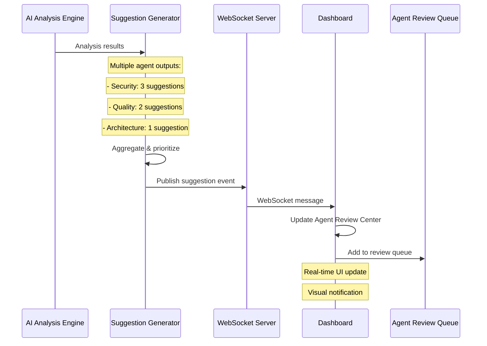
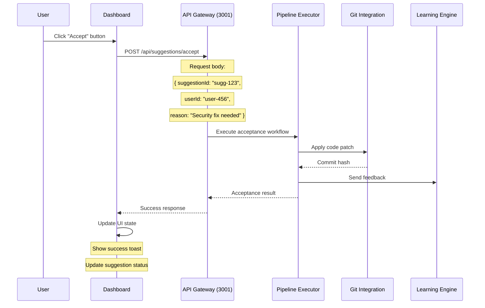
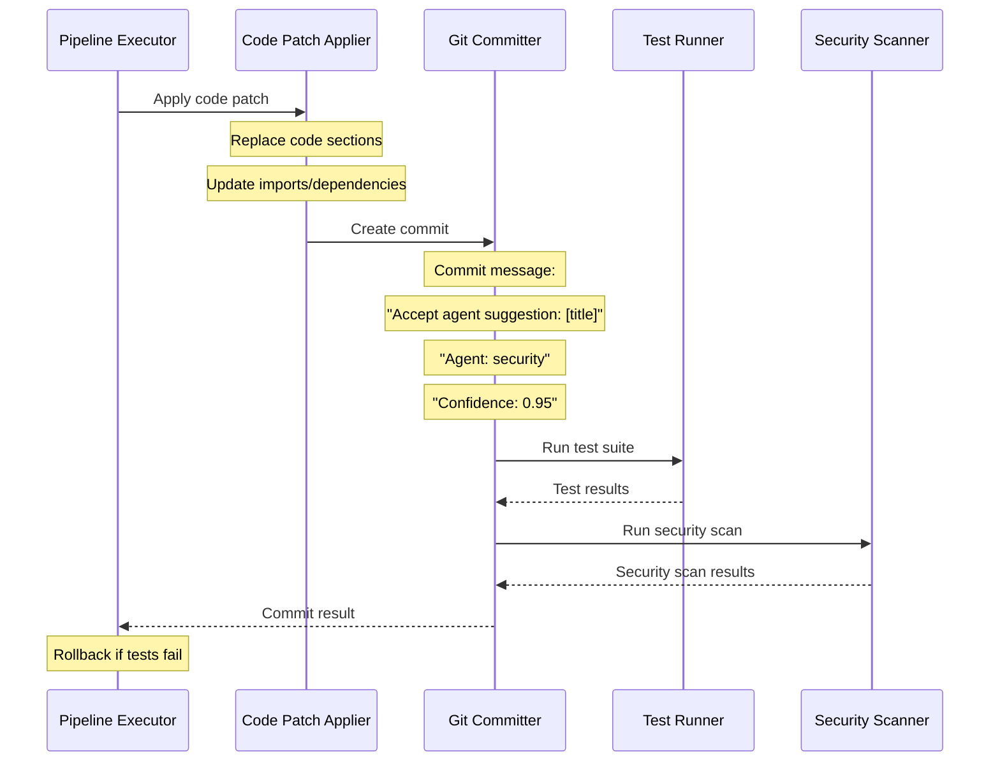
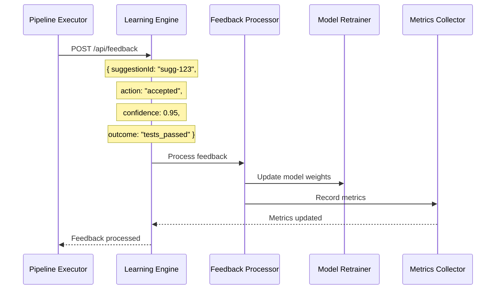

# Codeflow Commander - Workflow Specification

## Overview

This document defines the complete data lifecycle and user interaction workflows for Codeflow Commander. It describes how code changes trigger the entire system, from file detection to suggestion acceptance, and the technical implementation of user actions.

## Table of Contents

1. [Happy Path - Code Change Lifecycle](#happy-path---code-change-lifecycle)
2. [Action Path - Suggestion Acceptance](#action-path---suggestion-acceptance)
3. [Error Handling & Edge Cases](#error-handling--edge-cases)
4. [API Contracts](#api-contracts)
5. [Performance Considerations](#performance-considerations)

## Happy Path - Code Change Lifecycle

### Step 1: Developer Saves File (Daemon Detection)

**Trigger**: File system event (inotify on Linux, FSEvents on macOS)

**Components Involved**:
- File System Watcher Daemon
- Git Status Monitor
- Change Queue Manager

**Technical Flow**:



**Data Structure**:
```typescript
interface ChangeEvent {
  id: string;                    // UUID v4
  file: string;                  // Relative path from repo root
  repository: string;            // Repository name
  changeType: 'modify' | 'create' | 'delete';
  timestamp: string;             // ISO 8601
  gitStatus: 'modified' | 'untracked' | 'new';
  fileSize: number;              // Bytes
  checksum: string;              // SHA-256 of file content
}
```

### Step 2: Logic for analyze-diff

**Trigger**: Change event processed from queue

**Components Involved**:
- Change Processor
- Git Diff Generator
- Context Enricher
- EKG Query Engine

**Technical Flow**:



**Git Diff Generation**:
```bash
# Command executed
git diff HEAD --unified=3 -- src/app.ts

# Result structure
interface GitDiff {
  file: string;
  hunks: DiffHunk[];
  additions: number;
  deletions: number;
}

interface DiffHunk {
  oldStart: number;
  oldLines: number;
  newStart: number;
  newLines: number;
  lines: string[];  // Unified diff lines
}
```

**Context Enrichment**:
```typescript
interface ContextMetadata {
  fileType: 'source' | 'test' | 'config' | 'docs';
  language: 'typescript' | 'javascript' | 'python' | 'go' | 'rust';
  complexity: 'low' | 'medium' | 'high' | 'critical';
  lastModified: string;           // ISO 8601
  authors: string[];              // Recent contributors
  testCoverage: number;           // Percentage
  securityLevel: 'public' | 'internal' | 'restricted';
}
```

### Step 3: EKG (Graph DB) Context Query

**Trigger**: Context enrichment phase

**Components Involved**:
- Python FastAPI Backend (Port 8000)
- Neo4j Graph Database
- Relationship Resolver

**Technical Flow**:



**GraphQL Query Structure**:
```graphql
query GetFileContext($filePath: String!, $repository: String!) {
  file(path: $filePath, repository: $repository) {
    id
    path
    dependencies {
      target {
        path
        type
        criticality
      }
      type
      version
    }
    owners {
      team {
        name
        members
      }
      responsibility
    }
    riskFactors {
      securityLevel
      testCoverage
      lastModified
    }
  }
}
```

### Step 4: Suggestion Push to Frontend

**Trigger**: AI analysis completes

**Components Involved**:
- AI Analysis Engine
- Suggestion Generator
- WebSocket Server
- Frontend Dashboard

**Technical Flow**:



**WebSocket Message Structure**:
```typescript
interface SuggestionEvent {
  type: 'NEW_SUGGESTION';
  suggestion: AgentSuggestion;
  timestamp: string;
  priority: 'high' | 'medium' | 'low';
}

interface AgentSuggestion {
  id: string;
  repositoryId: string;
  agentType: 'security' | 'quality' | 'architecture' | 'performance';
  title: string;
  description: string;
  severity: 'critical' | 'high' | 'medium' | 'low';
  confidence: number;  // 0.0 to 1.0
  status: 'pending' | 'accepted' | 'rejected';
  codePatch: CodePatch;
  reasoning: string;
  validationResults: ValidationResults;
  createdAt: string;
  reviewedBy?: string;
}
```

## Action Path - Suggestion Acceptance

### Step 1: User Clicks "Accept" in Dashboard

**Trigger**: User interaction in Agent Review Center

**Components Involved**:
- Frontend Dashboard
- API Gateway
- Pipeline Executor
- Git Integration

**Technical Flow**:



**Acceptance API Contract**:
```http
POST /api/suggestions/accept
Content-Type: application/json
Authorization: Bearer <JWT_TOKEN>

{
  "suggestionId": "sugg-123",
  "userId": "user-456", 
  "reason": "Security vulnerability fix",
  "autoCommit": true,
  "createPR": false
}

Response: 200 OK
{
  "status": "accepted",
  "commitHash": "abc123def456",
  "message": "Suggestion applied successfully"
}
```

### Step 2: Code Patch Application

**Trigger**: Acceptance workflow execution

**Components Involved**:
- Code Patch Applier
- Git Committer
- Test Runner
- Security Scanner

**Technical Flow**:



**Code Patch Structure**:
```typescript
interface CodePatch {
  file: string;                    // Target file path
  lineStart: number;               // Start line (1-based)
  lineEnd: number;                 // End line (1-based)
  originalCode: string;            // Code to replace
  suggestedCode: string;           // New code
  language: string;                // Programming language
  patchType: 'replace' | 'insert' | 'delete';
  dependencies?: DependencyUpdate[];
}

interface DependencyUpdate {
  package: string;
  currentVersion: string;
  targetVersion: string;
  updateType: 'patch' | 'minor' | 'major';
}
```

### Step 3: Learning Engine Feedback

**Trigger**: Suggestion acceptance/rejection

**Components Involved**:
- Learning Engine
- Feedback Processor
- Model Retrainer
- Metrics Collector

**Technical Flow**:



**Feedback API Contract**:
```http
POST /api/agent-feedback
Content-Type: application/json
Authorization: Bearer <JWT_TOKEN>

{
  "suggestionId": "sugg-123",
  "agentType": "security",
  "action": "accepted",  // "accepted" | "rejected"
  "confidence": 0.95,
  "reason": "Security vulnerability fix",
  "outcome": "tests_passed",  // "tests_passed" | "tests_failed" | "security_improved"
  "userId": "user-456",
  "timestamp": "2025-01-15T13:30:00Z"
}
```

## Error Handling & Edge Cases

### File System Errors

**Scenario**: File watcher fails to detect changes
**Recovery Strategy**:
1. Fallback to periodic polling (30-second intervals)
2. Manual trigger via CLI command
3. Health check alerts to monitoring system

### Git Integration Errors

**Scenario**: Git diff generation fails
**Recovery Strategy**:
1. Retry with exponential backoff (1s, 2s, 4s, 8s)
2. Fallback to file content comparison
3. Skip analysis with error logging

### AI Analysis Failures

**Scenario**: AI service timeout or error
**Recovery Strategy**:
1. Circuit breaker pattern (fail fast after 3 consecutive failures)
2. Fallback to rule-based analysis
3. Queue for retry with exponential backoff

### Database Connection Issues

**Scenario**: EKG database unavailable
**Recovery Strategy**:
1. Cache recent queries for 5 minutes
2. Fallback to local dependency analysis
3. Graceful degradation (partial context)

## API Contracts

### Change Detection API

```http
POST /api/changes/detect
Content-Type: application/json

{
  "file": "src/app.ts",
  "repository": "codeflow-commander",
  "changeType": "modify",
  "timestamp": "2025-01-15T13:30:00Z",
  "gitStatus": "modified"
}

Response: 202 Accepted
{
  "changeId": "change-abc123",
  "status": "queued",
  "estimatedProcessingTime": 30
}
```

### Analysis Results API

```http
GET /api/analysis/results/{changeId}
Authorization: Bearer <JWT_TOKEN>

Response: 200 OK
{
  "changeId": "change-abc123",
  "status": "completed",
  "suggestions": [
    {
      "id": "sugg-123",
      "agentType": "security",
      "title": "SQL Injection vulnerability",
      "description": "User input not properly sanitized",
      "severity": "high",
      "confidence": 0.95,
      "codePatch": { /* ... */ }
    }
  ],
  "processingTime": 25000
}
```

### Suggestion Management API

```http
POST /api/suggestions/{suggestionId}/action
Content-Type: application/json
Authorization: Bearer <JWT_TOKEN>

{
  "action": "accept",  // "accept" | "reject"
  "userId": "user-456",
  "reason": "Security fix required",
  "autoCommit": true
}

Response: 200 OK
{
  "suggestionId": "sugg-123",
  "action": "accepted",
  "commitHash": "abc123def456",
  "message": "Suggestion applied successfully"
}
```

## Performance Considerations

### Scalability Targets

- **File Watcher**: Handle 1000+ files per repository
- **Analysis Engine**: Process 100 concurrent changes
- **Database**: Support 1M+ nodes and 10M+ relationships
- **API Response**: <200ms for 95% of requests

### Caching Strategy

1. **File Metadata Cache**: 5-minute TTL for file properties
2. **Git Status Cache**: 30-second TTL for repository status
3. **EKG Query Cache**: 2-minute TTL for relationship queries
4. **AI Response Cache**: 10-minute TTL for similar code patterns

### Rate Limiting

- **Change Detection**: 100 changes/minute per repository
- **Analysis Requests**: 10 concurrent analyses per user
- **Suggestion Actions**: 50 actions/minute per user
- **EKG Queries**: 200 queries/minute per IP

### Monitoring & Observability

**Key Metrics**:
- Change detection latency
- Analysis completion rate
- Suggestion acceptance rate
- EKG query response time
- API error rates

**Alerting**:
- File watcher downtime > 1 minute
- Analysis failure rate > 5%
- API response time > 1 second
- Database connection failures > 3

This workflow specification provides the complete technical blueprint for implementing the Codeflow Commander nervous system, ensuring reliable and scalable operation across all user interactions and system events.