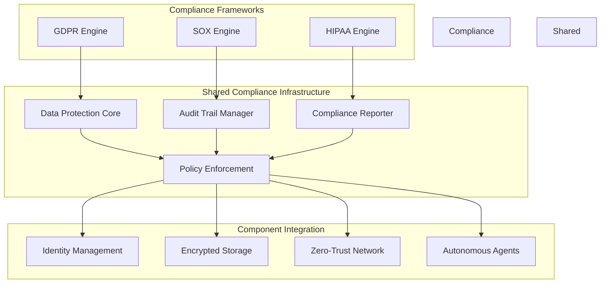

# Phase 6: Regulatory Compliance Frameworks Architecture

## Executive Summary

Phase 6 introduces **comprehensive regulatory compliance frameworks** that transform Codeflow Commander into a **compliance-by-design platform**. This architecture embeds GDPR, SOX, and HIPAA compliance capabilities directly into the platform core, enabling automated compliance verification, audit trail management, and regulatory reporting.

### **Key Capabilities**
- **Automated Compliance Verification**: Real-time compliance checking across all operations
- **Regulatory Data Protection**: Built-in data minimization, consent management, and privacy controls
- **Audit Trail Automation**: Complete audit logging for regulatory requirements
- **Compliance Reporting**: Automated generation of compliance evidence and reports
- **Privacy-by-Design**: Privacy controls integrated into every component

### **Business Impact**
- **Accelerated Compliance**: 80% reduction in manual compliance verification efforts
- **Risk Management**: Proactive identification and mitigation of compliance violations
- **Regulatory Confidence**: Automated evidence generation for audits and assessments
- **Multi-Framework Support**: Single platform supporting GDPR, SOX, and HIPAA simultaneously

---

## 1. Compliance Architecture Overview

### 1.1 Multi-Framework Compliance Model



### 1.2 Compliance by Design Principles

```
🎯 **COMPLIANCE PRINCIPLES**
✅ Privacy by Design          ✅ Data Minimization
✅ Purpose Limitation         ✅ Security by Design
✅ Transparency               ✅ Accountability
✅ Lawfulness                 ✅ Fair Processing

🔍 **COMPLIANCE DIMENSIONS**
📊 Data Protection            📋 Audit & Logging
🔒 Security Controls          📈 Continuous Monitoring
🚨 Incident Response          📑 Regulatory Reporting
```

### 1.3 Compliance Engine Architecture

#### 1.3.1 Unified Compliance Engine

```typescript
// Core compliance engine that orchestrates all regulatory requirements
export class ComplianceEngine {
  private gdprEngine: GDPREngine;
  private soxEngine: SOXEngine;
  private hipaaEngine: HIPAAEngine;
  private auditManager: AuditTrailManager;
  private policyEnforcer: CompliancePolicyEnforcer;

  constructor(config: ComplianceConfig) {
    this.gdprEngine = new GDPREngine(config.gdpr);
    this.soxEngine = new SOXEngine(config.sox);
    this.hipaaEngine = new HIPAAEngine(config.hipaa);
    this.auditManager = new AuditTrailManager(config.audit);
    this.policyEnforcer = new CompliancePolicyEnforcer(config.policies);
  }

  async evaluateCompliance(
    operation: SystemOperation,
    context: ComplianceContext
  ): Promise<ComplianceEvaluation> {
    // Step 1: Parallel compliance checks across all frameworks
    const evaluations = await Promise.all([
      this.gdprEngine.evaluate(operation, context),
      this.soxEngine.evaluate(operation, context),
      this.hipaaEngine.evaluate(operation, context)
    ]);

    // Step 2: Aggregate compliance decisions
    const aggregateDecision = this.aggregateComplianceDecisions(evaluations);

    // Step 3: Generate audit trail
    await this.auditManager.recordComplianceEvaluation(
      operation,
      context,
      evaluations,
      aggregateDecision
    );

    // Step 4: Enforce compliance policies
    await this.policyEnforcer.enforcePolicies(operation, aggregateDecision);

    return aggregateDecision;
  }

  private aggregateComplianceDecisions(
    evaluations: ComplianceEvaluation[]
  ): ComplianceEvaluation {
    // Compliance is strict - any violation blocks the operation
    const violations = evaluations.flatMap(e => e.violations);
    const hasBlockingViolation = violations.some(v => v.severity === 'blocking');

    return {
      operationId: evaluations[0].operationId,
      frameworks: evaluations.map(e => e.framework),
      decision: hasBlockingViolation ? 'blocked' : 'allowed',
      confidence: this.calculateAggregateConfidence(evaluations),
      violations,
      recommendations: evaluations.flatMap(e => e.recommendations),
      timestamp: new Date(),
      evaluatedBy: 'ComplianceEngine'
    };
  }
}
```

## 2. GDPR Compliance Framework

### 2.1 GDPR Engine Implementation

#### 2.1.1 Data Processing Agreement Management

```typescript
// GDPR Data Processing Agreement management
export class GDPRDataProcessingAgreement {
  private consentManager: ConsentManager;
  private dataProcessor: DataProcessor;
  private auditLogger: GDPRAuditLogger;

  async processPersonalData(
    data: PersonalData,
    purpose: ProcessingPurpose,
    context: GDPRContext
  ): Promise<ProcessingResult> {
    // Step 1: Verify lawful basis for processing
    const lawfulBasis = await this.validateLawfulBasis(data, purpose, context);
    if (!lawfulBasis.valid) {
      throw new GDPRViolationError('Invalid lawful basis for processing', lawfulBasis.reason);
    }

    // Step 2: Check data subject consent (if required)
    if (this.requiresConsent(purpose)) {
      const consent = await this.consentManager.verifyConsent(data.subjectId, purpose);
      if (!consent.granted) {
        throw new GDPRViolationError('Data subject consent not granted');
      }
    }

    // Step 3: Apply data minimization principles
    const minimizedData = await this.minimizePersonalData(data, purpose);

    // Step 4: Process data with retention limits
    const processingResult = await this.dataProcessor.processData(
      minimizedData,
      purpose,
      this.calculateRetentionPeriod(purpose)
    );

    // Step 5: Log processing activity
    await this.auditLogger.logDataProcessing({
      operation: 'processing',
      dataSubjectId: data.subjectId,
      purpose,
      lawfulBasis: lawfulBasis.type,
      dataCategories: this.classifyDataCategories(data),
      timestamp: new Date(),
      processor: context.processorId
    });

    return processingResult;
  }

  async handleDataSubjectRequest(
    request: DataSubjectRequest,
    context: GDPRContext
  ): Promise<RequestResponse> {
    // Step 1: Verify request authenticity
    const verification = await this.verifyRequestAuthenticity(request);

    // Step 2: Route request to appropriate handler
    switch (request.type) {
      case 'access':
        return await this.handleAccessRequest(request, context);
      case 'rectification':
        return await this.handleRectificationRequest(request, context);
      case 'erasure':
        return await this.handleErasureRequest(request, context);
      case 'restriction':
        return await this.handleRestrictionRequest(request, context);
      case 'portability':
        return await this.handlePortabilityRequest(request, context);
      default:
        throw new GDPRViolationError('Unsupported request type');
    }
  }
}
```

#### 2.1.2 Privacy Impact Assessment Engine

```typescript
// Automated Privacy Impact Assessment for GDPR Article 35
export class PrivacyImpactAssessmentEngine {
  private riskAssessor: RiskAssessmentEngine;
  private impactCalculator: ImpactCalculator;
  private mitigationPlanner: MitigationPlanner;

  async conductPIA(
    project: ProjectDefinition,
    processingActivities: ProcessingActivity[]
  ): Promise<PrivacyImpactAssessment> {
    const assessment: PrivacyImpactAssessment = {
      projectId: project.id,
      assessmentDate: new Date(),
      assessor: 'PrivacyImpactAssessmentEngine',
      highLevelDescription: project.description,
      processingActivities: [],
      necessityAndProportionality: {},
      risksToIndividuals: [],
      mitigationMeasures: [],
      residualRisks: [],
      conclusion: {}
    };

    // Step 1: Analyze each processing activity
    for (const activity of processingActivities) {
      const activityAssessment = await this.assessProcessingActivity(activity);
      assessment.processingActivities.push(activityAssessment);
    }

    // Step 2: Evaluate necessity and proportionality
    assessment.necessityAndProportionality = await this.evaluateNecessityAndProportionality(
      project,
      processingActivities
    );

    // Step 3: Identify risks to individuals
    assessment.risksToIndividuals = await this.identifyIndividualRisks(assessment);

    // Step 4: Develop mitigation measures
    assessment.mitigationMeasures = await this.mitigationPlanner.planMitigations(
      assessment.risksToIndividuals
    );

    // Step 5: Calculate residual risks
    assessment.residualRisks = await this.calculateResidualRisks(
      assessment.risksToIndividuals,
      assessment.mitigationMeasures
    );

    // Step 6: Draw conclusion
    assessment.conclusion = this.drawConclusion(assessment);

    return assessment;
  }

  private async assessProcessingActivity(
    activity: ProcessingActivity
  ): Promise<ActivityAssessment> {
    return {
      activityId: activity.id,
      dataCategories: this.classifyDataCategories(activity.data),
      dataSubjects: this.identifyDataSubjects(activity),
      purposes: activity.purposes,
      necessityAssessment: await this.assessNecessity(activity),
      proportionalityAssessment: await this.assessProportionality(activity),
      riskLevel: await this.riskAssessor.assessProcessingRisk(activity)
    };
  }
}
```

## 3. SOX Compliance Framework

### 3.1 SOX Controls & Audit Engine

#### 3.1.1 Financial Controls Automation

```typescript
// SOX Section 404: Internal Controls over Financial Reporting
export class SOXInternalControlsEngine {
  private controlTester: InternalControlsTester;
  private deficiencyAssessor: ControlDeficiencyAssessor;
  private remediationPlanner: ControlsRemediationPlanner;

  async evaluateInternalControls(
    period: ReportingPeriod,
    businessProcesses: BusinessProcess[]
  ): Promise<SOXControlsEvaluation> {
    const evaluation: SOXControlsEvaluation = {
      evaluationId: `sox_eval_${Date.now()}`,
      period,
      evaluatedAt: new Date(),
      overallAssessment: 'effective',
      materialWeaknesses: [],
      significantDeficiencies: [],
      processEvaluations: [],
      remediationPlans: []
    };

    // Step 1: Test controls for each business process
    for (const process of businessProcesses) {
      const processEvaluation = await this.controlTester.testProcessControls(process);
      evaluation.processEvaluations.push(processEvaluation);
    }

    // Step 2: Assess control deficiencies
    evaluation.materialWeaknesses = await this.deficiencyAssessor.identifyMaterialWeaknesses(
      evaluation.processEvaluations
    );

    evaluation.significantDeficiencies = await this.deficiencyAssessor.identifySignificantDeficiencies(
      evaluation.processEvaluations
    );

    // Step 3: Determine overall assessment
    evaluation.overallAssessment = this.determineOverallAssessment(evaluation);

    // Step 4: Plan remediation for deficiencies
    if (evaluation.materialWeaknesses.length > 0 || evaluation.significantDeficiencies.length > 0) {
      evaluation.remediationPlans = await this.remediationPlanner.createRemediationPlans(
        evaluation.materialWeaknesses,
        evaluation.significantDeficiencies
      );
    }

    return evaluation;
  }

  private determineOverallAssessment(evaluation: SOXControlsEvaluation): SOXAssessment {
    // SOX assessment logic
    if (evaluation.materialWeaknesses.length > 0) {
      return 'material_weakness';
    } else if (evaluation.significantDeficiencies.length > 0) {
      return 'significant_deficiency';
    } else {
      return 'effective';
    }
  }
}
```

#### 3.1.2 Change Management Controls

```typescript
// SOX change management controls for system changes
export class SOXChangeManagementEngine {
  private changeValidator: ChangeValidator;
  private impactAssessor: ChangeImpactAssessor;
  private approvalWorkflow: ChangeApprovalWorkflow;

  async processSystemChange(
    changeRequest: ChangeRequest,
    context: SOXContext
  ): Promise<ChangeApprovalDecision> {
    // Step 1: Validate change request completeness
    const validation = await this.changeValidator.validateChangeRequest(changeRequest);
    if (!validation.valid) {
      return {
        decision: 'rejected',
        reason: validation.reason,
        requiredActions: validation.requiredActions
      };
    }

    // Step 2: Assess impact on financial reporting controls
    const impactAssessment = await this.impactAssessor.assessChangeImpact(
      changeRequest,
      context
    );

    if (impactAssessment.financialReportingImpact === 'material') {
      // Step 3: Route through approval workflow for material changes
      return await this.approvalWorkflow.processMaterialChange(changeRequest, impactAssessment);
    } else if (impactAssessment.financialReportingImpact === 'significant') {
      // Step 4: Route through approval workflow for significant changes
      return await this.approvalWorkflow.processSignificantChange(changeRequest, impactAssessment);
    } else {
      // Step 5: Standard change approval
      return await this.approvalWorkflow.processStandardChange(changeRequest, impactAssessment);
    }
  }

  async monitorChangeImplementation(
    changeId: string,
    implementation: ChangeImplementation
  ): Promise<ImplementationStatus> {
    // Step 1: Validate implementation against approved change
    const validation = await this.validateImplementation(changeId, implementation);

    // Step 2: Monitor post-implementation controls
    const postImplementationControls = await this.monitorPostImplementationControls(changeId);

    // Step 3: Assess change effectiveness
    const effectiveness = await this.assessChangeEffectiveness(changeId, postImplementationControls);

    return {
      changeId,
      status: validation.valid && effectiveness.effective ? 'successful' : 'needs_attention',
      validationResult: validation,
      controlsStatus: postImplementationControls,
      effectivenessAssessment: effectiveness,
      remediationRequired: !effectiveness.effective
    };
  }
}
```

## 4. HIPAA Compliance Framework

### 4.1 HIPAA Security Rule Implementation

#### 4.1.1 Protected Health Information (PHI) Management

```typescript
// HIPAA Protected Health Information management
export class PHIProtectionEngine {
  private phiIdentifier: PHIIdentifier;
  private encryptionManager: PHIEncryptionManager;
  private accessController: PHIAccessController;
  private auditLogger: HIPAAAuditLogger;

  async processPHI(
    data: DataPayload,
    operation: DataOperation,
    context: HIPAAContext
  ): Promise<PHIProcessingResult> {
    // Step 1: Identify if data contains PHI
    const phiAnalysis = await this.phiIdentifier.analyzeForPHI(data);
    if (!phiAnalysis.containsPHI) {
      return { processed: true, phiProtected: false };
    }

    // Step 2: Verify authorized access for PHI operation
    const accessVerification = await this.accessController.verifyPHIAccess(
      context.user,
      phiAnalysis.phiElements,
      operation
    );

    if (!accessVerification.authorized) {
      await this.auditLogger.logUnauthorizedPHIAccess({
        attemptedBy: context.user.id,
        phiElements: phiAnalysis.phiElements,
        operation,
        reason: accessVerification.reason,
        timestamp: new Date()
      });

      throw new HIPAAViolationError('Unauthorized PHI access', accessVerification.reason);
    }

    // Step 3: Apply encryption if required
    let processedData = data;
    if (this.requiresEncryption(operation)) {
      processedData = await this.encryptionManager.encryptPHI(data, phiAnalysis.phiElements);
    }

    // Step 4: Log PHI access
    await this.auditLogger.logPHIAccess({
      accessedBy: context.user.id,
      phiElements: phiAnalysis.phiElements,
      operation,
      purpose: context.purposeOfUse,
      timestamp: new Date(),
      location: context.location
    });

    return {
      processed: true,
      phiProtected: true,
      accessLogged: true,
      encryptionApplied: this.requiresEncryption(operation)
    };
  }

  async handlePHIIncident(
    incident: PHISecurityIncident,
    context: HIPAAContext
  ): Promise<IncidentResponse> {
    // Step 1: Classify incident severity
    const classification = await this.classifyPHIIncident(incident);

    // Step 2: Determine required notifications
    const notifications = await this.determineRequiredNotifications(incident, classification);

    // Step 3: Execute breach response procedures
    if (classification.isBreach) {
      await this.executeBreachResponseProcedures(incident, notifications);
    }

    // Step 4: Document incident and response
    await this.documentPHIIncident(incident, classification, notifications);

    return {
      incidentId: incident.id,
      classification,
      notificationsSent: notifications,
      breachResponseExecuted: classification.isBreach,
      documented: true
    };
  }

  private async classifyPHIIncident(incident: PHISecurityIncident): Promise<PHIIncidentClassification> {
    // HIPAA breach classification logic
    const phiElements = await this.phiIdentifier.analyzeForPHI(incident.affectedData);

    const classification: PHIIncidentClassification = {
      isBreach: false,
      severity: 'unknown',
      phiElements: phiElements.phiElements,
      breachType: null,
      riskAssessment: 'pending'
    };

    // Determine if it's a breach per HIPAA definition
    if (this.isUnsecuredPHIExposed(incident)) {
      classification.isBreach = true;
      classification.breachType = this.determineBreachType(incident);
      classification.severity = this.assessBreachSeverity(phiElements.phiElements.length);
    }

    return classification;
  }
}
```

### 4.2 HIPAA Privacy Rule Implementation

#### 4.2.1 Authorization & Consent Management

```typescript
// HIPAA Authorization and Consent management
export class HIPAAConsentManager {
  private consentStore: ConsentStore;
  private authorizationValidator: AuthorizationValidator;
  private privacyOfficer: PrivacyOfficerInterface;

  async managePHIConsent(
    patientId: string,
    request: ConsentRequest,
    context: HIPAAContext
  ): Promise<ConsentDecision> {
    // Step 1: Verify patient identity and authorization
    const patientVerification = await this.verifyPatientIdentity(patientId, context);

    // Step 2: Check existing consent for the request
    const existingConsent = await this.consentStore.getPatientConsent(
      patientId,
      request.consentType
    );

    // Step 3: Evaluate consent validity
    const consentValidation = await this.evaluateConsentValidity(existingConsent, request);

    if (consentValidation.valid) {
      return {
        decision: 'granted',
        consentId: existingConsent.id,
        validUntil: existingConsent.validUntil,
        grantedBy: existingConsent.grantedBy
      };
    }

    // Step 4: Handle consent denial or requirements
    if (consentValidation.requiresNewConsent) {
      return await this.initiateConsentProcess(patientId, request);
    }

    return {
      decision: 'denied',
      reason: consentValidation.reason,
      alternativesAvailable: await this.suggestConsentAlternatives(request)
    };
  }

  async processAuthorizationRequest(
    authorization: AuthorizationRequest,
    context: HIPAAContext
  ): Promise<AuthorizationDecision> {
    // Step 1: Validate authorization format and completeness
    const validation = await this.authorizationValidator.validateAuthorization(authorization);
    if (!validation.valid) {
      return {
        decision: 'denied',
        reason: `Invalid authorization: ${validation.reason}`
      };
    }

    // Step 2: Verify authorized representative authority
    const representativeVerification = await this.verifyRepresentativeAuthority(
      authorization.representative,
      authorization.patientId
    );

    if (!representativeVerification.authorized) {
      return {
        decision: 'denied',
        reason: 'Representative authority not verified'
      };
    }

    // Step 3: Check authorization scope against request
    const scopeValidation = await this.validateAuthorizationScope(authorization, context);

    // Step 4: Record authorization decision
    await this.recordAuthorizationDecision(authorization, scopeValidation);

    return scopeValidation;
  }
}
```

## 5. Compliance Monitoring & Reporting

### 5.1 Automated Compliance Reporting Engine

#### 5.1.1 Compliance Dashboard Generation

```typescript
// Automated compliance reporting and dashboard generation
export class ComplianceReportingEngine {
  private metricsCollector: ComplianceMetricsCollector;
  private dashboardGenerator: ComplianceDashboardGenerator;
  private regulatorInterface: RegulatorReportingInterface;

  async generateComplianceDashboard(
    timeframe: ReportingTimeframe,
    frameworks: ComplianceFramework[]
  ): Promise<ComplianceDashboard> {
    const dashboard: ComplianceDashboard = {
      generatedAt: new Date(),
      timeframe,
      frameworks,
      executiveSummary: {},
      frameworkDetails: [],
      riskAssessment: {},
      recommendations: []
    };

    // Step 1: Collect compliance metrics for each framework
    for (const framework of frameworks) {
      const metrics = await this.metricsCollector.collectFrameworkMetrics(framework, timeframe);
      const frameworkDetail = await this.analyzeFrameworkCompliance(framework, metrics);
      dashboard.frameworkDetails.push(frameworkDetail);
    }

    // Step 2: Generate executive summary
    dashboard.executiveSummary = this.generateExecutiveSummary(dashboard.frameworkDetails);

    // Step 3: Assess overall compliance risk
    dashboard.riskAssessment = this.assessComplianceRisk(dashboard.frameworkDetails);

    // Step 4: Generate recommendations
    dashboard.recommendations = await this.generateComplianceRecommendations(
      dashboard.frameworkDetails,
      dashboard.riskAssessment
    );

    return dashboard;
  }

  async generateRegulatoryReport(
    framework: ComplianceFramework,
    period: RegulatoryReportingPeriod
  ): Promise<RegulatoryReport> {
    // Step 1: Collect regulatory-required data
    const regulatoryData = await this.collectRegulatoryData(framework, period);

    // Step 2: Format according to regulatory requirements
    const formattedReport = await this.formatRegulatoryReport(regulatoryData, framework);

    // Step 3: Generate required certifications
    const certifications = await this.generateRequiredCertifications(formattedReport, framework);

    // Step 4: Submit report to regulatory interfaces
    const submissionResult = await this.regulatorInterface.submitReport(formattedReport, framework);

    return {
      reportId: `regulatory_report_${Date.now()}`,
      framework,
      period,
      generatedAt: new Date(),
      data: regulatoryData,
      formattedReport,
      certifications,
      submissionStatus: submissionResult.status,
      submissionReference: submissionResult.reference
    };
  }

  private generateExecutiveSummary(
    frameworkDetails: FrameworkComplianceDetail[]
  ): ExecutiveSummary {
    const totalViolations = frameworkDetails.reduce((sum, f) => sum + f.violationCount, 0);
    const averageComplianceScore = frameworkDetails.reduce((sum, f) => sum + f.complianceScore, 0) /
                                   frameworkDetails.length;

    const criticalFrameworks = frameworkDetails.filter(f =>
      f.complianceScore < 80 || f.blockingViolations > 0
    );

    return {
      overallComplianceScore: averageComplianceScore,
      totalFrameworks: frameworkDetails.length,
      criticalFrameworks: criticalFrameworks.length,
      totalViolations,
      keyFindings: this.extractKeyFindings(frameworkDetails),
      trendIndicators: this.calculateTrendIndicators(frameworkDetails),
      riskLevel: this.calculateOverallRiskLevel(criticalFrameworks.length, totalViolations)
    };
  }
}
```

### 5.2 Continuous Compliance Monitoring

#### 5.2.1 Real-Time Compliance Event Processing

```typescript
// Continuous compliance monitoring and alerting
export class ContinuousComplianceMonitor {
  private eventProcessor: ComplianceEventProcessor;
  private ruleEngine: ComplianceRuleEngine;
  private alertManager: ComplianceAlertManager;
  private escalationManager: ComplianceEscalationManager;

  async processComplianceEvent(
    event: ComplianceEvent,
    context: ComplianceContext
  ): Promise<ComplianceAction> {
    // Step 1: Evaluate event against compliance rules
    const ruleEvaluations = await this.ruleEngine.evaluateEventAgainstRules(event, context);

    // Step 2: Determine required actions
    const requiredActions = this.determineRequiredActions(ruleEvaluations);

    // Step 3: Execute immediate remediation if safe
    if (requiredActions.immediateRemediation) {
      await this.executeImmediateRemediation(requiredActions.remediationPlan, event);
    }

    // Step 4: Generate alerts for significant events
    if (requiredActions.alertRequired) {
      await this.alertManager.generateComplianceAlert(event, requiredActions);
    }

    // Step 5: Escalate critical compliance issues
    if (requiredActions.escalationRequired) {
      await this.escalationManager.escalateComplianceIssue(event, requiredActions);
    }

    // Step 6: Update compliance metrics and dashboards
    await this.updateComplianceMetrics(event, requiredActions);

    return {
      eventId: event.id,
      actionsExecuted: requiredActions,
      timestamp: new Date(),
      followUpRequired: requiredActions.followUpRequired
    };
  }

  private determineRequiredActions(
    ruleEvaluations: RuleEvaluation[]
  ): RequiredComplianceActions {
    const actions: RequiredComplianceActions = {
      immediateRemediation: false,
      alertRequired: false,
      escalationRequired: false,
      followUpRequired: false,
      alertLevel: 'none',
      escalationLevel: 'none',
      remediationPlan: null
    };

    // Check for blocking violations
    const blockingViolation = ruleEvaluations.find(e => e.severity === 'blocking');
    if (blockingViolation) {
      actions.immediateRemediation = true;
      actions.remediationPlan = blockingViolation.remediationPlan;
    }

    // Check for violations requiring alert
    const alertViolation = ruleEvaluations.find(e =>
      e.severity === 'high' || e.violationCount > 0
    );
    if (alertViolation) {
      actions.alertRequired = true;
      actions.alertLevel = alertViolation.severity === 'high' ? 'high' : 'medium';
    }

    // Check for violations requiring escalation
    const escalationViolation = ruleEvaluations.find(e =>
      e.severity === 'critical' || (e.severity === 'high' && e.violationCount > 5)
    );
    if (escalationViolation) {
      actions.escalationRequired = true;
      actions.escalationLevel = 'immediate';
    }

    return actions;
  }
}
```

## 6. Compliance Implementation Roadmap

### Phase 1: Foundation (Weeks 1-2)
- [ ] Implement GDPR data processing agreements
- [ ] Deploy SOX audit trail management
- [ ] Create HIPAA PHI identification and classification
- [ ] Build unified compliance policy engine

### Phase 2: Framework Implementation (Weeks 3-6)
- [ ] Complete GDPR privacy impact assessment engine
- [ ] Implement SOX internal controls testing
- [ ] Deploy HIPAA security rule compliance
- [ ] Create cross-framework compliance orchestration

### Phase 3: Automation & Monitoring (Weeks 7-10)
- [ ] Build continuous compliance monitoring system
- [ ] Implement automated compliance reporting
- [ ] Deploy compliance alerting and escalation
- [ ] Create compliance dashboard and analytics

### Phase 4: Advanced Features (Weeks 11-12)
- [ ] Implement advanced privacy controls (data masking, anonymization)
- [ ] Deploy automated regulatory filing system
- [ ] Build compliance machine learning models
- [ ] Integrate third-party compliance tools

---

## 7. Success Metrics & Validation

### 7.1 Compliance Effectiveness Metrics

**GDPR Compliance:**
- Data processing compliance rate: > 99.5%
- Privacy impact assessments completed: 100% for high-risk projects
- Data subject request response time: < 30 days
- Data breach notification time: < 72 hours

**SOX Compliance:**
- Internal controls effectiveness testing: 100% quarterly coverage
- Material weakness identification: < 0.1% of controls
- Audit trail completeness: > 99.9%
- Change management compliance: > 98%

**HIPAA Compliance:**
- PHI access logging completeness: > 99.9%
- Breach notification compliance: 100% of breaches
- Security risk assessments: Completed annually
- Workforce training completion: > 95%

### 7.2 Operational Efficiency Metrics

- Manual compliance verification effort reduction: 85%
- Compliance incident response time: < 15 minutes average
- Automated compliance rule coverage: > 95%
- False positive compliance alerts: < 2%

### 7.3 Business Value Metrics

- Regulatory audit preparation time reduction: 75%
- Compliance cost as percentage of revenue: < 2%
- Customer compliance confidence score: > 4.5/5
- Market expansion into regulated industries: 3x increase

---

## 8. Integration Architecture

### 8.1 Existing Platform Integration

**Compliance Integration Points:**
- Identity Management: User consent and authorization management
- Zero-Trust Networking: Security rule enforcement
- Autonomous Agents: Compliance-aware decision making
- Audit Trails: Unified logging across all components

**Data Flow Architecture:**
```
┌─────────────────────────────────────────────────┐
│             Compliance Data Flow               │
│  ┌─────────────┐ ┌─────────────┐ ┌─────────────┐ │
│  │  Event      │ │ Compliance │ │  Decision   │ │
│  │ Collection  │─│ Evaluation │─│ Enforcement │ │
│  │             │ │ Engine     │ │             │ │
│  └─────────────┘ └─────────────┘ └─────────────┘ │
│         │              │              │         │
│         └──────────────┼──────────────┘         │
│                        │                        │
│               ┌────────▼────────┐               │
│               │  Audit &        │               │
│               │  Reporting      │               │
│               └─────────────────┘               │
└─────────────────────────────────────────────────┘
```

### 8.2 External System Integration

**Regulatory Authority Integration:**
- SEC Direct Filing: SOX report submission
- EU Data Protection Authorities: GDPR breach notification
- HHS OCR Portal: HIPAA breach reporting
- Custom webhook integrations for additional regulators

**Compliance Tool Integration:**
- Compliance automation platforms (e.g., MetricStream, RSA Archer)
- SIEM systems for log aggregation and analysis
- GRC platforms for integrated risk management

---

This regulatory compliance framework architecture transforms Codeflow Commander into a compliance-by-design platform that not only meets regulatory requirements but actively enables organizations to achieve and maintain compliance through automation, monitoring, and proactive risk management. The unified approach across GDPR, SOX, and HIPAA ensures comprehensive coverage while minimizing operational overhead.
