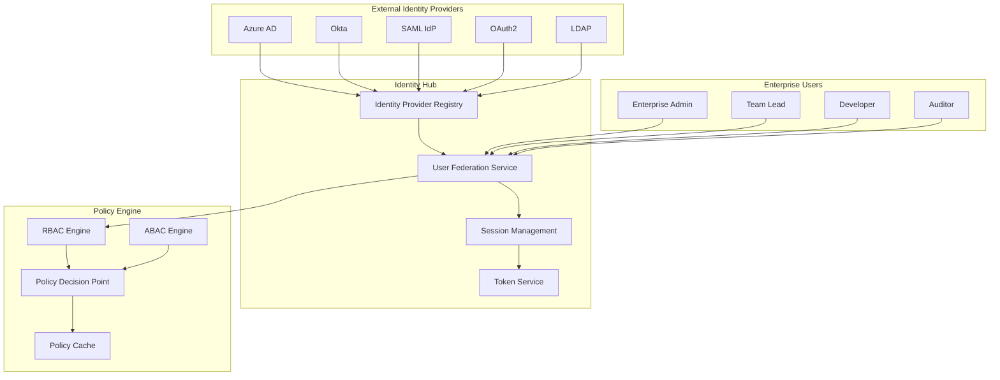

# Phase 6: Enterprise Identity Management Architecture

## Executive Summary

Phase 6 introduces **enterprise-grade identity and access management** to the Codeflow Commander platform, enabling secure multi-tenant operations across large organizations. This architecture transforms the platform from a single-team tool into an **enterprise-ready autonomous engineering platform**.

### **Key Capabilities**
- **Multi-Tenant Federation**: Support for hundreds of teams with isolated resources
- **Enterprise Authentication**: OAuth2, SAML, Azure AD, Okta, LDAP integration
- **Comprehensive RBAC**: Role-based and attribute-based access control
- **Audit & Compliance**: Complete audit trails for regulatory compliance
- **Zero-Trust Security**: Never trust, always verify across all operations

### **Business Impact**
- **Enterprise Scalability**: Support for 1000+ concurrent users across multiple organizations
- **Regulatory Compliance**: Built-in support for GDPR, SOX, HIPAA compliance
- **Security Assurance**: Zero-trust architecture preventing unauthorized access
- **Governance Control**: Centralized policy management with fine-grained permissions

---

## 1. Identity Management Architecture

### 1.1 Core Components Overview



### 1.2 Identity Provider Interface Architecture

#### 1.2.1 Enterprise Identity Provider Interface

```typescript
// Core identity provider abstraction
export interface EnterpriseIdentityProvider {
  // Identity provider metadata
  name: string;
  type: 'oauth2' | 'saml' | 'azure_ad' | 'okta' | 'ldap' | 'custom';
  version: string;
  capabilities: IdentityProviderCapabilities;

  // Configuration
  configuration: ProviderConfiguration;

  // Core operations
  authenticate(credentials: AuthCredentials): Promise<AuthResult>;
  authorize(user: string, resource: string, action: string): Promise<AuthDecision>;
  getUserProfile(userId: string): Promise<UserProfile>;
  syncUsers(tenantId: string): Promise<SyncResult>;
  validateToken(token: string): Promise<TokenValidationResult>;

  // Lifecycle management
  initialize(config: ProviderConfiguration): Promise<void>;
  healthCheck(): Promise<HealthStatus>;
  shutdown(): Promise<void>;
}

// Identity provider capabilities matrix
export interface IdentityProviderCapabilities {
  // Authentication methods
  supportsMFA: boolean;
  supportsSSO: boolean;
  supportsJIT: boolean; // Just-In-Time provisioning

  // User management
  supportsUserSync: boolean;
  supportsGroupSync: boolean;
  supportsAttributeMapping: boolean;

  // Advanced features
  supportsRiskBasedAuth: boolean;
  supportsAdaptiveAccess: boolean;
  supportsDeviceTrust: boolean;

  // Compliance
  supportsAuditLogs: boolean;
  gdprCompliant: boolean;
  hipaaCompliant: boolean;
  soxCompliant: boolean;
}
```

#### 1.2.2 OAuth2 Provider Implementation

```typescript
// OAuth2 Identity Provider implementation
export class OAuth2IdentityProvider implements EnterpriseIdentityProvider {
  private oauthConfig: OAuth2Config;
  private tokenCache: TokenCache;
  private userProfileCache: UserCache;

  constructor(config: OAuth2Config) {
    this.oauthConfig = config;
    this.tokenCache = new TokenCache();
    this.userProfileCache = new UserCache();
  }

  async authenticate(credentials: AuthCredentials): Promise<AuthResult> {
    try {
      // Step 1: Validate client credentials
      await this.validateClient(credentials.clientId, credentials.clientSecret);

      // Step 2: Exchange authorization code for tokens
      const tokenResponse = await this.exchangeCodeForTokens(
        credentials.authorizationCode,
        credentials.redirectUri
      );

      // Step 3: Validate tokens and extract user identity
      const idToken = await this.validateIdToken(tokenResponse.idToken);

      // Step 4: Fetch user profile
      const userProfile = await this.fetchUserProfile(tokenResponse.accessToken);

      // Step 5: Create enterprise user context
      const enterpriseUser = await this.createEnterpriseUser(idToken, userProfile);

      return {
        success: true,
        user: enterpriseUser,
        tokens: {
          accessToken: tokenResponse.accessToken,
          refreshToken: tokenResponse.refreshToken,
          expiresIn: tokenResponse.expiresIn,
          tokenType: 'Bearer'
        },
        session: await this.createSession(enterpriseUser)
      };

    } catch (error) {
      return {
        success: false,
        error: error instanceof Error ? error.message : 'Authentication failed'
      };
    }
  }

  private async exchangeCodeForTokens(
    code: string,
    redirectUri: string
  ): Promise<TokenResponse> {
    const tokenUrl = this.oauthConfig.tokenEndpoint;

    const response = await fetch(tokenUrl, {
      method: 'POST',
      headers: {
        'Content-Type': 'application/x-www-form-urlencoded',
        'Authorization': `Basic ${Buffer.from(
          `${this.oauthConfig.clientId}:${this.oauthConfig.clientSecret}`
        ).toString('base64')}`
      },
      body: new URLSearchParams({
        grant_type: 'authorization_code',
        code,
        redirect_uri: redirectUri,
        scope: this.oauthConfig.scopes.join(' ')
      })
    });

    if (!response.ok) {
      throw new Error(`Token exchange failed: ${response.statusText}`);
    }

    return await response.json();
  }
}
```

### 1.3 Multi-Tenant User Federation

#### 1.3.1 Enterprise User Context Model

```typescript
// Complete enterprise user representation
export interface EnterpriseUser {
  // Core identity
  userId: string;
  enterpriseId: string;
  providerUserId: string;
  identityProvider: string;

  // Profile information
  profile: UserProfile;
  attributes: UserAttributes;

  // Enterprise context
  tenants: UserTenant[];
  roles: EnterpriseRole[];
  permissions: EnterprisePermission[];

  // Compliance and privacy
  compliance: UserCompliance;
  privacy: UserPrivacy;

  // System metadata
  createdAt: Date;
  lastLogin: Date;
  accountStatus: AccountStatus;
  securityProfile: SecurityProfile;
}

// Tenant membership model
export interface UserTenant {
  tenantId: string;
  tenantName: string;
  tenantRole: TenantRole;
  joinedAt: Date;
  lastActivity: Date;
  permissions: string[];
  attributes: Record<string, any>;
}

// Enterprise role hierarchy
export enum EnterpriseRole {
  ENTERPRISE_ADMIN = 'enterprise_admin',
  TENANT_ADMIN = 'tenant_admin',
  TEAM_LEAD = 'team_lead',
  DEVELOPER = 'developer',
  AUDITOR = 'auditor',
  GUEST = 'guest'
}

// Comprehensive permission model
export interface EnterprisePermission {
  permissionId: string;
  resourceType: ResourceType;
  resourceId: string;
  actions: PermissionAction[];
  conditions?: PermissionCondition[];
  expiresAt?: Date;
  grantedBy: string;
  grantedAt: Date;
}

// Resource type taxonomy
export enum ResourceType {
  REPOSITORY = 'repository',
  BRANCH = 'branch',
  PULL_REQUEST = 'pull_request',
  AGENT = 'agent',
  POLICY = 'policy',
  AUDIT_LOG = 'audit_log',
  SYSTEM_CONFIG = 'system_config',
  USER_MANAGEMENT = 'user_management'
}

// Permission action taxonomy
export enum PermissionAction {
  CREATE = 'create',
  READ = 'read',
  UPDATE = 'update',
  DELETE = 'delete',
  EXECUTE = 'execute',
  APPROVE = 'approve',
  AUDIT = 'audit',
  MANAGE = 'manage'
}
```

#### 1.3.2 Tenant Isolation Architecture

```typescript
// Multi-tenant data isolation service
export class TenantIsolationService {
  private tenantRouter: TenantRouter;
  private dataPartitioner: DataPartitioner;
  private accessController: AccessController;

  constructor() {
    this.tenantRouter = new TenantRouter();
    this.dataPartitioner = new DataPartitioner();
    this.accessController = new AccessController();
  }

  async routeRequest(
    user: EnterpriseUser,
    request: HttpRequest
  ): Promise<RoutingDecision> {
    // Step 1: Determine target tenant
    const targetTenant = await this.determineTargetTenant(user, request);
    if (!targetTenant) {
      throw new AuthorizationError('No valid tenant context');
    }

    // Step 2: Validate tenant access
    await this.validateTenantAccess(user, targetTenant);

    // Step 3: Apply data partitioning
    const partitionKey = await this.dataPartitioner.getPartitionKey(targetTenant);
    request.headers.set('X-Tenant-ID', targetTenant.tenantId);
    request.headers.set('X-Partition-Key', partitionKey);

    // Step 4: Route request to appropriate service instance
    return await this.tenantRouter.routeToTenant(request, targetTenant);
  }

  private async determineTargetTenant(
    user: EnterpriseUser,
    request: HttpRequest
  ): Promise<UserTenant | null> {
    // Check explicit tenant ID in request
    const explicitTenantId = request.headers.get('X-Tenant-ID') ||
                            request.query.get('tenantId');

    if (explicitTenantId) {
      return user.tenants.find(t => t.tenantId === explicitTenantId) || null;
    }

    // Default to user's primary tenant
    return user.tenants.find(t => t.tenantRole === TenantRole.PRIMARY) ||
           user.tenants[0] || null;
  }
}
```

### 1.4 Session Management & Authentication

#### 1.4.1 Enterprise Session Architecture

```typescript
// Enterprise session management
export interface EnterpriseSession {
  sessionId: string;
  userId: string;
  enterpriseId: string;
  tenantId: string;

  // Session metadata
  createdAt: Date;
  expiresAt: Date;
  lastActivity: Date;
  ipAddress: string;
  userAgent: string;
  deviceFingerprint: string;

  // Authentication context
  authenticationMethod: AuthMethod;
  mfaVerified: boolean;
  riskScore: number;

  // Security controls
  securityControls: SessionSecurityControls;

  // Activity tracking
  activities: SessionActivity[];
}

// Session security controls
export interface SessionSecurityControls {
  maxIdleTime: number;          // Maximum idle time in seconds
  maxSessionTime: number;       // Maximum total session time
  requireContinuousAuth: boolean; // Continuous authentication requirement
  geolocationCheck: boolean;    // Check for suspicious location changes
  deviceCheck: boolean;         // Validate device consistency
  concurrentSessionLimit: number; // Max concurrent sessions
}

// Continuous authentication service
export class ContinuousAuthenticator {
  private riskEngine: RiskAssessmentEngine;
  private sessionStore: SessionStore;
  private notificationService: NotificationService;

  async validateSessionActivity(
    sessionId: string,
    activity: UserActivity
  ): Promise<AuthDecision> {
    // Get current session
    const session = await this.sessionStore.getSession(sessionId);
    if (!session) {
      return { decision: 'deny', reason: 'Session not found' };
    }

    // Assess risk of activity
    const riskAssessment = await this.riskEngine.assessActivityRisk(session, activity);

    if (riskAssessment.riskLevel >= RiskLevel.HIGH) {
      // Trigger additional authentication
      const additionalAuth = await this.requestAdditionalAuth(session, riskAssessment);
      if (!additionalAuth.success) {
        await this.handleSuspiciousActivity(session, activity);
        return { decision: 'deny', reason: 'High-risk activity detected' };
      }
    }

    // Update session activity
    await this.updateSessionActivity(session, activity);

    // Check for session expiry conditions
    if (await this.shouldExpireSession(session)) {
      await this.expireSession(sessionId);
      return { decision: 'deny', reason: 'Session expired due to security policy' };
    }

    return { decision: 'allow' };
  }

  private async requestAdditionalAuth(
    session: EnterpriseSession,
    riskAssessment: RiskAssessment
  ): Promise<AuthResult> {
    // Send MFA challenge or additional verification
    if (session.authenticationMethod === 'mfa') {
      return await this.sendMFAChallenge(session);
    } else {
      // Fallback to re-authentication
      return await this.requestReauthentication(session, riskAssessment);
    }
  }
}
```

### 1.5 Policy Decision Point (PDP) Engine

#### 1.5.1 RBAC + ABAC Combined Model

```typescript
// Declarative policy model
export interface EnterprisePolicy {
  policyId: string;
  name: string;
  description: string;

  // Policy scope
  scope: PolicyScope;
  appliesTo: AppliesTo;

  // Policy conditions
  conditions: PolicyCondition[];

  // Policy actions
  effect: PolicyEffect;
  actions: PolicyStatement[]; // What is allowed/denied

  // Metadata
  createdBy: string;
  createdAt: Date;
  version: string;
  tags: string[];

  // Compliance requirements
  compliance: ComplianceRequirement[];
}

// Policy decision engine
export class PolicyDecisionPoint {
  private policyStore: PolicyStore;
  private contextBuilder: ContextBuilder;
  private evaluationCache: EvaluationCache;

  async evaluateAccess(
    request: AccessRequest,
    context: AuthorizationContext
  ): Promise<PolicyDecision> {
    // Step 1: Check cache first
    const cacheKey = this.generateCacheKey(request, context);
    const cached = await this.evaluationCache.get(cacheKey);
    if (cached && this.isCacheValid(cached)) {
      return cached.decision;
    }

    // Step 2: Gather complete context
    const fullContext = await this.contextBuilder.buildContext(request, context);

    // Step 3: Retrieve applicable policies
    const applicablePolicies = await this.getApplicablePolicies(request, fullContext);

    // Step 4: Evaluate policies
    const decision = await this.evaluatePolicies(applicablePolicies, fullContext);

    // Step 5: Cache result
    await this.evaluationCache.set(cacheKey, {
      decision,
      evaluatedAt: new Date(),
      ttl: this.calculateCacheTtl(decision)
    });

    return decision;
  }

  private async getApplicablePolicies(
    request: AccessRequest,
    context: AuthorizationContext
  ): Promise<EnterprisePolicy[]> {
    const policies = await this.policyStore.findPolicies({
      scope: context.tenantId,
      resourceType: request.resource.type,
      appliesTo: {
        roles: context.user.roles,
        attributes: context.user.attributes
      }
    });

    return policies.filter(policy =>
      this.policyMatchesRequest(policy, request, context)
    );
  }

  private async evaluatePolicies(
    policies: EnterprisePolicy[],
    context: AuthorizationContext
  ): Promise<PolicyDecision> {
    let finalDecision: PolicyEffect = 'deny';
    const obligations: PolicyObligation[] = [];
    const advice: PolicyAdvice[] = [];

    // Evaluate policies in order (deny overrides allow)
    for (const policy of policies) {
      const result = await this.evaluateSinglePolicy(policy, context);

      if (result.effect === 'deny') {
        finalDecision = 'deny';
        obligations.push(...result.obligations);
        advice.push(...result.advice);
        break; // Deny takes precedence
      } else if (result.effect === 'allow' && finalDecision !== 'deny') {
        finalDecision = 'allow';
        obligations.push(...result.obligations);
        advice.push(...result.advice);
      }
    }

    return {
      decision: finalDecision,
      obligations,
      advice,
      evaluatedAt: new Date(),
      policyIds: policies.map(p => p.policyId)
    };
  }
}
```

---

## 2. Implementation Phases

### Phase 1: Identity Provider Integration (Weeks 1-2)
- Implement OAuth2, SAML, Azure AD, Okta providers
- Create identity provider abstraction layer
- Build provider registration and configuration system

### Phase 2: User Federation Service (Weeks 3-4)
- Implement multi-tenant user management
- Create user profile synchronization
- Build tenant isolation mechanisms

### Phase 3: Policy Engine (Weeks 5-6)
- Implement RBAC/ABAC combined model
- Create policy definition and management interfaces
- Build policy evaluation and caching systems

### Phase 4: Session & Security (Weeks 7-8)
- Continuous authentication implementation
- Risk-based access control
- Session management and monitoring

---

## 3. Security Considerations

### 3.1 Attack Vector Mitigation
- **Session Hijacking**: Short-lived tokens with rotation
- **Privilege Escalation**: Principle of least privilege enforcement
- **Denial of Service**: Rate limiting and resource quotas
- **Data Exfiltration**: Row-level security and data isolation

### 3.2 Compliance Requirements
- **GDPR**: Data minimization, consent management, right to erasure
- **SOX**: Audit trails, access logging, change management
- **HIPAA**: PHI protection, access controls, breach notification

### 3.3 Monitoring & Alerting
- **Real-time Security Events**: Failed authentications, suspicious access patterns
- **Compliance Monitoring**: Automated policy violation detection
- **Performance Monitoring**: Authentication latency, policy evaluation times

---

## 4. API Specifications

### 4.1 Identity Management APIs

```typescript
// Identity Provider Management
POST   /api/v1/identity/providers          // Register new provider
PUT    /api/v1/identity/providers/{id}     // Update provider config
DELETE /api/v1/identity/providers/{id}     // Remove provider
GET    /api/v1/identity/providers/{id}/test // Test provider connection

// User Federation APIs
POST   /api/v1/users/sync                  // Trigger user synchronization
GET    /api/v1/users/{id}/tenants          // Get user's tenant memberships
POST   /api/v1/users/{id}/tenants          // Add user to tenant

// Authentication APIs
POST   /api/v1/auth/login                  // Initiate authentication
POST   /api/v1/auth/mfa                    // MFA verification
POST   /api/v1/auth/token                  // Token exchange
POST   /api/v1/auth/logout                 // Session termination

// Policy Management APIs
POST   /api/v1/policies                    // Create policy
PUT    /api/v1/policies/{id}               // Update policy
DELETE /api/v1/policies/{id}               // Delete policy
GET    /api/v1/policies/{id}/evaluate      // Test policy evaluation
```

### 4.2 Authorization APIs

```typescript
// Access Control APIs
POST   /api/v1/access/evaluate             // Evaluate access request
GET    /api/v1/access/user/{userId}        // Get user permissions
GET    /api/v1/access/resource/{resourceId} // Get resource policies

// Audit APIs
GET    /api/v1/audit/access-logs           // Access audit logs
GET    /api/v1/audit/policy-changes        // Policy change history
POST   /api/v1/audit/export                // Export audit data
```

---

## 5. Database Schema

### 5.1 Core Tables

```sql
-- Identity Providers
CREATE TABLE identity_providers (
    id UUID PRIMARY KEY,
    name VARCHAR(255) NOT NULL,
    type VARCHAR(50) NOT NULL,
    configuration JSONB NOT NULL,
    capabilities JSONB NOT NULL,
    status VARCHAR(20) DEFAULT 'active',
    created_at TIMESTAMP NOT NULL,
    updated_at TIMESTAMP NOT NULL
);

-- Enterprise Users
CREATE TABLE enterprise_users (
    user_id UUID PRIMARY KEY,
    enterprise_id UUID NOT NULL,
    provider_user_id VARCHAR(255),
    identity_provider VARCHAR(100),
    profile JSONB NOT NULL,
    attributes JSONB,
    compliance JSONB,
    privacy JSONB,
    account_status VARCHAR(20) DEFAULT 'active',
    created_at TIMESTAMP NOT NULL,
    last_login TIMESTAMP,
    FOREIGN KEY (enterprise_id) REFERENCES enterprises(id)
);

-- User Tenant Memberships
CREATE TABLE user_tenants (
    user_id UUID NOT NULL,
    tenant_id UUID NOT NULL,
    tenant_role VARCHAR(50) NOT NULL,
    permissions TEXT[],
    attributes JSONB,
    joined_at TIMESTAMP NOT NULL,
    last_activity TIMESTAMP,
    PRIMARY KEY (user_id, tenant_id),
    FOREIGN KEY (user_id) REFERENCES enterprise_users(user_id),
    FOREIGN KEY (tenant_id) REFERENCES tenants(id)
);

-- Enterprise Policies
CREATE TABLE enterprise_policies (
    policy_id UUID PRIMARY KEY,
    name VARCHAR(255) NOT NULL,
    description TEXT,
    scope UUID NOT NULL, -- Tenant or Enterprise
    conditions JSONB NOT NULL,
    effect VARCHAR(10) NOT NULL, -- 'allow' or 'deny'
    actions JSONB NOT NULL,
    compliance JSONB,
    created_by UUID NOT NULL,
    created_at TIMESTAMP NOT NULL,
    version VARCHAR(20) NOT NULL,
    FOREIGN KEY (created_by) REFERENCES enterprise_users(user_id)
);

-- Enterprise Sessions
CREATE TABLE enterprise_sessions (
    session_id VARCHAR(255) PRIMARY KEY,
    user_id UUID NOT NULL,
    enterprise_id UUID NOT NULL,
    tenant_id UUID NOT NULL,
    created_at TIMESTAMP NOT NULL,
    expires_at TIMESTAMP NOT NULL,
    last_activity TIMESTAMP NOT NULL,
    ip_address INET,
    user_agent TEXT,
    device_fingerprint VARCHAR(255),
    authentication_method VARCHAR(50),
    mfa_verified BOOLEAN DEFAULT false,
    risk_score INTEGER DEFAULT 0,
    security_controls JSONB,
    FOREIGN KEY (user_id) REFERENCES enterprise_users(user_id),
    FOREIGN KEY (enterprise_id) REFERENCES enterprises(id),
    FOREIGN KEY (tenant_id) REFERENCES tenants(id)
);
```

---

## 6. Success Metrics

- **Scalability**: Support 10,000+ concurrent enterprise users
- **Security**: < 0.01% unauthorized access incidents
- **Compliance**: 100% audit trail coverage for regulated operations
- **Performance**: < 50ms average authentication latency
- **Uptime**: 99.95% availability of authentication services

---

## 7. Migration Strategy

### 7.1 Phased Migration Approach
1. **Week 1-2**: Implement alongside existing simple auth
2. **Week 3-4**: Migrate beta customers to enterprise auth
3. **Week 5-6**: Enable enterprise features (multi-tenancy, RBAC)
4. **Week 7-8**: Full migration with enterprise-only features

### 7.2 Backward Compatibility
- Existing single-tenant users automatically become single-tenant enterprises
- Simple authentication continues to work via enterprise auth adapters
- Gradual feature enablement based on enterprise tier

### 7.3 Rollback Plan
- Maintain dual authentication systems during migration
- Feature flags for enterprise-only functionality
- Automated rollback scripts for critical issues

This enterprise identity management architecture transforms Codeflow Commander into a platform ready for large-scale enterprise deployment while maintaining the security, compliance, and governance standards required by regulated industries.
