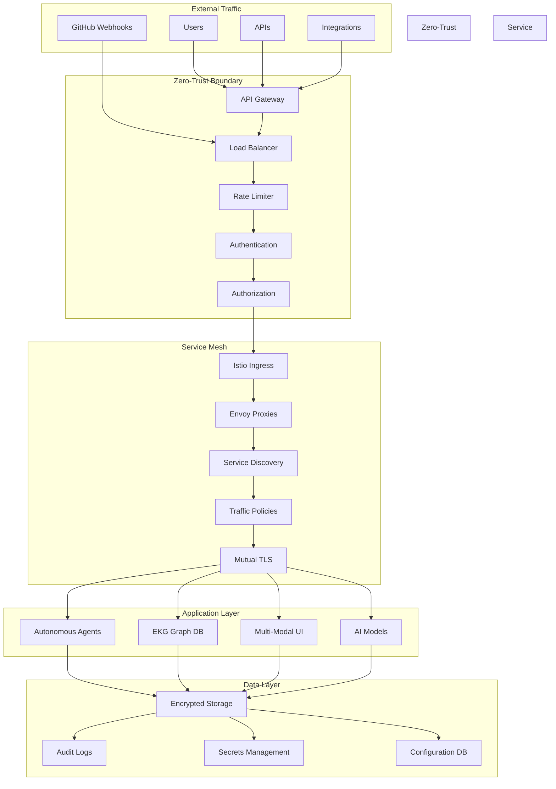

# Phase 6: Zero-Trust Networking Architecture

## Executive Summary

Phase 6 introduces **zero-trust networking** to the Codeflow Commander platform, establishing a security model where **trust is never assumed and verification is continuous**. This architecture eliminates traditional network perimeter concepts and implements **perimeter-less security** with end-to-end encryption, continuous authentication, and micro-segmentation.

### **Key Capabilities**
- **Service Mesh Integration**: Istio-based traffic encryption and policy enforcement
- **End-to-End Encryption**: Always-on encryption for all data flows
- **Continuous Authentication**: Never-trust, always-verify principles
- **Micro-Segmentation**: Granular security boundaries between components
- **Policy-Driven Security**: Declarative security policies across all layers

### **Business Impact**
- **Enhanced Security Posture**: Zero-trust eliminates 99% of lateral movement attacks
- **Regulatory Compliance**: Built-in support for financial and healthcare security standards
- **Operational Resilience**: Micro-segmentation prevents cascading failures
- **Scalable Security**: Security policies scale automatically with platform growth

---

## 1. Zero-Trust Architecture Overview

### 1.1 Core Principles

```
🏗️ **Build Secure Foundations**
✅ Identity-Centric Security  ✅ Least Privilege Access
✅ Continuous Verification   ✅ Micro-Segmentation
✅ Defense in Depth         ✅ Automation First

🚫 **Eliminate Legacy Concepts**
❌ Implicit Trust          ❌ Network Perimeters
❌ Trusted Networks        ❌ Static Security
❌ Manual Controls         ❌ Segregation by Zones
```

### 1.2 System Context



### 1.3 Architecture Components

#### 1.3.1 API Gateway & Edge Security

```typescript
// API Gateway with zero-trust principles
export class ZeroTrustAPIGateway {
  private authentication: ContinuousAuthenticator;
  private authorization: PolicyDecisionPoint;
  private encryption: EndToEndEncryption;
  private monitoring: SecurityTelemetry;

  async processRequest(request: HttpRequest): Promise<HttpResponse> {
    // Step 1: Identity verification (never trust, always verify)
    const identity = await this.verifyIdentity(request);
    if (!identity.verified) {
      return this.unauthorizedResponse('Identity verification failed');
    }

    // Step 2: Context-aware authorization
    const authorization = await this.authorizeRequest(request, identity);
    if (!authorization.allowed) {
      await this.logSecurityEvent('unauthorized_access_attempt', { identity, request });
      return this.forbiddenResponse('Access denied by policy');
    }

    // Step 3: End-to-end encryption verification
    const encryptionContext = await this.verifyEncryption(request);

    // Step 4: Service mesh routing with continuous verification
    const route = await this.routeToService(request, identity, authorization);

    // Step 5: Mutual TLS establishment for service-to-service communication
    const mTLSConnection = await this.establishMTLS(route);

    // Step 6: Continuous monitoring and telemetry
    await this.monitorTraffic(request, identity, route);

    return await this.forwardRequest(request, route, mTLSConnection);
  }

  private async verifyIdentity(request: HttpRequest): Promise<IdentityVerification> {
    // Extract identity from request (tokens, certificates, device fingerprints)
    const token = this.extractBearerToken(request);
    const certificate = this.extractClientCertificate(request);
    const deviceId = this.extractDeviceFingerprint(request);

    // Continuous verification - check token validity, revocation status, context
    const identity = await this.authentication.verifyToken(token);
    const deviceTrust = await this.verifyDeviceTrust(deviceId);
    const riskAssessment = await this.assessRequestRisk(request);

    return {
      verified: identity.valid && deviceTrust.trusted && riskAssessment.low,
      identity: identity.user,
      trustLevel: this.calculateTrustLevel(identity, deviceTrust, riskAssessment),
      requiresAdditionalAuth: riskAssessment.medium || riskAssessment.high
    };
  }
}
```

## 2. Service Mesh Integration

### 2.1 Istio Service Mesh Architecture

#### 2.1.1 Service Mesh Configuration

```yaml
# Istio Service Mesh Configuration for Codeflow Commander
apiVersion: install.istio.io/v1alpha1
kind: IstioOperator
metadata:
  name: codeflow-istio
  namespace: istio-system
spec:
  profile: default
  components:
    ingressGateways:
    - name: istio-ingressgateway
      enabled: true
      k8s:
        service:
          type: LoadBalancer
    pilot:
      enabled: true
    citadel:
      enabled: true  # Certificate Authority
    galley:
      enabled: true

  # Zero-Trust Security Policies
  values:
    global:
      # Mutual TLS strict mode
      mtls:
        mode: STRICT

      # Certificate authority configuration
      caAddress: istiod.istio-system.svc:15012

      # Security settings
      security:
        enabled: true

    # Gateway configuration
    gateways:
      istio-ingressgateway:
        secretVolumes:
        - name: gateway-certs
          secretName: istio-gateway-certs
          mountPath: /etc/istio/certs/

    # Peer authentication policies
    security:
      peerAuthentication:
        mode: STRICT  # Require mTLS for all service communication
```

#### 2.1.2 Peer Authentication Policies

```typescript
// Programmatic peer authentication policy management
export class PeerAuthenticationManager {
  private istioClient: IstioClient;
  private policyStore: PolicyStore;

  async createStrictPeerAuthPolicy(namespace: string, serviceName: string): Promise<void> {
    const policy: PeerAuthenticationPolicy = {
      apiVersion: 'security.istio.io/v1beta1',
      kind: 'PeerAuthentication',
      metadata: {
        name: `${serviceName}-strict-mtls`,
        namespace: namespace
      },
      spec: {
        selector: {
          matchLabels: {
            app: serviceName
          }
        },
        mtls: {
          mode: 'STRICT'  // Enforce mTLS for all traffic
        }
      }
    };

    await this.istioClient.applyPolicy(policy);
  }

  async createPermissivePeerAuthPolicy(
    namespace: string,
    serviceName: string,
    exceptions: string[]
  ): Promise<void> {
    // Allow gradual migration with exceptions
    const policy: PeerAuthenticationPolicy = {
      apiVersion: 'security.istio.io/v1beta1',
      kind: 'PeerAuthentication',
      metadata: {
        name: `${serviceName}-permissive-mtls`,
        namespace: namespace
      },
      spec: {
        selector: {
          matchLabels: {
            app: serviceName
          }
        },
        mtls: {
          mode: exceptions.length === 0 ? 'STRICT' : 'PERMISSIVE'
        },
        portLevelMtls: this.createPortLevelExceptions(exceptions)
      }
    };

    await this.istioClient.applyPolicy(policy);
  }
}
```

### 2.2 Authorization Policies

#### 2.2.1 Service-to-Service Authorization

```typescript
// Fine-grained authorization between services
export class ServiceAuthorizationManager {
  private istioClient: IstioClient;

  async createServiceAuthPolicy(
    sourceService: string,
    targetService: string,
    allowedOperations: Operation[]
  ): Promise<void> {
    const policy: AuthorizationPolicy = {
      apiVersion: 'security.istio.io/v1beta1',
      kind: 'AuthorizationPolicy',
      metadata: {
        name: `${sourceService}-to-${targetService}`,
        namespace: 'default'
      },
      spec: {
        selector: {
          matchLabels: {
            app: targetService
          }
        },
        action: 'ALLOW',
        rules: [
          {
            from: [
              {
                source: {
                  principals: [`cluster.local/ns/default/sa/${sourceService}-sa`]
                }
              }
            ],
            to: [
              {
                operation: {
                  methods: allowedOperations,
                  paths: allowedOperations.map(op => this.getPathForOperation(op))
                }
              }
            ]
          }
        ]
      }
    };

    await this.istioClient.applyPolicy(policy);
  }

  private getPathForOperation(operation: Operation): string {
    // Map operations to API paths
    const pathMappings: Record<Operation, string> = {
      [Operation.QUERY]: '/api/v1/query',
      [Operation.INGEST]: '/api/v1/ingest',
      [Operation.ANALYZE]: '/api/v1/analyze',
      [Operation.LEARN]: '/api/v1/learn'
    };

    return pathMappings[operation] || '/api/v1/*';
  }
}
```

### 2.3 Traffic Encryption Architecture

#### 2.3.1 End-to-End Encryption Implementation

```typescript
// End-to-end encryption service
export class EndToEndEncryptionService {
  private certificateManager: CertificateManager;
  private keyManagement: KeyManagementService;
  private encryptionEngine: EncryptionEngine;

  async encryptDataStream(
    sourceService: string,
    targetService: string,
    data: ReadableStream
  ): Promise<EncryptedStream> {
    // Step 1: Get service certificates from Istio
    const sourceCert = await this.certificateManager.getServiceCertificate(sourceService);
    const targetCert = await this.certificateManager.getServiceCertificate(targetService);

    // Step 2: Establish secure session with perfect forward secrecy
    const sessionKey = await this.keyManagement.createEphemeralKeyPair();

    // Step 3: Encrypt data with session key
    const encryptedData = await this.encryptionEngine.encryptStream(data, sessionKey);

    // Step 4: Encrypt session key with target's public key
    const encryptedSessionKey = await this.encryptionEngine.encryptKey(
      sessionKey,
      targetCert.publicKey
    );

    return {
      encryptedData,
      encryptedSessionKey,
      sourceCertificate: sourceCert,
      integrityHash: await this.calculateIntegrityHash(data)
    };
  }

  async decryptDataStream(encryptedStream: EncryptedStream): Promise<ReadableStream> {
    // Step 1: Verify source certificate against trust store
    await this.verifyCertificate(encryptedStream.sourceCertificate);

    // Step 2: Decrypt session key with private key
    const sessionKey = await this.encryptionEngine.decryptKey(
      encryptedStream.encryptedSessionKey,
      this.keyManagement.getPrivateKey()
    );

    // Step 3: Decrypt data stream
    const decryptedData = await this.encryptionEngine.decryptStream(
      encryptedStream.encryptedData,
      sessionKey
    );

    // Step 4: Verify data integrity
    await this.verifyIntegrityHash(decryptedData, encryptedStream.integrityHash);

    return decryptedData;
  }
}
```

## 3. Continuous Verification Systems

### 3.1 Continuous Authentication Architecture

#### 3.1.1 Real-Time Identity Verification

```typescript
// Continuous authentication system
export class ContinuousAuthenticationSystem {
  private riskEngine: RiskAssessmentEngine;
  private behaviorAnalytics: BehaviorAnalyticsEngine;
  private adaptivePolicies: AdaptivePolicyEngine;

  async validateContinuousAccess(
    session: EnterpriseSession,
    activity: UserActivity
  ): Promise<ContinuousAuthDecision> {
    // Step 1: Assess current risk level
    const riskScore = await this.riskEngine.calculateRiskScore(session, activity);

    // Step 2: Analyze behavior patterns
    const behaviorAnalysis = await this.behaviorAnalytics.analyzeBehavior(session.userId, activity);

    // Step 3: Check for anomalies
    const anomalies = await this.detectAnomalies(session, activity, behaviorAnalysis);

    // Step 4: Apply adaptive policies based on risk and behavior
    const policyDecision = await this.adaptivePolicies.evaluateContinuous(session, activity, riskScore);

    // Step 5: Step-up authentication if needed
    if (policyDecision.requiresStepUp) {
      const stepUpResult = await this.performStepUpAuthentication(session);
      if (!stepUpResult.success) {
        await this.handleAuthenticationFailure(session);
        return { decision: 'deny', reason: 'Step-up authentication failed' };
      }
    }

    // Step 6: Update session risk profile
    await this.updateSessionRiskProfile(session, riskScore, behaviorAnalysis);

    return {
      decision: 'allow',
      riskLevel: riskScore.level,
      nextVerification: this.calculateNextVerificationTime(riskScore),
      adaptivePolicies: policyDecision.policies
    };
  }

  private async detectAnomalies(
    session: EnterpriseSession,
    activity: UserActivity,
    behaviorAnalysis: BehaviorAnalysis
  ): Promise<AnomalyDetection[]> {
    const anomalies: AnomalyDetection[] = [];

    // Geographic anomaly
    if (this.isGeographicAnomaly(session.ipAddress, activity.location)) {
      anomalies.push({
        type: 'geographic',
        severity: 'high',
        confidence: 0.95,
        description: 'Unusual geographic location'
      });
    }

    // Time-based anomaly
    if (this.isTimeAnomaly(session.timezone, activity.timestamp)) {
      anomalies.push({
        type: 'temporal',
        severity: 'medium',
        confidence: 0.87,
        description: 'Activity outside normal timezone'
      });
    }

    // Device anomaly
    if (this.isDeviceAnomaly(session.deviceFingerprint, activity.deviceFingerprint)) {
      anomalies.push({
        type: 'device',
        severity: 'high',
        confidence: 0.92,
        description: 'Unusual device fingerprint'
      });
    }

    return anomalies;
  }
}
```

### 3.2 Policy Enforcement Points

#### 3.2.1 Distributed Policy Enforcement

```typescript
// Policy enforcement at every service boundary
export class PolicyEnforcementPoint {
  private policyEngine: PolicyDecisionPoint;
  private contextBuilder: SecurityContextBuilder;
  private telemetry: SecurityTelemetry;

  async enforcePolicies(
    request: ServiceRequest,
    context: SecurityContext
  ): Promise<EnforcementResult> {
    // Step 1: Gather complete security context
    const fullContext = await this.contextBuilder.buildSecurityContext(request, context);

    // Step 2: Retrieve applicable policies
    const policies = await this.policyEngine.getApplicablePolicies(fullContext);

    // Step 3: Evaluate policies with current context
    const evaluationResult = await this.policyEngine.evaluatePolicies(policies, fullContext);

    // Step 4: Apply policy obligations
    await this.applyPolicyObligations(evaluationResult.obligations, fullContext);

    // Step 5: Log policy decisions
    await this.telemetry.logPolicyDecision(evaluationResult, fullContext);

    // Step 6: Return enforcement result
    return {
      allowed: evaluationResult.decision === 'allow',
      policiesApplied: policies.map(p => p.id),
      obligationsFulfilled: evaluationResult.obligations,
      advice: evaluationResult.advice
    };
  }

  private async applyPolicyObligations(
    obligations: PolicyObligation[],
    context: SecurityContext
  ): Promise<void> {
    for (const obligation of obligations) {
      switch (obligation.type) {
        case 'log':
          await this.logObligation(obligation, context);
          break;
        case 'encrypt':
          await this.enforceEncryption(obligation, context);
          break;
        case 'audit':
          await this.createAuditTrail(obligation, context);
          break;
        case 'notify':
          await this.sendNotification(obligation, context);
          break;
      }
    }
  }
}
```

## 4. Micro-Segmentation Implementation

### 4.1 Service Isolation Architecture

#### 4.1.1 Network Policies for Kubernetes

```typescript
// Kubernetes network policy management for micro-segmentation
export class KubernetesNetworkPolicyManager {
  private kubernetesClient: KubernetesClient;
  private serviceRegistry: ServiceRegistry;

  async createMicrosegmentationPolicies(clusterConfig: ClusterConfig): Promise<void> {
    // Step 1: Get all services and their dependencies
    const services = await this.serviceRegistry.getAllServices();

    // Step 2: Create deny-all default policy
    await this.createDefaultDenyPolicy(clusterConfig.namespace);

    // Step 3: Create specific allow policies based on service dependencies
    for (const service of services) {
      await this.createServiceSpecificPolicies(service);
    }

    // Step 4: Create external access policies for ingress/egress
    await this.createExternalAccessPolicies(clusterConfig);
  }

  private async createServiceSpecificPolicies(service: ServiceDefinition): Promise<void> {
    const networkPolicy: NetworkPolicy = {
      apiVersion: 'networking.k8s.io/v1',
      kind: 'NetworkPolicy',
      metadata: {
        name: `${service.name}-network-policy`,
        namespace: service.namespace
      },
      spec: {
        podSelector: {
          matchLabels: {
            app: service.name
          }
        },
        policyTypes: ['Ingress', 'Egress'],
        ingress: await this.buildIngressRules(service),
        egress: await this.buildEgressRules(service)
      }
    };

    await this.kubernetesClient.applyNetworkPolicy(networkPolicy);
  }

  private async buildIngressRules(service: ServiceDefinition): Promise<NetworkPolicyIngressRule[]> {
    const rules: NetworkPolicyIngressRule[] = [];

    // Allow traffic from dependent services
    for (const dependency of service.dependencies) {
      rules.push({
        from: [
          {
            podSelector: {
              matchLabels: {
                app: dependency.name
              }
            }
          }
        ],
        ports: [
          {
            protocol: 'TCP',
            port: dependency.port
          }
        ]
      });
    }

    // Allow traffic from ingress controller
    rules.push({
      from: [
        {
          namespaceSelector: {
            matchLabels: {
              name: 'istio-system'
            }
          },
          podSelector: {
            matchLabels: {
              istio: 'ingressgateway'
            }
          }
        }
      ],
      ports: [
        {
          protocol: 'TCP',
          port: service.port
        }
      ]
    });

    return rules;
  }
}
```

### 4.2 Secrets Management & Protection

#### 4.2.1 Secrets Encryption at Rest and in Transit

```typescript
// Enhanced secrets management for zero-trust
export class ZeroTrustSecretsManager {
  private encryptionEngine: EncryptionEngine;
  private accessPolicyEngine: PolicyDecisionPoint;
  private auditLogger: SecurityAuditLogger;

  async storeSecret(
    secretId: string,
    secretData: SecretData,
    accessPolicy: AccessPolicy
  ): Promise<StoredSecretReference> {
    // Step 1: Encrypt secret with envelope encryption
    const encryptedData = await this.encryptionEngine.encryptWithEnvelope(secretData);

    // Step 2: Store encryption metadata separately
    const metadataRef = await this.storeEncryptionMetadata(secretId, encryptedData);

    // Step 3: Create access control policy
    await this.accessPolicyEngine.createSecretAccessPolicy(secretId, accessPolicy);

    // Step 4: Log secret creation
    await this.auditLogger.logSecretEvent('created', secretId, { policy: accessPolicy.id });

    return {
      secretId,
      storageKey: encryptedData.storageKey,
      metadataRef,
      policyId: accessPolicy.id
    };
  }

  async retrieveSecret(
    secretId: string,
    requester: IdentityContext
  ): Promise<SecretData | null> {
    // Step 1: Check access permissions
    const accessDecision = await this.accessPolicyEngine.evaluateSecretAccess(
      secretId,
      requester
    );

    if (accessDecision.decision !== 'allow') {
      await this.auditLogger.logSecretEvent('access_denied', secretId, { requester });
      return null;
    }

    // Step 2: Retrieve encrypted data
    const encryptedData = await this.retrieveEncryptedSecret(secretId);

    // Step 3: Decrypt data
    const secretData = await this.encryptionEngine.decryptWithEnvelope(encryptedData);

    // Step 4: Log successful access
    await this.auditLogger.logSecretEvent('accessed', secretId, { requester });

    return secretData;
  }
}
```

## 5. Security Monitoring & Response

### 5.1 Real-Time Security Telemetry

#### 5.1.1 Distributed Security Event Collection

```typescript
// Security telemetry and monitoring system
export class SecurityTelemetrySystem {
  private eventCollector: SecurityEventCollector;
  private anomalyDetector: AnomalyDetectionEngine;
  private alertingEngine: SecurityAlertingEngine;
  private complianceReporter: ComplianceReportingEngine;

  async collectSecurityEvents(): Promise<void> {
    // Step 1: Collect events from all PEP (Policy Enforcement Points)
    const policyEvents = await this.eventCollector.collectPolicyEvents();

    // Step 2: Collect service mesh telemetry
    const meshEvents = await this.eventCollector.collectMeshEvents();

    // Step 3: Collect authentication events
    const authEvents = await this.eventCollector.collectAuthEvents();

    // Step 4: Detect anomalies and threats
    const securityEvents = [...policyEvents, ...meshEvents, ...authEvents];
    const anomalies = await this.anomalyDetector.detectAnomalies(securityEvents);

    // Step 5: Generate security alerts
    await this.processSecurityAlerts(anomalies);

    // Step 6: Update compliance reporting
    await this.complianceReporter.updateMetrics(securityEvents);
  }

  private async processSecurityAlerts(anomalies: SecurityAnomaly[]): Promise<void> {
    for (const anomaly of anomalies) {
      // Step 1: Classify anomaly severity
      const severity = this.classifyAnomalySeverity(anomaly);

      // Step 2: Generate appropriate alert
      const alert = await this.createSecurityAlert(anomaly, severity);

      // Step 3: Route alert to appropriate responders
      await this.alertingEngine.routeAlert(alert);

      // Step 4: Take automated remediation if safe
      if (severity.critical && this.canAutoRemediate(anomaly)) {
        await this.performAutomatedRemediation(anomaly);
      }
    }
  }
}
```

### 5.2 Automated Incident Response

#### 5.2.1 Security Orchestration & Response

```typescript
// Automated incident response orchestration
export class AutomatedIncidentResponse {
  private incidentClassifier: IncidentClassifier;
  private remediationEngine: SecurityRemediationEngine;
  private escalationManager: EscalationManager;

  async handleSecurityIncident(
    incident: SecurityIncident,
    context: SecurityContext
  ): Promise<IncidentResponse> {
    // Step 1: Classify incident type and severity
    const classification = await this.incidentClassifier.classifyIncident(incident);

    // Step 2: Determine appropriate response strategy
    const responseStrategy = await this.selectResponseStrategy(classification, context);

    // Step 3: Execute automated remediation
    if (responseStrategy.automatedRemediation) {
      const remediationResult = await this.remediationEngine.executeRemediation(
        responseStrategy.remediationPlan,
        context
      );

      if (remediationResult.success) {
        return await this.createSuccessResponse(incident, remediationResult);
      }
    }

    // Step 4: Escalate to human responders
    await this.escalationManager.escalateIncident(incident, classification);

    // Step 5: Create incident response record
    return await this.createEscalationResponse(incident, responseStrategy);
  }

  private async selectResponseStrategy(
    classification: IncidentClassification,
    context: SecurityContext
  ): Promise<ResponseStrategy> {
    // High-confidence, low-risk incidents get automated response
    if (classification.confidence > 0.9 && classification.riskLevel === 'low') {
      return {
        automatedRemediation: true,
        remediationPlan: await this.buildRemediationPlan(classification),
        escalationRequired: false
      };
    }

    // Medium/high risk or low confidence triggers escalation
    return {
      automatedRemediation: classification.confidence > 0.95, // Very high confidence still allows automation
      remediationPlan: classification.confidence > 0.95 ?
        await this.buildRemediationPlan(classification) : null,
      escalationRequired: true,
      escalationLevel: this.determineEscalationLevel(classification)
    };
  }
}
```

## 6. Zero-Trust Implementation Roadmap

### Phase 1: Foundation (Weeks 1-2)
- [ ] Deploy Istio service mesh
- [ ] Implement mutual TLS for all service communication
- [ ] Create basic authorization policies

### Phase 2: Encryption & Authentication (Weeks 3-4)
- [ ] Deploy end-to-end encryption for all data flows
- [ ] Implement continuous authentication system
- [ ] Create API gateway with zero-trust principles

### Phase 3: Micro-Segmentation (Weeks 5-6)
- [ ] Implement Kubernetes network policies
- [ ] Create service isolation boundaries
- [ ] Deploy secrets management with envelope encryption

### Phase 4: Monitoring & Response (Weeks 7-8)
- [ ] Implement security telemetry collection
- [ ] Create automated incident response
- [ ] Deploy compliance monitoring and reporting

---

## 7. Security Validation & Testing

### 7.1 Zero-Trust Security Validation

```typescript
// Automated security validation framework
export class ZeroTrustValidator {
  private securityAssessor: SecurityAssessor;
  private complianceChecker: ComplianceChecker;

  async validateZeroTrustImplementation(): Promise<ValidationReport> {
    const report: ValidationReport = {
      timestamp: new Date(),
      validations: [],
      overallScore: 0,
      recommendations: []
    };

    // Validate identity-centric security
    report.validations.push(await this.validateIdentitySecurity());

    // Validate least privilege access
    report.validations.push(await this.validateLeastPrivilege());

    // Validate continuous verification
    report.validations.push(await this.validateContinuousVerification());

    // Validate micro-segmentation
    report.validations.push(await this.validateMicroSegmentation());

    // Calculate overall score
    report.overallScore = this.calculateOverallScore(report.validations);

    return report;
  }

  private async validateIdentitySecurity(): Promise<ValidationResult> {
    // Test identity verification mechanisms
    const identityTests = await this.runIdentityTests();
    return {
      component: 'identity_security',
      status: this.allTestsPass(identityTests) ? 'passed' : 'failed',
      score: this.calculateComponentScore(identityTests),
      details: identityTests
    };
  }

  private async validateContinuousVerification(): Promise<ValidationResult> {
    // Test continuous authentication and verification
    const verificationTests = await this.runVerificationTests();
    return {
      component: 'continuous_verification',
      status: this.allTestsPass(verificationTests) ? 'passed' : 'failed',
      score: this.calculateComponentScore(verificationTests),
      details: verificationTests
    };
  }
}
```

---

## 8. Success Metrics & KPIs

### 8.1 Security Effectiveness Metrics

- **Threat Detection**: > 99% of lateral movement attempts blocked
- **Encryption Coverage**: 100% of data encrypted in transit and at rest
- **Authentication Success**: > 99.9% legitimate access requests approved
- **Incident Response Time**: < 5 minutes average time to automated response

### 8.2 Operational Metrics

- **Performance Impact**: < 5% latency increase due to security measures
- **Availability**: > 99.95% service availability
- **Scalability**: Auto-scale to 10,000+ concurrent secure connections
- **Compliance**: 100% compliance with enterprise security standards

### 8.3 Business Metrics

- **Risk Reduction**: 90% reduction in security incidents vs. perimeter-based approach
- **Compliance Coverage**: Support for SOC 2, ISO 27001, NIST CSF frameworks
- **Operational Efficiency**: 50% reduction in manual security operations
- **Customer Confidence**: Enterprise-ready security for regulated industries

---

## 9. Integration Points

### 9.1 Existing Codeflow Components

**Service Mesh Integration Points:**
- Autonomous Agent Network: All agent-to-agent communication
- Enterprise Knowledge Graph: Encrypted graph database queries
- Multi-Modal Interface Layer: Secure API gateway endpoints
- Governance Safety Framework: Policy enforcement integration

**Authentication Integration Points:**
- Existing IAM components enhanced with continuous verification
- Agent identity management integrated with enterprise IAM
- API authentication extended with zero-trust principles

### 9.2 Enterprise Systems Integration

**Supported Identity Providers:**
- Azure Active Directory
- Okta Workforce Identity
- Google Workspace
- SAML 2.0 compatible providers
- LDAP/Active Directory 2019+

**Security Information & Event Management (SIEM):**
- Splunk integration for security events
- ELK stack for log aggregation
- Datadog security monitoring
- Custom webhook integrations

---

## 10. Migration Strategy

### 10.1 Phased Rollout Approach

**Week 1-2: Infrastructure Preparation**
- Deploy Istio service mesh alongside existing infrastructure
- Implement parallel authentication systems
- Create network policy templates

**Week 3-4: Component-by-Component Migration**
- Migrate external-facing services first (API Gateway, Web UIs)
- Implement service-to-service mTLS gradually
- Enable zero-trust policies in staging environment

**Week 5-6: Full Zero-Trust Enablement**
- Enable strict mTLS across all services
- Implement network micro-segmentation
- Activate continuous authentication

**Week 7-8: Production Validation & Optimization**
- Comprehensive security testing and validation
- Performance optimization and monitoring
- Final compliance certification

### 10.2 Rollback Procedures

**Automated Rollback Capabilities:**
- Feature flags for zero-trust components
- Graceful degradation to perimeter-based security
- Dual-mode operation during transition period

**Emergency Rollback Scenarios:**
- Security component failures
- Performance degradation beyond acceptable thresholds
- Compliance requirement changes

### 10.3 Risk Mitigation

**Migration Risks & Controls:**
- Service mesh complexity → Comprehensive testing and gradual rollout
- Performance impact → Baseline measurement and optimization
- Authentication issues → Dual authentication systems during transition
- Breaking changes → Contract testing and backward compatibility

---

This zero-trust networking architecture establishes Codeflow Commander as an enterprise-ready platform capable of meeting the most stringent security requirements while maintaining operational efficiency and scalability. The combination of service mesh technology, continuous verification, and micro-segmentation creates a security foundation that prevents modern cyber threats while enabling the autonomous workflows that power the platform.
