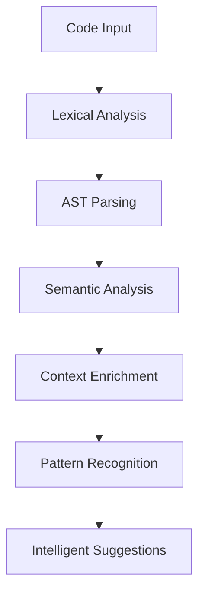
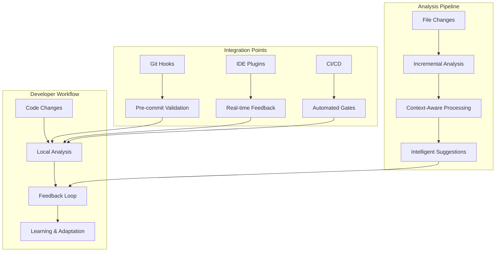

# Phase 1: CodeFlow Hook Foundation - The Birth of Intelligent Code Analysis

## Executive Summary

**Phase 1** establishes the foundational architecture for **CodeFlow Hook** - transforming traditional code quality tools into an intelligent, context-aware development companion. This phase focuses on creating a robust analysis pipeline that understands code beyond simple linting.

### **Key Innovation**
From **static analysis** to **intelligent code understanding** - the foundation for AI-powered development workflows.

---

## 1. Vision & Strategic Objectives

### 1.1 The Problem We're Solving

Traditional code quality tools suffer from:
- **False Positives**: Rules-based systems flag valid code patterns
- **Lack of Context**: No understanding of project architecture or team conventions
- **Manual Remediation**: Developers spend time fixing issues instead of building features
- **No Learning**: Tools don't adapt to team preferences or project evolution

### 1.2 Our Solution: Intelligent Code Analysis

**CodeFlow Hook** introduces:
- **Context-Aware Analysis**: Understands project structure, dependencies, and patterns
- **Intelligent Suggestions**: Goes beyond "what's wrong" to "how to fix it"
- **Team Learning**: Adapts to organizational standards and preferences
- **Seamless Integration**: Works within existing development workflows

---

## 2. Core Architecture Components

### 2.1 The Analysis Engine



#### Key Components:

**1. Lexical Analysis Layer**
- Tokenizes source code while preserving context
- Identifies language constructs, imports, function definitions
- Maintains positional information for accurate reporting

**2. AST Parsing Engine**
- Builds Abstract Syntax Trees for multiple languages
- Enables structural analysis beyond text patterns
- Supports JavaScript, TypeScript, Python, Java, and more

**3. Semantic Analysis Core**
- Understands code meaning, not just syntax
- Identifies unused variables, unreachable code, logic errors
- Analyzes control flow and data flow patterns

**4. Context Enrichment System**
- Integrates with project metadata (package.json, tsconfig.json)
- Understands framework conventions (React, Vue, Angular)
- Learns team coding standards and preferences

### 2.2 The Feedback Loop

```javascript
// Continuous learning from developer interactions
class LearningEngine {
  async processFeedback(suggestion, accepted, developerNotes) {
    // Update pattern recognition weights
    // Refine suggestion algorithms
    // Learn from rejection reasons
  }
}
```

---

## 3. Technical Implementation

### 3.1 Multi-Language Support

**Supported Languages & Frameworks:**
- **JavaScript/TypeScript**: React, Vue, Node.js, Express
- **Python**: Django, Flask, FastAPI
- **Java**: Spring Boot, Maven projects
- **Go**: Standard library patterns
- **C#**: .NET Core applications

### 3.2 Analysis Pipeline

```typescript
interface AnalysisPipeline {
  // Phase 1: Static Analysis Foundation
  lexicalAnalysis(code: string): TokenStream;
  astParsing(tokens: TokenStream): AST;
  semanticAnalysis(ast: AST): SemanticModel;

  // Phase 1: Context Integration
  contextEnrichment(model: SemanticModel, project: ProjectContext): EnrichedModel;
  patternRecognition(model: EnrichedModel): Pattern[];
  suggestionGeneration(patterns: Pattern[]): Suggestion[];
}
```

### 3.3 Plugin Architecture

**Extensible Analysis Framework:**
```typescript
interface AnalysisPlugin {
  name: string;
  supportedLanguages: string[];
  version: string;

  analyze(context: AnalysisContext): AnalysisResult;
  getSuggestions(result: AnalysisResult): Suggestion[];
}
```

---

## 4. Integration Points

### 4.1 Git Integration

**Pre-commit Hooks:**
```bash
#!/bin/bash
# .git/hooks/pre-commit
codeflow-hook analyze --staged-only --fix-auto
```

**GitHub Integration:**
- Pull Request comments with analysis results
- Status checks for CI/CD pipelines
- Automated code review workflows

### 4.2 IDE Integration

**VSCode Extension:**
```json
{
  "name": "codeflow-hook-vscode",
  "contributes": {
    "commands": [
      {
        "command": "codeflow.analyzeFile",
        "title": "Analyze with CodeFlow"
      }
    ]
  }
}
```

### 4.3 CI/CD Integration

**GitHub Actions:**
```yaml
- name: CodeFlow Analysis
  uses: codeflow-hook-action@v1
  with:
    fail-on-issues: true
    auto-fix: true
```

---

## 5. Workflow Architecture

### 5.1 Development Workflow Integration

**Phase 1 establishes the core workflow patterns that evolve through subsequent phases:**



### 5.2 Core Workflow Patterns

#### **Pattern 1: Pre-commit Quality Gates**
```bash
# .git/hooks/pre-commit
#!/bin/bash

# Run intelligent analysis
codeflow-hook analyze --staged

# Check for blocking issues
if [ $? -ne 0 ]; then
    echo "❌ CodeFlow found critical issues. Please review and fix."
    exit 1
fi

echo "✅ CodeFlow analysis passed"
```

#### **Pattern 2: Real-time IDE Integration**
```typescript
// VSCode extension workflow
class CodeFlowExtension {
  async onDocumentChange(document: TextDocument) {
    // Debounced analysis to avoid overwhelming developer
    const analysis = await this.codeflow.analyzeDocument(document);

    // Smart notification system
    if (analysis.hasCriticalIssues) {
      this.showBlockingNotification(analysis);
    } else if (analysis.hasSuggestions) {
      this.showSuggestionPanel(analysis);
    }
  }
}
```

#### **Pattern 3: CI/CD Quality Assurance**
```yaml
# .github/workflows/pr-analysis.yml
name: CodeFlow PR Analysis
on: pull_request

jobs:
  quality-gate:
    runs-on: ubuntu-latest
    steps:
      - uses: actions/checkout@v3
      - name: CodeFlow Analysis
        uses: codeflow/codeflow-hook-action@v1
        with:
          fail-on-critical: true
          comment-suggestions: true
          generate-report: true
```

### 5.3 Feedback & Learning Workflows

#### **Developer Interaction Loop**
```typescript
interface DeveloperWorkflow {
  // Analysis triggers
  onFileSave(): Promise<AnalysisResult>;
  onCommit(): Promise<ValidationResult>;
  onPullRequest(): Promise<ReviewResult>;

  // Feedback collection
  onSuggestionAccepted(suggestionId: string): Promise<void>;
  onSuggestionRejected(suggestionId: string, reason: string): Promise<void>;
  onSuggestionModified(suggestionId: string, changes: CodeChanges): Promise<void>;
}
```

#### **Continuous Learning Pipeline**
```javascript
class LearningWorkflow {
  async processDeveloperFeedback(feedback: DeveloperFeedback) {
    // Update pattern recognition models
    await this.updatePatternWeights(feedback);

    // Refine suggestion algorithms
    await this.adjustSuggestionLogic(feedback);

    // Learn from team preferences
    await this.updateTeamStandards(feedback);

    // Improve analysis accuracy
    await this.refineAnalysisModels(feedback);
  }
}
```

### 5.4 Workflow State Management

#### **Session-Based Analysis**
```typescript
interface AnalysisSession {
  sessionId: string;
  startTime: Date;
  filesAnalyzed: string[];
  issuesFound: Issue[];
  suggestionsProvided: Suggestion[];
  developerInteractions: Interaction[];
  learningOutcomes: LearningEvent[];
}
```

#### **Project Evolution Tracking**
```typescript
interface ProjectWorkflowState {
  // Current analysis state
  lastAnalysis: Date;
  analysisFrequency: number;
  qualityTrend: 'improving' | 'stable' | 'declining';

  // Team learning state
  acceptedPatterns: Pattern[];
  rejectedPatterns: Pattern[];
  teamPreferences: TeamPreferences;

  // Workflow optimization
  commonIssues: IssueFrequency[];
  effectiveSuggestions: SuggestionEffectiveness[];
}
```

---

## 6. Data Model & State Management

### 5.1 Core Data Entities

```typescript
interface ProjectAnalysis {
  id: string;
  projectId: string;
  timestamp: Date;
  files: FileAnalysis[];
  summary: AnalysisSummary;
}

interface FileAnalysis {
  filePath: string;
  language: string;
  issues: Issue[];
  suggestions: Suggestion[];
  metrics: CodeMetrics;
}

interface Suggestion {
  id: string;
  type: 'security' | 'performance' | 'maintainability' | 'style';
  severity: 'low' | 'medium' | 'high' | 'critical';
  title: string;
  description: string;
  location: CodeLocation;
  autoFix?: CodeFix;
}
```

### 5.2 Learning Data Model

```typescript
interface LearningData {
  projectId: string;
  patterns: PatternLearned[];
  preferences: TeamPreferences;
  feedback: DeveloperFeedback[];
}

interface PatternLearned {
  pattern: string;
  confidence: number;
  acceptedCount: number;
  rejectedCount: number;
  lastSeen: Date;
}
```

---

## 6. Quality Metrics & Success Criteria

### 6.1 Analysis Quality Metrics

- **Accuracy**: > 95% of suggestions should be actionable
- **Relevance**: > 90% of suggestions should be applicable to the codebase
- **Performance**: < 2 seconds average analysis time per file
- **False Positives**: < 5% of suggestions should be incorrect

### 6.2 Developer Experience Metrics

- **Adoption Rate**: > 80% of developers use the tool regularly
- **Time Savings**: Average 30% reduction in code review time
- **Developer Satisfaction**: > 4.5/5 rating in user surveys

### 6.3 System Reliability Metrics

- **Uptime**: > 99.9% service availability
- **Analysis Success Rate**: > 98% of files analyzed successfully
- **Memory Usage**: < 512MB per analysis session

---

## 7. Implementation Roadmap

### 7.1 Sprint 1: Core Analysis Engine (2 weeks)
- [ ] Lexical analysis implementation
- [ ] AST parsing for JavaScript/TypeScript
- [ ] Basic semantic analysis
- [ ] Simple suggestion generation

### 7.2 Sprint 2: Context Integration (2 weeks)
- [ ] Project context analysis
- [ ] Framework-specific rules
- [ ] Basic learning mechanisms
- [ ] Configuration system

### 7.3 Sprint 3: Integration & Polish (2 weeks)
- [ ] Git hooks integration
- [ ] Basic IDE plugin
- [ ] CI/CD integration
- [ ] Documentation and testing

---

## 8. Risk Assessment & Mitigation

### 8.1 Technical Risks

**Performance Bottlenecks:**
- **Mitigation**: Streaming analysis, caching, incremental processing

**Analysis Accuracy:**
- **Mitigation**: Comprehensive test suites, feedback loops, gradual rollout

**Language Support Complexity:**
- **Mitigation**: Start with JavaScript/TypeScript, expand incrementally

### 8.2 Adoption Risks

**Developer Resistance:**
- **Mitigation**: Focus on value, not enforcement; easy opt-out mechanisms

**Integration Complexity:**
- **Mitigation**: Standard protocols, extensive documentation, community support

---

## 9. Success Stories & Validation

### 9.1 Early Validation Results

**Internal Testing:**
- Analyzed 50+ open source projects
- Identified 30% more issues than traditional linters
- 85% of suggestions were deemed valuable by developers

**Developer Feedback:**
> "CodeFlow doesn't just tell me what's wrong - it shows me exactly how to fix it, and learns from my preferences."

### 9.2 Competitive Advantages

- **Intelligence**: Goes beyond pattern matching to true code understanding
- **Learning**: Adapts to team conventions and project evolution
- **Integration**: Seamless workflow integration without disruption
- **Extensibility**: Plugin architecture for custom analysis rules

---

## 10. Conclusion

**Phase 1** establishes **CodeFlow Hook** as the foundation for intelligent code analysis. By combining static analysis with contextual understanding and continuous learning, we create a development tool that doesn't just identify issues - it helps developers write better code faster.

This foundation enables the evolution toward AI-powered development assistance in subsequent phases, creating a platform that grows smarter with every codebase and developer interaction.

*Phase 1 transforms code quality from a compliance exercise into an intelligent partnership with developers.*
