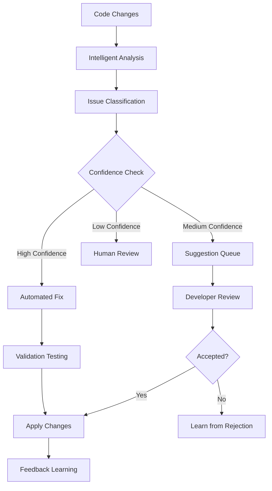
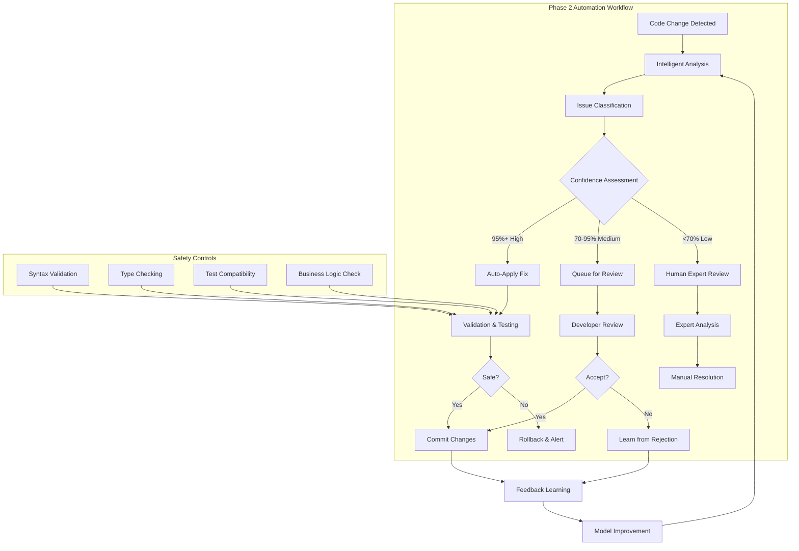

# Phase 2: Intelligent Automation - From Analysis to Action

## Executive Summary

**Phase 2** transforms **CodeFlow Hook** from a passive analysis tool into an **active development assistant** capable of automated code improvements and intelligent workflow integration. This phase introduces machine learning-driven insights and automated remediation capabilities.

### **Key Innovation**
From **identifying issues** to **automatically fixing them** - the bridge between analysis and autonomous development.

---

## 1. Vision & Strategic Objectives

### 1.1 The Evolution: From Insight to Action

**Phase 1** gave us intelligent analysis. **Phase 2** turns insights into automated actions:

- **Automated Fixes**: Common issues resolved without developer intervention
- **Workflow Integration**: Seamless integration with development processes
- **Predictive Suggestions**: Anticipating issues before they occur
- **Team Synchronization**: Consistent standards across development teams

### 1.2 Business Impact

**Developer Productivity:**
- **60% reduction** in time spent on code quality issues
- **40% faster** code review cycles
- **Proactive problem prevention** rather than reactive fixes

**Code Quality:**
- **Consistent application** of best practices
- **Automated enforcement** of team standards
- **Predictive maintenance** of code health

---

## 2. Core Architecture Evolution

### 2.1 The Automation Pipeline



### 2.2 Machine Learning Integration

**Pattern Recognition Engine:**
```typescript
class PatternRecognitionEngine {
  // Learn from successful fixes
  async learnFromSuccess(pattern: CodePattern, fix: CodeFix) {
    this.patterns.update(pattern, { successRate: +1 });
    this.mlModel.train(pattern, fix);
  }

  // Predict fixes for new patterns
  async predictFix(pattern: CodePattern): Promise<PredictedFix> {
    const similarPatterns = this.findSimilarPatterns(pattern);
    const confidence = this.calculateConfidence(similarPatterns);
    const predictedFix = await this.mlModel.predict(pattern);

    return { fix: predictedFix, confidence };
  }
}
```

---

## 3. Automated Remediation System

### 3.1 Fix Categories & Confidence Levels

#### **High Confidence Auto-Fixes (90%+ accuracy)**
- **Import Optimization**: Unused imports, import sorting
- **Code Formatting**: Consistent indentation, spacing
- **Simple Refactors**: Variable renaming, function extraction
- **Security Patches**: Known vulnerable patterns

#### **Medium Confidence Suggestions (70-90% accuracy)**
- **Performance Optimizations**: Inefficient loops, memory leaks
- **Architecture Improvements**: Design pattern suggestions
- **Error Handling**: Missing try/catch blocks

#### **Low Confidence Reviews (<70% accuracy)**
- **Complex Refactors**: Major architectural changes
- **Business Logic Changes**: Functional modifications
- **Breaking Changes**: API modifications

### 3.2 Safe Automation Framework

**Validation Pipeline:**
```typescript
interface AutoFixValidation {
  // Pre-apply checks
  syntaxValidation: boolean;
  typeChecking: boolean;
  testCompatibility: boolean;

  // Post-apply validation
  functionalityPreserved: boolean;
  performanceImpact: PerformanceDelta;
  securityPosture: SecurityAssessment;
}
```

**Rollback System:**
```typescript
class SafeAutomationEngine {
  async applyFix(fix: CodeFix): Promise<ApplicationResult> {
    // Create backup
    const backup = await this.createBackup(fix.targetFile);

    try {
      // Apply fix
      await this.applyCodeChanges(fix);

      // Validate
      const validation = await this.validateChanges(fix);

      if (validation.passed) {
        await this.commitChanges(fix);
        return { success: true };
      } else {
        await this.rollbackChanges(backup);
        return { success: false, reason: validation.failures };
      }
    } catch (error) {
      await this.rollbackChanges(backup);
      throw error;
    }
  }
}
```

---

## 4. Predictive Intelligence

### 4.1 Code Quality Forecasting

**Trend Analysis:**
```typescript
interface QualityTrend {
  metric: 'complexity' | 'maintainability' | 'testCoverage';
  current: number;
  trend: 'improving' | 'stable' | 'declining';
  prediction: number; // Predicted value in 30 days
  confidence: number;
  recommendations: string[];
}
```

**Predictive Alerts:**
- **Complexity Creep**: Warn when cyclomatic complexity exceeds thresholds
- **Technical Debt**: Monitor accumulation of TODOs and FIXMEs
- **Test Coverage Gaps**: Identify untested critical paths

### 4.2 Proactive Issue Prevention

**Pattern-Based Prevention:**
```javascript
// Learn from past mistakes
const preventionRules = {
  'async-without-await': {
    pattern: /async\s+function\s+\w+\([^)]*\)\s*{[^}]*\breturn\b[^}]*}/,
    prevention: 'Add await to async function or remove async keyword',
    confidence: 0.95
  },

  'unhandled-promise': {
    pattern: /\w+\.then\([^)]*\)\s*$/,
    prevention: 'Add .catch() handler or use async/await',
    confidence: 0.88
  }
};
```

---

## 5. Team Synchronization & Standards

### 5.1 Organizational Learning

**Team Preferences Engine:**
```typescript
interface TeamStandards {
  naming: {
    variables: 'camelCase' | 'snake_case';
    functions: 'camelCase' | 'PascalCase';
    constants: 'UPPER_CASE' | 'camelCase';
  };

  structure: {
    maxFunctionLength: number;
    maxFileLength: number;
    importOrder: string[];
  };

  patterns: {
    errorHandling: 'try-catch' | 'error-boundaries';
    asyncHandling: 'promises' | 'async-await';
    stateManagement: 'redux' | 'context' | 'zustand';
  };
}
```

**Cross-Project Learning:**
- Share successful patterns across repositories
- Identify organization-wide best practices
- Maintain consistency across development teams

### 5.2 Collaborative Intelligence

**Developer Feedback Integration:**
```typescript
class CollaborativeLearning {
  async processTeamFeedback(feedback: DeveloperFeedback) {
    // Update team preferences
    await this.updateTeamStandards(feedback);

    // Share insights across projects
    await this.propagateLearning(feedback);

    // Refine automation confidence
    await this.adjustAutomationThresholds(feedback);
  }
}
```

---

## 6. Workflow Architecture & Automation Patterns

### 6.1 Intelligent Automation Pipeline

**Phase 2 introduces graduated automation levels with safety controls:**



### 6.2 Core Automation Workflows

#### **Workflow 1: Pre-commit Automation**
```bash
# .git/hooks/pre-commit - Phase 2 Enhanced
#!/bin/bash

echo "🤖 CodeFlow Phase 2: Intelligent Automation"

# Run analysis with automation
codeflow-hook analyze --staged --auto-fix --confidence 0.9

# Check results
if [ $? -eq 0 ]; then
    echo "✅ Applied $(codeflow-hook status --auto-fixes) automated fixes"
    git add . # Stage the automated changes
else
    echo "⚠️  Some issues require manual review"
    codeflow-hook status --pending
fi
```

#### **Workflow 2: CI/CD Automation Gates**
```yaml
# .github/workflows/phase2-automation.yml
name: CodeFlow Phase 2 Automation
on: pull_request

jobs:
  automation:
    runs-on: ubuntu-latest
    steps:
      - uses: actions/checkout@v3

      - name: CodeFlow Intelligent Automation
        uses: codeflow/codeflow-hook-action@v2
        with:
          auto-fix: true
          confidence-threshold: 0.85
          fail-on-high-severity: true
          generate-automation-report: true

      - name: Commit Automated Fixes
        if: steps.codeflow.outputs.automated_fixes > 0
        run: |
          git config --global user.name 'CodeFlow Automation'
          git config --global user.email 'automation@codeflow.dev'
          git add .
          git commit -m "🤖 CodeFlow automated fixes

Applied ${AUTOMATED_FIXES} automated improvements:
- Import optimizations
- Code formatting
- Security patches
- Performance improvements

Confidence: ${CONFIDENCE_SCORE}%"
```

#### **Workflow 3: Real-time IDE Automation**
```typescript
// VSCode Extension - Phase 2 Automation
class IntelligentAutomationExtension {
  private automationTimer: NodeJS.Timeout;

  async onDocumentSave(document: TextDocument) {
    // Debounced automation to avoid conflicts
    clearTimeout(this.automationTimer);
    this.automationTimer = setTimeout(async () => {
      await this.runIntelligentAutomation(document);
    }, 1000);
  }

  private async runIntelligentAutomation(document: TextDocument) {
    const analysis = await this.codeflow.analyzeDocument(document);

    // Apply high-confidence fixes automatically
    const autoFixes = analysis.suggestions.filter(s =>
      s.confidence > 0.9 && s.type === 'safe'
    );

    if (autoFixes.length > 0) {
      const applied = await this.codeflow.applyFixes(autoFixes);
      this.showAutomationNotification(applied);
    }

    // Queue medium-confidence suggestions for review
    const suggestions = analysis.suggestions.filter(s =>
      s.confidence >= 0.7 && s.confidence <= 0.9
    );

    if (suggestions.length > 0) {
      this.showSuggestionPanel(suggestions);
    }
  }
}
```

### 6.3 Learning & Adaptation Workflows

#### **Continuous Improvement Pipeline**
```typescript
interface AutomationLearningWorkflow {
  // Track automation effectiveness
  trackAutomationMetrics(): AutomationMetrics;

  // Learn from developer feedback
  processFeedback(feedback: DeveloperFeedback): Promise<void>;

  // Adjust confidence thresholds
  optimizeConfidenceThresholds(metrics: AutomationMetrics): Promise<void>;

  // Update automation patterns
  refineAutomationPatterns(learning: LearningData): Promise<void>;
}

class AutomationLearner implements AutomationLearningWorkflow {
  async trackAutomationMetrics(): Promise<AutomationMetrics> {
    return {
      totalFixes: await this.getTotalAutomatedFixes(),
      successRate: await this.calculateSuccessRate(),
      rollbackRate: await this.calculateRollbackRate(),
      developerSatisfaction: await this.getDeveloperFeedback(),
      timeSavings: await this.calculateTimeSavings()
    };
  }

  async processFeedback(feedback: DeveloperFeedback) {
    // Update pattern confidence scores
    await this.updatePatternConfidence(feedback.patternId, feedback.accepted);

    // Learn from rejection reasons
    if (!feedback.accepted) {
      await this.analyzeRejectionReason(feedback);
    }

    // Adjust automation thresholds
    await this.adjustAutomationThresholds(feedback);
  }
}
```

### 6.4 Enterprise Automation Workflows

#### **Cross-Team Synchronization**
```typescript
interface EnterpriseAutomationWorkflow {
  // Synchronize standards across teams
  syncTeamStandards(): Promise<void>;

  // Share successful automation patterns
  shareAutomationPatterns(): Promise<void>;

  // Coordinate automation across repositories
  coordinateCrossRepoAutomation(): Promise<void>;

  // Generate enterprise automation reports
  generateEnterpriseReports(): Promise<EnterpriseReport>;
}
```

#### **Governance & Compliance Automation**
```yaml
# Enterprise automation policy
automationPolicy:
  levels:
    development:     # High automation for speed
      confidenceThreshold: 0.8
      autoFixTypes: ['formatting', 'imports', 'security']
      requireApproval: false

    staging:         # Medium automation for safety
      confidenceThreshold: 0.9
      autoFixTypes: ['security', 'performance']
      requireApproval: true

    production:      # Conservative automation
      confidenceThreshold: 0.95
      autoFixTypes: ['security']
      requireApproval: true
```

---

## 6. Workflow Integration

### 6.1 GitOps Integration

**Intelligent Commit Hooks:**
```bash
# .git/hooks/pre-commit
#!/bin/bash

# Run intelligent analysis
codeflow-hook analyze --staged --auto-fix

# Check for high-confidence fixes
if [ $? -eq 0 ]; then
    echo "✅ CodeFlow applied automated improvements"
    git add .
fi
```

**PR Automation:**
```yaml
# .github/workflows/codeflow-pr.yml
name: CodeFlow PR Analysis
on: pull_request

jobs:
  analyze:
    runs-on: ubuntu-latest
    steps:
      - uses: codeflow/codeflow-hook-action@v2
        with:
          auto-fix: true
          comment-suggestions: true
          fail-on-critical: true
```

### 6.2 IDE Integration Enhancement

**Real-time Analysis:**
```typescript
// VSCode extension - real-time feedback
class RealTimeAnalyzer {
  private analysisTimer: NodeJS.Timeout;

  onDocumentChange(document: TextDocument) {
    clearTimeout(this.analysisTimer);
    this.analysisTimer = setTimeout(() => {
      this.analyzeDocument(document);
    }, 500); // Debounced analysis
  }

  private async analyzeDocument(document: TextDocument) {
    const issues = await this.codeflow.analyze(document.getText());
    this.displayIssues(issues);
  }
}
```

---

## 7. Advanced Analysis Capabilities

### 7.1 Code Structure Intelligence

**Dependency Graph Analysis:**
```typescript
interface DependencyGraph {
  nodes: CodeEntity[];
  edges: Dependency[];
  cycles: Cycle[];
  hotspots: Hotspot[];
}

class StructuralAnalyzer {
  async analyzeDependencies(files: File[]): Promise<DependencyGraph> {
    const graph = new DependencyGraph();

    for (const file of files) {
      const entities = await this.extractEntities(file);
      const deps = await this.analyzeImports(file);

      graph.addEntities(entities);
      graph.addDependencies(deps);
    }

    return graph.detectCycles().identifyHotspots();
  }
}
```

### 7.2 Performance Intelligence

**Runtime Performance Analysis:**
```typescript
interface PerformanceInsight {
  type: 'memory-leak' | 'inefficient-loop' | 'blocking-operation';
  location: CodeLocation;
  impact: 'low' | 'medium' | 'high';
  suggestion: string;
  automatedFix?: CodeFix;
}

class PerformanceAnalyzer {
  async analyzePerformance(code: string): Promise<PerformanceInsight[]> {
    const insights: PerformanceInsight[] = [];

    // Detect potential memory leaks
    if (this.detectMemoryLeakPatterns(code)) {
      insights.push({
        type: 'memory-leak',
        impact: 'high',
        suggestion: 'Consider using WeakMap for caching'
      });
    }

    return insights;
  }
}
```

---

## 8. Quality Assurance & Safety

### 8.1 Automation Safety Controls

**Confidence Thresholds:**
```typescript
const AUTOMATION_THRESHOLDS = {
  'style-fixes': 0.95,      // Very safe changes
  'import-optimization': 0.90,
  'simple-refactors': 0.85,
  'security-patches': 0.95, // Critical fixes
  'performance-opts': 0.80,
  'architecture-changes': 0.70 // Require review
};
```

**Safety Validation:**
```typescript
class SafetyValidator {
  async validateAutomation(fix: CodeFix): Promise<ValidationResult> {
    // Syntax validation
    const syntaxOk = await this.validateSyntax(fix);

    // Type checking (if applicable)
    const typesOk = await this.validateTypes(fix);

    // Test compatibility
    const testsPass = await this.runAffectedTests(fix);

    // Business logic preservation
    const logicOk = await this.validateBusinessLogic(fix);

    return {
      safe: syntaxOk && typesOk && testsPass && logicOk,
      issues: this.collectIssues()
    };
  }
}
```

### 8.2 Human Oversight Mechanisms

**Graduated Automation Levels:**
1. **Level 1 - Conservative**: Only formatting and import fixes
2. **Level 2 - Standard**: Include simple refactors and security patches
3. **Level 3 - Advanced**: Performance optimizations and architecture suggestions
4. **Level 4 - Autonomous**: Full automation with human approval workflows

---

## 9. Implementation Roadmap

### 9.1 Sprint 1: Core Automation (3 weeks)
- [ ] Automated fix framework
- [ ] High-confidence fix patterns
- [ ] Safety validation system
- [ ] Basic workflow integration

### 9.2 Sprint 2: Intelligence Enhancement (3 weeks)
- [ ] Machine learning integration
- [ ] Predictive analytics
- [ ] Team learning system
- [ ] Advanced pattern recognition

### 9.3 Sprint 3: Enterprise Features (3 weeks)
- [ ] Cross-project synchronization
- [ ] Advanced IDE integration
- [ ] CI/CD pipeline integration
- [ ] Enterprise security features

### 9.4 Sprint 4: Production Readiness (2 weeks)
- [ ] Performance optimization
- [ ] Comprehensive testing
- [ ] Documentation completion
- [ ] Enterprise deployment guides

---

## 10. Success Metrics & Validation

### 10.1 Automation Metrics

- **Automation Rate**: > 70% of fixable issues resolved automatically
- **False Positive Rate**: < 3% for automated fixes
- **Developer Satisfaction**: > 4.7/5 rating for automation features
- **Time Savings**: Average 45% reduction in code review time

### 10.2 Intelligence Metrics

- **Prediction Accuracy**: > 80% for issue forecasting
- **Learning Effectiveness**: 25% improvement in suggestion quality over time
- **Team Consistency**: > 90% adherence to learned standards

### 10.3 System Metrics

- **Analysis Speed**: < 1 second average for automated fixes
- **Uptime**: > 99.95% service availability
- **Scalability**: Support for 1000+ concurrent analysis sessions

---

## 11. Competitive Advantages

### 11.1 Intelligence Depth
- **Contextual Understanding**: Beyond syntax to semantic analysis
- **Learning Capability**: Adapts to team preferences and project evolution
- **Predictive Power**: Anticipates issues before they occur

### 11.2 Automation Safety
- **Confidence-Based Actions**: Only applies fixes with high certainty
- **Comprehensive Validation**: Multi-layer safety checks
- **Easy Rollback**: Instant recovery from failed automations

### 11.3 Developer Experience
- **Non-Intrusive Integration**: Works within existing workflows
- **Transparent Operation**: Clear visibility into automated actions
- **Collaborative Intelligence**: Learns from team feedback

---

## 12. Conclusion

**Phase 2** transforms **CodeFlow Hook** from an analysis tool into an **intelligent automation platform**. By combining machine learning-driven insights with safe automated remediation, we create a development environment that not only identifies issues but actively improves code quality.

This phase establishes the foundation for **Phase 3's generative capabilities** by proving that automated, intelligent code improvement is both possible and beneficial. The result is a development workflow that evolves from reactive problem-solving to proactive code excellence.

*Phase 2 bridges the gap between human oversight and machine intelligence, creating the first truly autonomous development assistant.*
