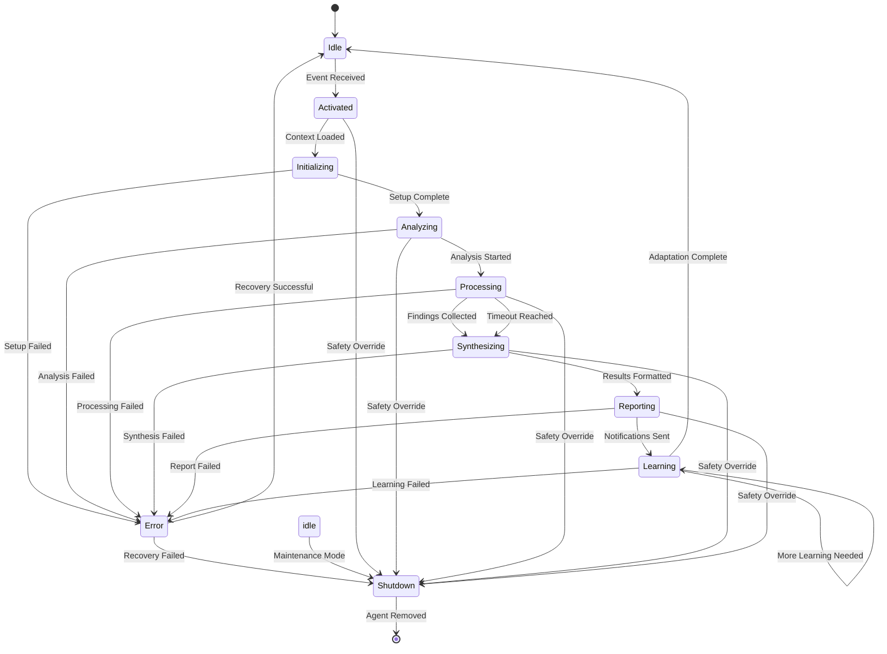

# Phase 5: Agent & Workflow Design - Implementation Blueprint

## Executive Summary

This document provides the **detailed technical specification** for the Autonomous Agent Network (AAN) implementation, focusing on the core agent framework, state machines, communication protocols, and specialized agent logic. This serves as the definitive **implementation guide** for the Phase 5 agent swarm.

### **Key Deliverables:**
- **AutonomousAgent base class** with lifecycle management
- **State machine diagrams** for agent behavior
- **Message bus protocols** for inter-agent communication
- **Specialized agent logic** for Security, Architecture, Performance, Quality agents
- **Decision framework** with confidence scoring and action prioritization

---

## 1. Core Agent Framework

### 1.1 AutonomousAgent Base Class Specification

```typescript
/**
 * Base class for all autonomous agents in the AAN
 * Provides lifecycle management, state transitions, and communication protocols
 */
abstract class AutonomousAgent {
  // Identity and Configuration
  public readonly id: string;
  public readonly type: AgentType;
  protected config: AgentConfiguration;

  // State Management
  private currentState: AgentState;
  private stateHistory: StateTransition[];
  private lastActiveTimestamp: Date;

  // Communication
  private messageBus: MessageBus;
  private eventSubscriptions: Map<string, Callback>;

  // Performance & Safety
  private confidenceThreshold: number;
  private actionRateLimiter: RateLimiter;
  private circuitBreaker: CircuitBreaker;

  // Learning & Adaptation
  private performanceMetrics: AgentMetrics[];
  private feedbackHistory: DeveloperFeedback[];
  private adaptationRules: AdaptationRule[];

  constructor(config: AgentConfiguration) {
    this.id = generateAgentId(this.type, config.repositoryId);
    this.type = config.type;
    this.config = config;
    this.currentState = AgentState.IDLE;

    // Initialize safety mechanisms
    this.confidenceThreshold = config.confidenceThreshold || 0.8;
    this.actionRateLimiter = new RateLimiter({
      maxActions: 10, // Max actions per hour
      windowMs: 3600000 // 1 hour
    });

    this.circuitBreaker = new CircuitBreaker({
      failureThreshold: 5,
      recoveryTimeout: 300000 // 5 minutes
    });
  }

  // Abstract methods to be implemented by specialized agents
  abstract async analyze(context: AnalysisContext): Promise<AnalysisResult>;
  abstract validateTrigger(trigger: TriggerEvent): boolean;
  abstract getSpecializationCapabilities(): AgentCapability[];

  // Lifecycle Management
  async activate(context: AnalysisContext): Promise<void> {
    await this.transitionState(AgentState.INITIALIZING);

    try {
      // Context enrichment via EKG
      const enrichedContext = await this.enrichContext(context);

      await this.transitionState(AgentState.ANALYZING);
      const analysis = await this.analyze(enrichedContext);

      await this.transitionState(AgentState.SYNTHESIZING);
      const recommendations = await this.synthesizeRecommendations(analysis);

      await this.transitionState(AgentState.REPORTING);
      await this.reportFindings(recommendations);

      await this.transitionState(AgentState.LEARNING);
      await this.processFeedback();

      await this.transitionState(AgentState.IDLE);

    } catch (error) {
      await this.handleError(error);
      await this.transitionState(AgentState.ERROR);
    }
  }

  private async enrichContext(context: AnalysisContext): Promise<AnalysisContext> {
    // Query EKG for repository intelligence and patterns
    const ekgIntelligence = await this.queryEKGIntelligence(context.repositoryId);
    const relevantPatterns = await this.queryRelevantPatterns(context);

    return {
      ...context,
      ekgIntelligence,
      relevantPatterns,
      organizationalContext: await this.getOrganizationalContext(context.repositoryId)
    };
  }

  // Communication Protocol
  async sendMessage(recipientId: string, message: AgentMessage): Promise<void> {
    await this.messageBus.publish({
      from: this.id,
      to: recipientId,
      type: message.type,
      payload: message.payload,
      correlationId: generateCorrelationId(),
      timestamp: new Date()
    });
  }

  async broadcastMessage(message: AgentMessage): Promise<void> {
    await this.messageBus.broadcast({
      from: this.id,
      type: message.type,
      payload: message.payload,
      correlationId: generateCorrelationId(),
      timestamp: new Date()
    });
  }

  // Safety & Governance
  async shouldTakeAction(recommendation: AgentRecommendation): Promise<boolean> {
    // Check confidence threshold
    if (recommendation.confidence < this.confidenceThreshold) {
      return false;
    }

    // Check rate limits
    if (!this.actionRateLimiter.canTakeAction()) {
      return false;
    }

    // Check circuit breaker
    if (this.circuitBreaker.isOpen()) {
      return false;
    }

    // Additional safety checks based on agent type
    return this.additionalSafetyChecks(recommendation);
  }

  protected abstract additionalSafetyChecks(recommendation: AgentRecommendation): boolean;

  // Learning & Adaptation
  async processFeedback(feedback?: DeveloperFeedback): Promise<void> {
    if (feedback) {
      this.feedbackHistory.push(feedback);
      await this.adaptBasedOnFeedback(feedback);
    }

    // Update performance metrics
    await this.updatePerformanceMetrics();

    // Apply adaptation rules
    await this.applyAdaptationRules();
  }

  private async adaptBasedOnFeedback(feedback: DeveloperFeedback): Promise<void> {
    // Adjust confidence threshold based on false positives
    if (feedback.action === 'rejected' && feedback.reason === 'false_positive') {
      this.confidenceThreshold += 0.05; // Increase threshold
      if (this.confidenceThreshold > 0.95) {
        this.confidenceThreshold = 0.95; // Cap at 95%
      }
    } else if (feedback.action === 'accepted') {
      this.confidenceThreshold -= 0.01; // Gradually lower threshold for positive feedback
      if (this.confidenceThreshold < 0.6) {
        this.confidenceThreshold = 0.6; // Floor at 60%
      }
    }
  }

  // State Transition Management
  private async transitionState(newState: AgentState): Promise<void> {
    const transition: StateTransition = {
      from: this.currentState,
      to: newState,
      timestamp: new Date()
    };

    this.stateHistory.push(transition);
    this.currentState = newState;
    this.lastActiveTimestamp = new Date();

    await this.onStateTransition(transition);
  }

  protected abstract onStateTransition(transition: StateTransition): Promise<void>;
}

// Export types and enums
export enum AgentType {
  SECURITY = 'security',
  ARCHITECTURE = 'architecture',
  PERFORMANCE = 'performance',
  QUALITY = 'quality'
}

export enum AgentState {
  IDLE = 'idle',
  ACTIVATED = 'activated',
  INITIALIZING = 'initializing',
  ANALYZING = 'analyzing',
  PROCESSING = 'processing',
  SYNTHESIZING = 'synthesizing',
  REPORTING = 'reporting',
  LEARNING = 'learning',
  ERROR = 'error',
  SHUTDOWN = 'shutdown'
}
```

### 1.2 Agent State Machine Diagram



### 1.3 Message Bus Communication Protocol

#### 1.3.1 Message Schemas

```typescript
interface AgentMessage {
  id: string;
  from: string;
  to?: string; // undefined for broadcasts
  type: MessageType;
  payload: any;
  correlationId: string;
  timestamp: Date;
  priority: MessagePriority;
  ttl?: number; // Time to live in milliseconds
}

enum MessageType {
  // Lifecycle Messages
  AGENT_ACTIVATED = 'agent.activated',
  AGENT_COMPLETED = 'agent.completed',
  AGENT_ERROR = 'agent.error',

  // Analysis Messages
  ANALYSIS_REQUEST = 'analysis.request',
  ANALYSIS_RESULTS = 'analysis.results',
  CORRELATION_REQUEST = 'correlation.request',
  PATTERN_DISCOVERED = 'pattern.discovered',

  // Learning Messages
  FEEDBACK_RECEIVED = 'feedback.received',
  ADAPTATION_APPLIED = 'adaptation.applied',

  // Coordination Messages
  RESOURCE_CONFLICT = 'resource.conflict',
  PRIORITY_NEGOTIATION = 'priority.negotiation',
  CONSENSUS_REQUEST = 'consensus.request'
}

enum MessagePriority {
  LOW = 0,
  NORMAL = 1,
  HIGH = 2,
  CRITICAL = 3
}

// Specialized Payload Types
interface AnalysisRequestPayload {
  repositoryId: string;
  triggerEvent: TriggerEvent;
  context: AnalysisContext;
  requestedCapabilities: AgentCapability[];
}

interface CorrelationRequestPayload {
  repositoryId: string;
  findings: AgentFinding[];
  requestedCorrelations: string[];
  confidenceThreshold: number;
}

interface ConsensusRequestPayload {
  repositoryId: string;
  topic: string;
  proposals: AgentRecommendation[];
  decisionDeadline: Date;
}
```

#### 1.3.2 Message Bus Implementation

```typescript
class MessageBus {
  private subscribers: Map<string, Callback[]> = new Map();
  private messageQueue: AgentMessage[] = [];
  private processingEnabled: boolean = true;

  async publish(message: AgentMessage): Promise<void> {
    // Add to queue for processing
    this.messageQueue.push(message);

    // Process queue asynchronously
    setImmediate(() => this.processQueue());
  }

  async broadcast(message: AgentMessage): Promise<void> {
    // Broadcast to all agents (modify 'to' field to undefined)
    await this.publish({ ...message, to: undefined });
  }

  subscribe(messageType: MessageType, callback: Callback, agentId?: string): Subscription {
    const key = agentId ? `${agentId}:${messageType}` : messageType;
    if (!this.subscribers.has(key)) {
      this.subscribers.set(key, []);
    }
    this.subscribers.get(key)!.push(callback);

    return {
      unsubscribe: () => this.unsubscribe(messageType, callback, agentId),
      messageType,
      agentId
    };
  }

  private async processQueue(): Promise<void> {
    if (!this.processingEnabled || this.messageQueue.length === 0) {
      return;
    }

    const message = this.messageQueue.shift()!;
    await this.deliverMessage(message);
  }

  private async deliverMessage(message: AgentMessage): Promise<void> {
    // Determine recipient keys for this message
    const recipientKeys: string[] = [];

    // Direct message
    if (message.to) {
      recipientKeys.push(`${message.to}:${message.type}`);
      recipientKeys.push(message.to); // Agent ID only for all types
    }

    // Broadcast messages
    recipientKeys.push(message.type); // All agents subscribed to this type
    recipientKeys.push('*'); // Catch-all subscriptions

    // Deliver to relevant subscribers
    for (const key of recipientKeys) {
      const callbacks = this.subscribers.get(key);
      if (callbacks) {
        for (const callback of callbacks) {
          try {
            await callback(message);
          } catch (error) {
            console.error(`Message handler error for ${key}:`, error);
          }
        }
      }
    }
  }

  // Circuit breaker for message bus protection
  pauseProcessing(): void {
    this.processingEnabled = false;
  }

  resumeProcessing(): void {
    this.processingEnabled = true;
    this.processQueue(); // Process any queued messages
  }
}
```

---

## 2. Specialized Agent Implementations

### 2.1 Security Agent

```typescript
class SecurityAgent extends AutonomousAgent {
  get type(): AgentType { return AgentType.SECURITY; }

  validateTrigger(trigger: TriggerEvent): boolean {
    return trigger.type === 'dependency_added' ||
           trigger.type === 'package_updated' ||
           trigger.type === 'configuration_changed' ||
           trigger.type === 'external_api_used';
  }

  getSpecializationCapabilities(): AgentCapability[] {
    return [
      Capability.DEPENDENCY_SCANNING,
      Capability.VULNERABILITY_DETECTION,
      Capability.AUTHENTICATION_REVIEW,
      Capability.AUTHORIZATION_ANALYSIS
    ];
  }

  async analyze(context: AnalysisContext): Promise<AnalysisResult> {
    const findings: SecurityFinding[] = [];

    // 1. Dependency Vulnerability Scanning
    const vulnerabilities = await this.scanDependencies(context);
    findings.push(...vulnerabilities);

    // 2. Authentication Pattern Analysis
    const authIssues = await this.analyzeAuthentication(context);
    findings.push(...authIssues);

    // 3. Authorization Analysis
    const authzIssues = await this.analyzeAuthorization(context);
    findings.push(...authzIssues);

    // 4. Secret Detection
    const secrets = await this.detectSecrets(context);
    findings.push(...secrets);

    return {
      agentId: this.id,
      timestamp: new Date(),
      findings,
      confidence: this.calculateOverallConfidence(findings)
    };
  }

  private async scanDependencies(context: AnalysisContext): Promise<SecurityFinding[]> {
    // Query EKG for known vulnerable patterns
    const vulnerablePatterns = await this.queryEKGVulnerablePatterns();

    // Scan current dependencies
    const currentDeps = await this.extractDependencies(context);

    const findings: SecurityFinding[] = [];

    for (const dep of currentDeps) {
      const knownVulnerabilities = vulnerablePatterns.filter(
        p => p.packageName === dep.name && p.version === dep.version
      );

      for (const vuln of knownVulnerabilities) {
        findings.push({
          type: 'dependency_vulnerability',
          severity: this.mapCVSStoSeverity(vuln.cvssScore),
          confidence: vuln.confidence,
          location: { file: 'package.json', line: dep.lineNumber },
          message: `${vuln.description}. Update ${dep.name} to ${vuln.safeVersion}`,
          recommendation: {
            action: 'update_dependency',
            details: {
              package: dep.name,
              fromVersion: dep.version,
              toVersion: vuln.safeVersion
            }
          }
        });
      }
    }

    return findings;
  }

  protected additionalSafetyChecks(recommendation: AgentRecommendation): boolean {
    // Security recommendations are critical - additional scrutiny required
    switch (recommendation.type) {
      case 'block_deployment':
        return recommendation.confidence > 0.95; // Very high bar for blocking
      case 'urgent_patch':
        return recommendation.confidence > 0.90;
      case 'dependency_update':
        return recommendation.confidence > 0.80;
      default:
        return recommendation.confidence > this.confidenceThreshold;
    }
  }
}
```

### 2.2 Architecture Agent

```typescript
class ArchitectureAgent extends AutonomousAgent {
  get type(): AgentType { return AgentType.ARCHITECTURE; }

  validateTrigger(trigger: TriggerEvent): boolean {
    return trigger.type === 'file_added' ||
           trigger.type === 'file_modified' ||
           trigger.type === 'dependency_changed' ||
           trigger.type === 'structural_change';
  }

  getSpecializationCapabilities(): AgentCapability[] {
    return [
      Capability.PATTERN_ANALYSIS,
      Capability.COUPLING_DETECTION,
      Capability.LAYER_VIOLATION_DETECTION,
      Capability.ARCHITECTURAL_CONSISTENCY
    ];
  }

  async analyze(context: AnalysisContext): Promise<AnalysisResult> {
    const findings: ArchitectureFinding[] = [];

    // 1. Design Pattern Compliance
    const patternViolations = await this.checkPatternCompliance(context);
    findings.push(...patternViolations);

    // 2. Coupling Analysis
    const couplingIssues = await this.analyzeCoupling(context);
    findings.push(...couplingIssues);

    // 3. Layer Architecture Validation
    const layerViolations = await this.validateLayerArchitecture(context);
    findings.push(...layerViolations);

    // 4. Complexity Metrics
    const complexityIssues = await this.assessComplexity(context);
    findings.push(...complexityIssues);

    return {
      agentId: this.id,
      timestamp: new Date(),
      findings,
      confidence: this.calculateOverallConfidence(findings)
    };
  }

  private async checkPatternCompliance(context: AnalysisContext): Promise<ArchitectureFinding[]> {
    // Get organizational architectural patterns from EKG
    const orgPatterns = await this.queryEKGArchitecturalPatterns(context.organizationId);

    const findings: ArchitectureFinding[] = [];

    for (const pattern of orgPatterns) {
      const compliance = await this.assessPatternCompliance(pattern, context);

      if (compliance.score < pattern.requiredThreshold) {
        findings.push({
          type: 'pattern_non_compliance',
          severity: 'medium',
          confidence: compliance.confidence,
          location: { file: compliance.failingFile, line: compliance.failingLine },
          message: `Non-compliant with ${pattern.name} pattern: ${compliance.reason}`,
          recommendation: {
            action: 'refactor_pattern',
            details: {
              patternName: pattern.name,
              currentImplementation: compliance.currentImpl,
              recommendedImplementation: pattern.bestPractice
            }
          }
        });
      }
    }

    return findings;
  }

  // Request correlation from other agents
  private async requestCorrelation(findings: ArchitectureFinding[]): Promise<CorrelatedResults> {
    const correlationRequest: CorrelationRequestPayload = {
      repositoryId: this.config.repositoryId,
      findings: findings.map(f => ({ ...f, agentType: 'architecture' })),
      requestedCorrelations: ['security_implications', 'performance_impact', 'quality_dependencies'],
      confidenceThreshold: 0.7
    };

    await this.broadcastMessage({
      type: MessageType.CORRELATION_REQUEST,
      payload: correlationRequest
    });

    // Wait for responses with timeout
    return new Promise((resolve) => {
      const timeout = setTimeout(() => resolve({}), 30000); // 30 second timeout

      this.messageBus.subscribe(MessageType.CORRELATION_RESPONSE, (message) => {
        if (message.correlationId === correlationRequest.correlationId) {
          clearTimeout(timeout);
          resolve(message.payload);
        }
      }, this.id);
    });
  }

  protected additionalSafetyChecks(recommendation: AgentRecommendation): boolean {
    // Architecture recommendations can be safely suggested at lower confidence
    switch (recommendation.type) {
      case 'refactor_pattern':
        return recommendation.confidence > 0.75; // Allow pattern suggestions
      case 'reduce_coupling':
        return recommendation.confidence > 0.80;
      case 'layer_violation':
        return recommendation.confidence > 0.85; // Stricter for layer violations
      default:
        return recommendation.confidence > this.confidenceThreshold;
    }
  }
}
```

### 2.3 Performance Agent

```typescript
class PerformanceAgent extends AutonomousAgent {
  get type(): AgentType { return AgentType.PERFORMANCE; }

  validateTrigger(trigger: TriggerEvent): boolean {
    return trigger.type === 'algorithm_changed' ||
           trigger.type === 'data_structure_modified' ||
           trigger.type === 'resource_usage_increased' ||
           trigger.type === 'loop_detected' ||
           trigger.type === 'memory_allocation_changed';
  }

  async analyze(context: AnalysisContext): Promise<AnalysisResult> {
    const findings: PerformanceFinding[] = [];

    // 1. Algorithm Complexity Analysis
    const complexity = await this.analyzeAlgorithmComplexity(context);
    findings.push(...complexity);

    // 2. Memory Usage Patterns
    const memoryIssues = await this.analyzeMemoryUsage(context);
    findings.push(...memoryIssues);

    // 3. I/O Operation Optimization
    const ioOptimizations = await this.analyzeIOOperations(context);
    findings.push(...ioOptimizations);

    // 4. Caching Opportunities
    const cachingOpportunities = await this.identifyCachingOpportunities(context);
    findings.push(...cachingOpportunities);

    return {
      agentId: this.id,
      timestamp: new Date(),
      findings,
      confidence: this.calculateOverallConfidence(findings)
    };
  }

  private async analyzeAlgorithmComplexity(context: AnalysisContext): Promise<PerformanceFinding[]> {
    const findings: PerformanceFinding[] = [];

    // Analyze code for common performance anti-patterns
    const antiPatterns = [
      { pattern: /for\s*\([^}]*for\s*\(/, name: 'Nested loops', severity: 'medium' },
      { pattern: /while\s*\(\s*true\s*\)/, name: 'Infinite loops without exit', severity: 'high' },
      { pattern: /\+=\s*[^;]*\+[^;]*;/, name: 'String concatenation in loop', severity: 'high' }
    ];

    for (const diff of context.codeChanges || []) {
      for (const antiPattern of antiPatterns) {
        if (antiPattern.pattern.test(diff.content)) {
          findings.push({
            type: 'performance_antipattern',
            severity: antiPattern.severity,
            confidence: 0.9,
            location: { file: diff.filePath, line: diff.lineNumber },
            message: `Detected ${antiPattern.name} which may cause performance issues`,
            recommendation: {
              action: 'optimize_algorithm',
              details: {
                antipattern: antiPattern.name,
                suggestedAlternative: this.getOptimizationAlternative(antiPattern.name)
              }
            }
          });
        }
      }
    }

    return findings;
  }

  private async identifyCachingOpportunities(context: AnalysisContext): Promise<PerformanceFinding[]> {
    // Query EKG for performance patterns in similar repositories
    const performancePatterns = await this.queryEKGPerformancePatterns(context.repositoryId);

    // Identify repetitive operations that could benefit from caching
    const findings: PerformanceFinding[] = [];

    for (const pattern of performancePatterns) {
      const occurrences = await this.findPatternOccurrences(pattern, context);

      if (occurrences.length > 0) {
        findings.push({
          type: 'caching_opportunity',
          severity: 'low',
          confidence: pattern.confidence,
          location: { file: pattern.file, line: pattern.line },
          message: `${pattern.description} - Consider caching`,
          recommendation: {
            action: 'implement_caching',
            details: {
              targetOperation: pattern.operation,
              cachingStrategy: pattern.recommendedCache
            }
          }
        });
      }
    }

    return findings;
  }

  protected additionalSafetyChecks(recommendation: AgentRecommendation): boolean {
    // Performance recommendations should not block, only suggest
    return recommendation.confidence > 0.70; // Lower threshold for suggestions
  }
}
```

### 2.4 Quality Agent

```typescript
class QualityAgent extends AutonomousAgent {
  get type(): AgentType { return AgentType.QUALITY; }

  validateTrigger(trigger: TriggerEvent): boolean {
    return trigger.type === 'commit_created' ||
           trigger.type === 'daily_check' ||
           trigger.type === 'weekly_audit' ||
           trigger.type === 'file_added';
  }

  async analyze(context: AnalysisContext): Promise<AnalysisResult> {
    const findings: QualityFinding[] = [];

    // 1. Code Style and Linting
    const styleIssues = await this.checkCodeStyle(context);
    findings.push(...styleIssues);

    // 2. Documentation Quality
    const docIssues = await this.analyzeDocumentation(context);
    findings.push(...docIssues);

    // 3. Test Coverage Analysis
    const testCoverage = await this.analyzeTestCoverage(context);
    findings.push(...testCoverage);

    // 4. Code Readability Metrics
    const readabilityIssues = await this.assessReadability(context);
    findings.push(...readabilityIssues);

    // 5. Dead Code Detection
    const deadCode = await this.detectDeadCode(context);
    findings.push(...deadCode);

    return {
      agentId: this.id,
      timestamp: new Date(),
      findings,
      confidence: Math.min(0.95, findings.length > 0 ? 0.85 : 0.60)
    };
  }

  private async checkCodeStyle(context: AnalysisContext): Promise<QualityFinding[]> {
    // Use ESLint/JSLint or similar configured standards
    const styleConfig = context.organizationStyle || {};

    const findings: QualityFinding[] = [];

    // Check line length
    const maxLineLength = styleConfig.maxLineLength || 120;

    // Analyze changed files
    for (const change of context.codeChanges || []) {
      const lines = change.content.split('\n');

      for (let i = 0; i < lines.length; i++) {
        const line = lines[i];
        const trimmedLine = line.trim();

        // Check line length
        if (line.length > maxLineLength && !trimmedLine.startsWith('//')) {
          findings.push({
            type: 'line_length',
            severity: 'low',
            confidence: 1.0,
            location: { file: change.filePath, line: change.lineNumber + i },
            message: `Line too long (${line.length} > ${maxLineLength})`,
            recommendation: {
              action: 'refactor_line',
              details: { maxLength: maxLineLength, currentLength: line.length }
            }
          });
        }

        // Check naming conventions
        if (trimmedLine.includes('var ')) {
          findings.push({
            type: 'variable_declaration',
            severity: 'low',
            confidence: 0.9,
            location: { file: change.filePath, line: change.lineNumber + i },
            message: 'Prefer const/let over var for variable declarations',
            recommendation: {
              action: 'use_const_let',
              details: { current: 'var', recommended: 'const or let' }
            }
          });
        }
      }
    }

    return findings;
  }

  private async analyzeDocumentation(context: AnalysisContext): Promise<QualityFinding[]> {
    const findings: QualityFinding[] = [];

    for (const change of context.codeChanges || []) {
      // Check for missing JSDoc on exported functions
      const exportedFunctions = this.extractExportedFunctions(change.content);

      for (const func of exportedFunctions) {
        if (!this.hasJSDocComment(change.content, func.lineNumber)) {
          findings.push({
            type: 'missing_documentation',
            severity: 'medium',
            confidence: 0.8,
            location: { file: change.filePath, line: func.lineNumber },
            message: `Exported function ${func.name} lacks JSDoc documentation`,
            recommendation: {
              action: 'add_jsdoc',
              details: {
                functionName: func.name,
                parameters: func.parameters,
                returnType: func.returnType
              }
            }
          });
        }
      }
    }

    return findings;
  }

  protected additionalSafetyChecks(recommendation: AgentRecommendation): boolean {
    // Quality checks are always suggestions, never blocking
    return recommendation.confidence > 0.60; // Low threshold for style suggestions
  }
}
```

---

## 3. Decision Framework and Confidence Scoring

### 3.1 Multi-Factor Confidence Calculation

```typescript
class ConfidenceCalculator {
  static calculateRecommendationConfidence(
    analysis: AnalysisResult,
    organizationalContext: OrganizationalContext,
    agentType: AgentType
  ): number {
    let confidence = 0;

    // Base confidence from analysis quality
