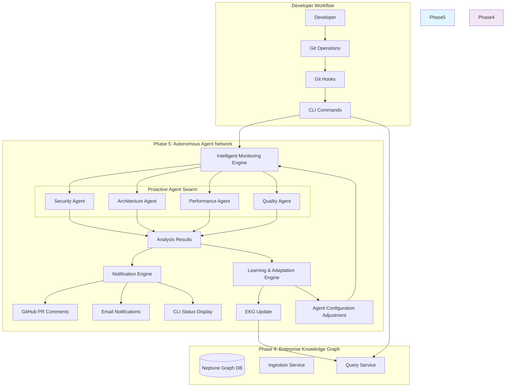
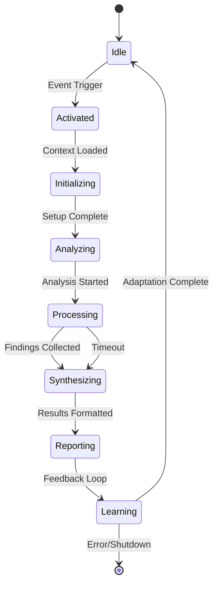

# Phase 5: Autonomous Agent Network (AAN) - High-Level Architectural Blueprint

## Executive Summary

Phase 5 introduces **proactive intelligence** to the Codeflow Commander platform through an Autonomous Agent Network (AAN) that leverages the EKG's organizational knowledge to **monitor, analyze, and improve codebases autonomously**.

### **Key Transformation**
- **Phase 4**: **Reactive Intelligence** - Analyze when requested
- **Phase 5**: **Proactive Intelligence** - Monitor, analyze, and improve continuously

### **Business Impact**
- **✨ Zero Latency Intelligence**: Issues identified before they impact development
- **🔄 Continuous Optimization**: Codebases evolve autonomously based on enterprise patterns
- **📈 Quality Acceleration**: Automated compliance with organizational standards
- **🧠 Learning Organization**: Platform adapts based on developer feedback and outcomes

---

## 1. Architectural Vision

### 1.1 Core Philosophy
The AAN transforms the EKG from a **queryable knowledge base** into an **active intelligence ecosystem** where autonomous agents continuously apply organizational intelligence to improve code quality, security, and architecture.

### 1.2 Architectural Principles
- **Autonomy with Oversight**: Agents act independently but within governance frameworks
- **Collaborative Intelligence**: Agents share insights to build comprehensive understanding
- **Safe Exploration**: Conservative approach to prevent disruptive recommendations
- **Learning-Driven Evolution**: Continuous improvement based on developer feedback

### 1.3 Success Metrics
- **Proactive Detection Rate**: % of issues found before developer commits
- **False Positive Rate**: < 5% of recommendations rejected
- **Developer Adoption**: > 80% acceptance rate of agent suggestions
- **Quality Improvement**: Measurable increase in code quality scores

---

## 2. High-Level Architecture

### 2.1 System Context



### 2.2 Core Components Overview

#### 2.2.1 Intelligent Monitoring Engine
- **Purpose**: Continuously monitors repository activity and triggers appropriate agents
- **Triggers**: Git pushes, PR creation, scheduled analysis windows
- **Intelligence**: Uses EKG context to determine which agents to activate

#### 2.2.2 Proactive Agent Swarm
Four specialized agents working collaboratively:

1. **Security Agent**: Vulnerability scanning, dependency analysis, threat detection
2. **Architecture Agent**: Pattern compliance, structural analysis, design consistency
3. **Performance Agent**: Bottleneck identification, optimization recommendations
4. **Quality Agent**: Code standards, readability, maintainability assessment

#### 2.2.3 Learning & Adaptation Engine
- **Purpose**: Continuously improves agent performance based on feedback
- **Functions**: Developer response analysis, false positive reduction, confidence calibration

#### 2.2.4 Notification Engine
- **Purpose**: Delivers intelligent, context-aware notifications
- **Channels**: GitHub comments, email, CLI status, Slack integrations

### 2.3 Interaction Patterns

#### 2.3.1 Event-Driven Architecture
```sequence
participant Dev as Developer
participant Git as Git Repository
participant IME as Intelligent Monitoring Engine
participant SA as Security Agent
participant NE as Notification Engine

Dev->Git: git push
Git->IME: Webhook Event
IME->IME: Analyze Context (EKG Query)
IME->SA: Trigger Security Scan
SA->SA: Scan Dependencies
SA->NE: High Priority Alert
NE->Git: Create PR Comment
NE->Dev: Email Notification
```

#### 2.3.2 Agent Collaboration Protocol
```sequence
participant IME as Intelligent Monitoring Engine
participant SecA as Security Agent
participant ArchA as Architecture Agent
participant LearnE as Learning Engine

IME->SecA: Analyze Repository R-123
IME->ArchA: Analyze Repository R-123

SecA->SecA: Dependency Scan
ArchA->ArchA: Pattern Analysis

SecA->LearnE: Correlation Request
ArchA->LearnE: Correlation Request

LearnE->SecA: Historical Patterns
LearnE->ArchA: Pattern Conflicts

SecA->IME: Security Findings (Priority: HIGH)
ArchA->IME: Architecture Issues (Priority: MEDIUM)
```

---

## 3. Component Deep Dive

### 3.1 Intelligent Monitoring Engine

#### 3.1.1 Event Processing Pipeline
```
┌─────────────────┐    ┌──────────────────┐    ┌─────────────────┐    ┌─────────────────┐
│  Raw Events     │ -> │  Event           │ -> │  Context        │ -> │  Agent          │
│  (GitHub/PR)    │    │  Normalization   │    │  Enrichment     │    │  Coordination  │
└─────────────────┘    └──────────────────┘    └─────────────────┘    └─────────────────┘
                              │                         │                         │
                              ▼                         ▼                         ▼
                       EKG Repository Query      Pattern/Dependency      Agent Selection
                       Intelligence Lookup       Analysis               & Prioritization
```

#### 3.1.2 Context Enrichment
- **Repository History**: Previous analysis results, developer patterns
- **Organizational Context**: Enterprise security policies, architectural standards
- **Team Dynamics**: Developer expertise levels, code ownership patterns
- **Temporal Patterns**: Code churn analysis, deployment frequency

#### 3.1.3 Agent Selection Algorithm
```typescript
function selectAgents(context: Context): AgentActivationPlan {
  const baseAgents = [SecurityAgent, ArchitectureAgent];

  // High-risk repositories get full agent swarm
  if (context.securityScore < 7.0) {
    return [...baseAgents, PerformanceAgent, QualityAgent];
  }

  // Active development gets performance monitoring
  if (context.commitFrequency > threshold) {
    return [...baseAgents, PerformanceAgent];
  }

  // Stable codebases get quality checks
  return [...baseAgents, QualityAgent];
}
```

### 3.2 Proactive Agent Swarm

Each agent follows a consistent lifecycle pattern while maintaining specialization:



#### 3.2.1 Security Agent
- **Trigger Conditions**: New dependencies, configuration changes, external library usage
- **Analysis Scope**: OWASP Top 10, dependency vulnerabilities, authentication patterns
- **Confidence Calibration**: Historical false positive rates, severity scoring

#### 3.2.2 Architecture Agent
- **Trigger Conditions**: New files, structural changes, dependency modifications
- **Analysis Scope**: Design patterns, architectural consistency, coupling/cohesion metrics
- **Learning Integration**: Organization-specific architectural preferences

#### 3.2.3 Performance Agent
- **Trigger Conditions**: Algorithmic changes, data structure modifications, resource usage
- **Analysis Scope**: Complexity analysis, resource patterns, scaling considerations
- **Proactive Behavior**: Recommends more efficient alternatives during development

#### 3.2.4 Quality Agent
- **Trigger Conditions**: Code commits, regular intervals (daily/weekly)
- **Analysis Scope**: Linting violations, style consistency, documentation quality
- **Context Awareness**: Adjusts standards based on repository criticality

### 3.3 Learning & Adaptation Engine

#### 3.3.1 Feedback Integration
- **Developer Actions**: Accept/Reject/Edit agent recommendations
- **Outcome Tracking**: Did recommendations improve code quality metrics?
- **Learning Models**: Confidence interval adjustment, pattern discovery

#### 3.3.2 Knowledge Synthesis
- **EKG Updates**: New patterns identified through agent analysis
- **Agent Behavior**: Modify analysis thresholds based on effectiveness
- **Organizational Learning**: Share successful patterns across teams

---

## 4. Integration Architecture

### 4.1 Phase 4 Legacy Integration
- **Query Service Enhancement**: Add agent-specific GraphQL mutations
- **Ingestion Service Updates**: Agent-triggered data collection
- **CLI Integration**: New agent management commands

### 4.2 Event-Driven Architecture
- **Message Bus**: Kafka/NATS for inter-agent communication
- **Webhook Processing**: GitHub events drive agent activation
- **Real-time Updates**: WebSocket connections for live agent status

### 4.3 Deployment Architecture

```yaml
# Agent Network Deployment
apiVersion: apps/v1
kind: Deployment
metadata:
  name: autonomous-agent-network
spec:
  replicas: 3  # Multi-node for HA
  template:
    spec:
      containers:
      - name: monitoring-engine
        image: codeflow/aan:latest
        env:
        - name: EKG_QUERY_URL
          value: "http://ekg-query-service:4000/graphql"
        - name: AGENT_CONFIG_PATH
          value: "/config/agent-config.yaml"
      - name: agent-swarm
        image: codeflow/agents:latest
        env:
        - name: MONITORING_ENGINE_URL
          value: "http://localhost:8080"
        - name: EKG_GRAPH_URL
          valueFrom:
            configMapKeyRef:
              name: neptune-config
              key: neptune_endpoint
```

---

## 5. Safety & Governance Framework

### 5.1 Agent Safety Bounds
- **Action Limits**: Maximum suggestions per day/hour per repository
- **Confidence Thresholds**: Minimum confidence scores for recommendations
- **Human Oversight**: Escalation procedures for critical suggestions

### 5.2 Risk Mitigation
- **Gradual Rollout**: Start with observation-only mode
- **Feedback Loops**: Easy rejection mechanisms with learning
- **Resource Limits**: Prevent agent resource exhaustion

### 5.3 Ethical Considerations
- **False Positive Impact**: Minimize development friction
- **Privacy Protection**: No personal data collection without consent
- **Bias Prevention**: Regular audit of agent recommendations

---

## 6. Implementation Roadmap

### 6.1 Sprint 1: Foundation (2 weeks)
- Monitoring Engine core functionality
- Basic agent framework and communication
- Event-driven architecture setup

### 6.2 Sprint 2: Core Agent Swarm (3 weeks)
- Security, Architecture, Performance, Quality agents
- Agent collaboration protocols
- Basic learning mechanisms

### 6.3 Sprint 3: Intelligence Enhancement (3 weeks)
- Advanced learning algorithms
- Agent specialization and adaptation
- Comprehensive notification system

### 6.4 Sprint 4: Production Readiness (2 weeks)
- Enterprise integration
- Monitoring and alerting
- Performance optimization
- Final validation and documentation

---

## 7. Success Criteria

### 7.1 Functional Validation
- [ ] Event processing pipeline functional
- [ ] All four agents operational
- [ ] EKG integration working
- [ ] Notification system functional
- [ ] CLI commands operational

### 7.2 Quality Metrics
- [ ] Agent availability > 99.9%
- [ ] Mean time to analysis < 30 seconds
- [ ] False positive rate < 5%
- [ ] Developer satisfaction > 4.5/5

### 7.3 Organizational Impact
- [ ] 40% reduction in post-deployment security issues
- [ ] 25% improvement in code quality metrics
- [ ] 30% faster resolution of architectural inconsistencies

---

## 8. Conclusion

Phase 5 transforms the Codeflow Commander platform from a **reactive analysis tool** into a **proactive intelligence ecosystem**. By leveraging the Phase 4 EKG foundation, the Autonomous Agent Network will continuously apply organizational knowledge to improve code quality, security, and architecture.

The combination of **intelligent monitoring**, **specialized agents**, and **continuous learning** creates a platform that not only understands organizational patterns but actively helps maintain and evolve them.

*This is not just incremental improvement—it's a fundamental transformation in how development teams interact with and benefit from their collective knowledge.*
